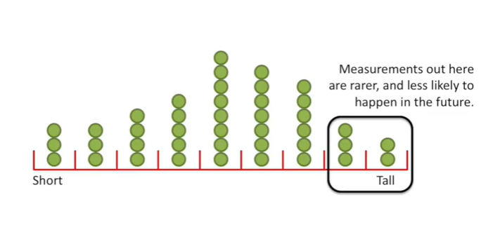

<https://www.youtube.com/watch?v=qBigTkBLU6g&list=PLblh5JKOoLUK0FLuzwntyYI10UQFUhsY9&index=1>

Today we\'re going to be talking front histograms and they\'re gonna be
clearly explained.

Imagine we went out and measured someone, and they were this tall,

and then we measured someone else

and then we measured a whole bunch of people.

We\'ve measured so many people that the dots of her lap some dots are
completely hidden.

We could try to make it easier to see the hidden measurements by
stacking any that are exactly the same.

But measurements that are the exact same are rare and a lot of the
hidden measurements are still hidden.

So instead of stacking measurements that are the exact same we divide
the range of values into bins.

And stack the measurements that fall in the same bin.

This my friends is a histogram.

BAM.

The taller the stack within a bin, the more measurements we made that
fall into that bin.

Duh.

We can use the histogram to predict the probability of getting future
measurements.

I would be willing to bet that the next measurement we make is somewhere
in this range.

Measurements out here are rarer and less likely to happen in the future.

If you want to use a distribution to approximate your data or future
measurements histograms are a good way to justify your decision.

By the way if you don\'t know what a distribution is there\'s a stat
quest for that.

In this case we might use a normal distribution to approximate the data
and future measurements.

If the data look like, this we might use an exponential distribution to
approximate this data and future measurements.

Note : figuring out how wide to make the bends is tricky.

If the bins are too narrow then they are not much help.

In this case the bends are so narrow that pretty much every measurement
gets its own bin.

This doesn\'t give us much more insight than what we had before so it\'s
not very useful.

And if the bins are too wide they are not much help.

In this case the bins are so wide that the measurements are split 50/50.

All this tells us us how many measurements are above the average and how
many are below.

This is more insight than before but we can do better.

Sometimes you have to try a bunch of different bin widths before you get
a clear picture.

In other words don\'t rely on the default setting of whatever program
you\'re using to draw the histogram.

You\'ve got to try a bunch of different settings before you\'re sure
that you\'ve got the best histogram you can draw.
