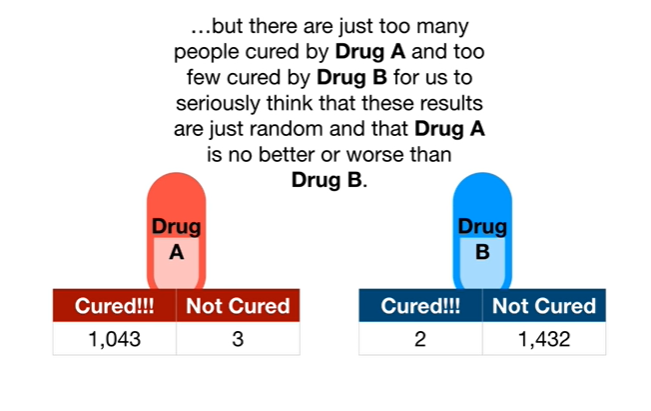
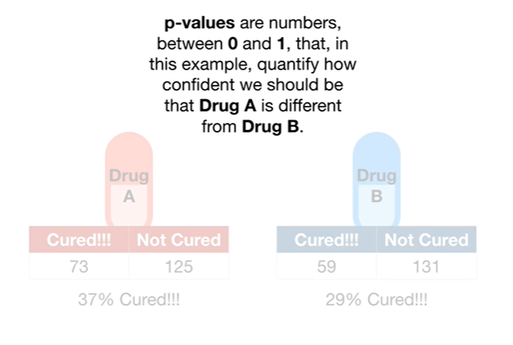
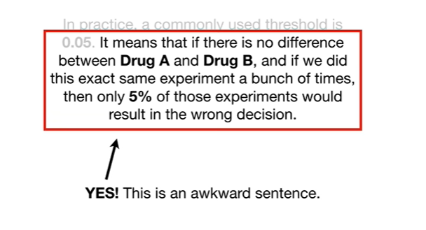
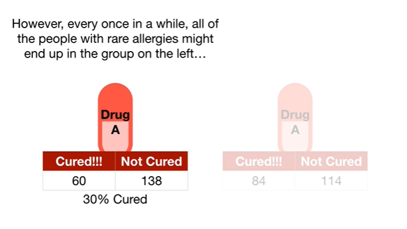
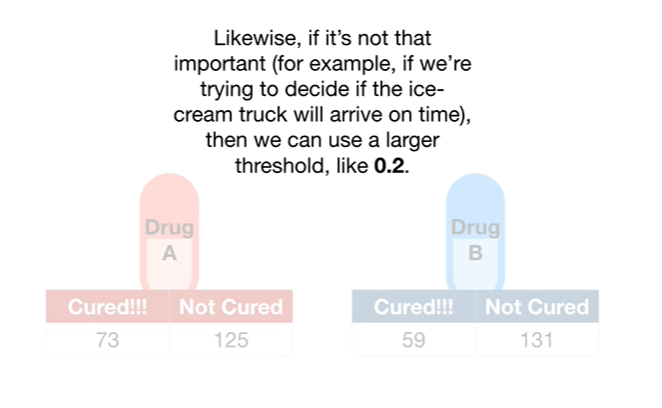
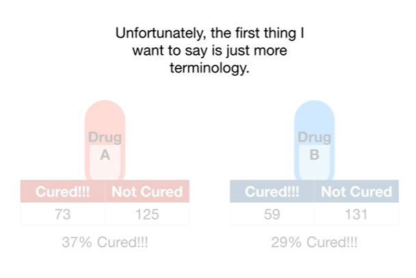
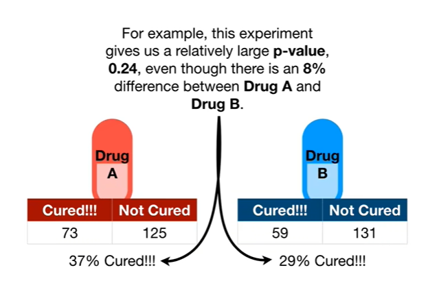

<https://www.youtube.com/watch?v=vemZtEM63GY&list=PLblh5JKOoLUK0FLuzwntyYI10UQFUhsY9&index=10>

Today we\'re gonna talk about what p-values are and how to interpret
them.

{width="5.927910104986877in"
height="3.615087489063867in"}

Imagine I have two drugs drug a and drug B.

{width="6.42798009623797in"
height="3.760941601049869in"}

And I want to know if drug a is different from drug B.

{width="6.886377952755906in"
height="3.406725721784777in"}

So I give one person drug a and I give one other person drug B the one
person using drug a is cured.

Hooray.

The one person using drug B is not cured.

Bummer.

{width="6.990558836395451in"
height="3.854704724409449in"}

Can we conclude that drug a is better than drug B ?

Nope !

{width="7.268055555555556in"
height="3.6527777777777777in"}

Drug B may have failed for a lot of different reasons.

{width="7.209339457567804in"
height="3.938050087489064in"}

Maybe this guy is taking a medication that has a bad interaction with
drug B

{width="7.268055555555556in"
height="3.821527777777778in"}

or maybe this guy has a rare allergy to drug B or maybe this guy didn\'t
take drug B properly and missed a dose

{width="7.209339457567804in"
height="3.8234503499562553in"}

or maybe drug A doesn\'t actually work and the placebo effect deserves
all of the credit.

{width="7.032230971128609in"
height="3.3754713473315836in"}

{width="6.89679571303587in"
height="4.135994094488189in"}

There are a lot of weird random things that can happen when doing a test

{width="6.855123578302712in"
height="4.261011592300962in"}

and this means that we need to try each drug on more than just one
person each.

{width="7.268055555555556in"
height="3.4868055555555557in"}

So we redo the experiment but this time we give each drug to two
different people.

{width="7.268055555555556in"
height="3.0541666666666667in"}

This time both people taking drug a are cured.

Hooray !!!

{width="7.268055555555556in"
height="3.292361111111111in"}

And one person taking drug B is cured and one person is not cured.

Hooray !!!

And bummer !!

{width="7.268055555555556in"
height="3.5756944444444443in"}

Is drug A better ?

{width="7.268055555555556in"
height="3.4305555555555554in"}

Are both drugs the same ?

{width="7.268055555555556in"
height="3.6430555555555557in"}

We can\'t answer either of those questions because maybe something weird
happened to this guy that caused drug B to fail

{width="7.268055555555556in"
height="3.6020833333333333in"}

or maybe something weird happened to this guy like maybe the drug was
mislabeled and he actually took drug a and that\'s why he was cured ;

{width="7.268055555555556in"
height="4.026388888888889in"}

So now we test the drugs on a lot of different people

{width="7.178085083114611in"
height="4.073485345581802in"}

and these are the results.

{width="7.268055555555556in"
height="3.952777777777778in"}

Drug A cured a whole lot of people 1043 compared to the number of people
it didn\'t cure 3.

{width="7.268055555555556in"
height="4.061111111111111in"}

In other words 99.7% of the 1046 people using drug a were cured.

{width="7.268055555555556in"
height="4.3125in"}

In contrast drug B only cured a few people - compared to the number of
people it didn\'t cure 1432.

{width="7.268055555555556in"
height="4.075in"}

In other words only 0.001 percent of the 1434 people using drug B were
cured.

{width="6.948886701662293in"
height="4.51104658792651in"}

If these were the results then it would be pretty obvious that drug a
was better than drug B.

{width="6.782195975503062in"
height="4.667318460192476in"}

In other words it would seem unrealistic to suppose that these results
were just random chance and that there is no real difference between
drug A and drug B.

{width="6.646760717410324in"
height="3.7401049868766405in"}

It\'s possible that some of these people were cured by placebo

{width="6.855123578302712in"
height="3.9484678477690287in"}

and some of these people were not cured because of some rare allergy

{width="6.782195975503062in"
height="4.281847112860892in"}

but they are just too many people cured by drug a and too few cured by
drug B for us to seriously think that these results are just random and
that drug A is no better or worse than drug B.

{width="6.886377952755906in"
height="3.802613735783027in"}

In contrast what if these were the results ?

{width="7.032230971128609in"
height="4.229757217847769in"}

Now only 37% of the people that took drug a were cured

{width="6.771778215223097in"
height="3.781778215223097in"}

compared to 29% that took drug B

{width="6.657179571303587in"
height="3.969304461942257in"}

so drug A cured a larger percentage of people

{width="6.667597331583552in"
height="4.365192475940508in"}

but given that no study is perfect and there are always a few random
things that happen how confident can we be that drug a is superior ?

{width="6.792614829396325in"
height="3.9172134733158357in"}

That\'s where the p-value comes in.

{width="6.6050885826771655in"
height="4.448537839020123in"}

p-values are numbers between zero and one that in this example quantify
how confident we should be that drug A is different from drug B.

{width="6.678015091863517in"
height="4.386029090113736in"}

The closer a p-value is to zero, the more confidence we have the drug A
and drug B are different.

{width="6.386307961504812in"
height="4.302683727034121in"}

So the question is how small does a p-value have to be before we are
sufficiently confident that drug A is different from drug B ?

{width="6.417562335958006in"
height="4.219338363954506in"}

In other words what threshold can we use to make a good decision ?

{width="6.480071084864392in"
height="4.552718722659668in"}

In practice a commonly used threshold is 0.05 it means that if there is
no difference between drug a and drug B and if we did this exact same
experiment a bunch of times that only 5% of those experiments would
result in the wrong decision.

{width="6.33421697287839in"
height="3.427561242344707in"}

Yes ! This is an awkward sentence.

{width="5.698711723534558in"
height="4.354774715660542in"}

So let\'s go through an example and work this out one step at a time.

{width="7.042649825021872in"
height="3.2191994750656168in"}

Imagine I gave the same drug drug A to two different groups.

{width="6.792614829396325in"
height="3.698432852143482in"}

Now any differences in the results are 100% attributable to weird random
things like a rare allergy in one person or a strong placebo effect in
another.

{width="6.386307961504812in"
height="3.3025437445319334in"}

In this case the p-value would be 0.9 which is way larger than 0.05.

{width="6.657179571303587in"
height="3.4588156167979003in"}

Thus we would say that we fail to see a difference between the two
groups.

{width="6.678015091863517in"
height="4.615227471566055in"}

If we repeated this same experiment a lot of times most of the time we
would get similarly large p-values.

{width="7.219757217847769in"
height="4.063066491688539in"}

However every once in a while all of the people with rare allergies
might end up in the group on the left

{width="7.0739041994750655in"
height="4.031812117235345in"}

and all of the people with the strong placebo reactions might end up in
the group on the right.

{width="6.532162073490814in"
height="4.1047397200349955in"}

As a result the p-value for this specific run of the experiment is 0.01
since the results are pretty different.

{width="6.469653324584427in"
height="3.8442869641294837in"}

Thus, in this case, we would say that the two groups are different even
though they both took the same drug.

{width="6.698851706036746in"
height="4.656899606299213in"}

Oh no it\'s the dreaded terminology alert.

Getting a small p-value when there is no difference is called a false
positive.

{width="6.771778215223097in"
height="4.261011592300962in"}

A 0.05 threshold for p-values means that 5% of the experiments where the
only differences come from weird random things will generate a p-value
smaller than 0.05.

{width="6.678015091863517in"
height="4.010976596675415in"}

In other words if there is no difference between drug a and drug B 5% of
the time we do the experiment we will get a p-value less than 0.05 aka a
false positive.

{width="6.750941601049869in"
height="3.8859590988626422in"}

Note : if it is extremely important that we are correct when we say the
drugs are different then we can use a smaller threshold like zero point
zero zero zero zero one.

{width="6.459234470691164in"
height="3.760941601049869in"}

Using a threshold of 0.00001 means we would only get a false positive
once every 100,000 experiments.

{width="6.89679571303587in"
height="4.250592738407699in"}

Likewise if it\'s not that important for example if we\'re trying to
decide if the ice cream truck will arrive on time then we can use a
larger threshold like 0.2.

{width="6.417562335958006in"
height="3.8338681102362204in"}

Using a threshold of 0.2 means we are willing to get a false positive
two times out of ten.

{width="6.823869203849519in"
height="4.146411854768154in"}

That said the most common threshold is 0.05 because trying to reduce the
number of false positives below 5% often costs more than it\'s worth.

{width="6.532162073490814in"
height="3.5629975940507435in"}

So if we calculate a p-value for this experiment

{width="6.678015091863517in"
height="3.938050087489064in"}

and the p-value is less than 0.05 then we will decide that drug A is
different from drug B.

{width="6.355053587051619in"
height="3.938050087489064in"}

That said, the p-value is actually zero point two four.

So we are not confident that drug A is different from drug B.

BAM !!!

{width="6.7092694663167105in"
height="4.198502843394576in"}

Okay before we\'re done let me say two more things about p-values.

{width="6.33421697287839in"
height="4.229757217847769in"}

Unfortunately the first thing I want to say is just more terminology.

{width="6.5009076990376204in"
height="4.208920603674541in"}

In fancy statistical lingo the idea of trying to determine if these
drugs are the same or not is called hypothesis testing.

{width="6.667597331583552in"
height="4.448537839020123in"}

The null hypothesis is that the drugs are the same

{width="6.8134503499562555in"
height="4.156829615048119in"}

and the p-value helps us decide if we should reject the null hypothesis
or not.

Small BAM !

{width="6.542579833770779in"
height="4.354774715660542in"}

Okay now that we have that fancy terminology out of the way the second
thing I want to say is way more interesting.

{width="6.7092694663167105in"
height="4.2714293525809275in"}

While a small p-value helps us decide if drug A is different from drug
B, it does not tell us how different they are.

{width="6.782195975503062in"
height="4.031812117235345in"}

In other words you can have a small p-value regardless of the size of
difference between drug a and drug B the difference can be tiny or huge.

{width="6.490488845144357in"
height="4.469373359580053in"}

For example this experiment gives us a relatively large p-value 0.2 for
even though there is an 8 percent difference between drug A and drug B.

{width="6.730106080489938in"
height="4.010976596675415in"}

In contrast this experiment which involves a lot more people gives us a
smaller p-value 0.04

{width="6.678015091863517in"
height="4.146411854768154in"}

even though given the new data there is only a 1% difference between
drug A and drug B.

{width="6.261290463692038in"
height="4.302683727034121in"}

In summary a small p-value does not imply that the effect size or
difference between drug a and drug B is large.

Double BAM !!!
