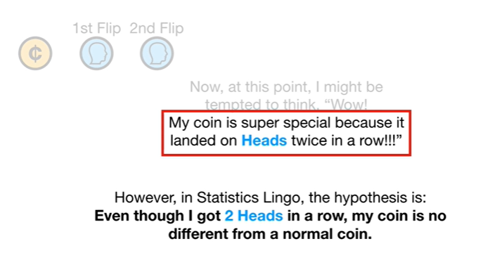
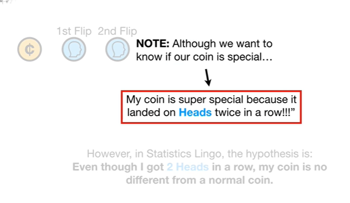
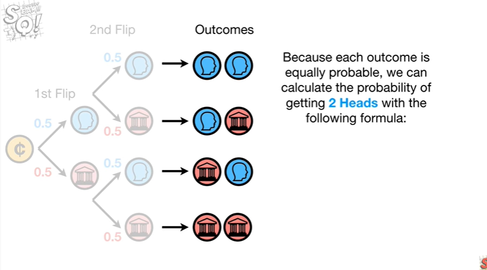
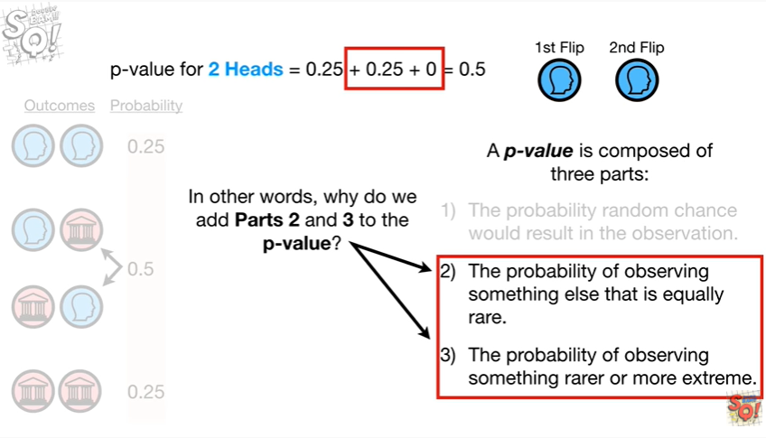
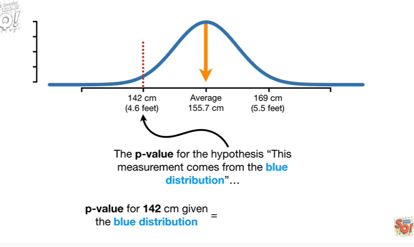
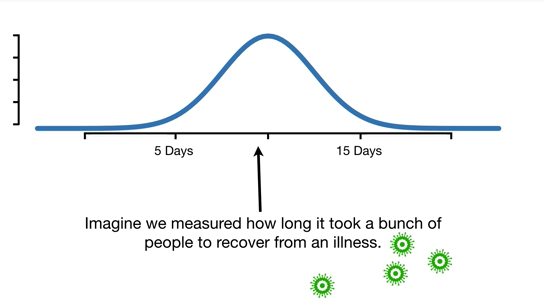
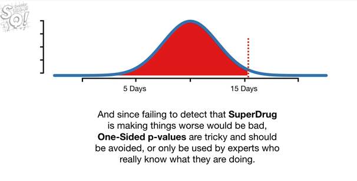
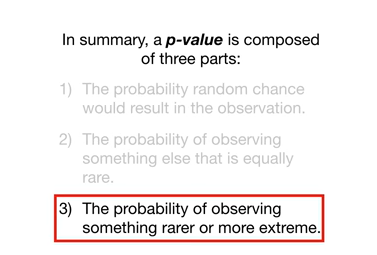

<https://www.youtube.com/watch?v=JQc3yx0-Q9E&list=PLblh5JKOoLUK0FLuzwntyYI10UQFUhsY9&index=11>

Today we\'re gonna talk about how to calculate p-values.

Note : this stat quest assumes that you are already familiar with what
p-values are and how to interpret them if not check out the quest.

Also note : before we get started I want to mention that there are two
types of P values

one sided and two sided.

Two-sided p-values are the most common and this quest focuses on
calculating them.

In contrast one-sided p-values are rarely used and to be honest
potentially dangerous I won\'t mention them again until the very end
when I give an example of why they should be avoided.

With that said let\'s imagine I had a coin

and I flipped it once and got heads.

Then I flipped it again and got heads a second time.

Now at this point I might be tempted to think wow !

My coin is super special because it landed on heads twice in a row !!

This is a hypothesis.

However in statistics lingo the hypothesis is : even though I got two
heads in a row, my coin is no different from a normal coin.

Note : although we want to know if our coin is special

the statistics lingo version says the opposite, that our coin is the
same as a normal coin.

Statisticians call this the null hypothesis and a small p-value will
tell us to reject it.

And if we reject this null hypothesis we will know that our coin is
special.

So let\'s test this hypothesis by calculating a p-value.

p-values are determined by adding up probabilities so let\'s start by
figuring out the probability of getting two heads in a row.

When we flip a normal everyday coin there\'s a 50% chance we\'ll get
heads

and a 50% chance we\'ll get tails.

Now if we got heads on the first flip

and flip the coin a second time

then just like before there\'s a 50% chance we\'ll get heads and a 50%
chance we\'ll get tails.

Likewise if we got tails on the first flip

and flip the coin again

then just like before there\'s a 50% chance we\'ll get heads and a 50%
chance we\'ll get tails.

Ultimately these are the four possible outcomes after flipping a coin
two times.

Because each outcome is equally probable we can calculate the
probability of getting two heads with the following formula :

the number of times we got two heads divided by the total number of
outcomes.

In this case we only got two heads one time so we put a 1 in the
numerator.

And since there were four possible outcomes we put a four in the
denominator.

Thus the probability of getting two heads is 0.25.

LLikewise the probability of getting two
tails is

0.25.

Finally the probability of getting one heads and one tails regardless of
the order is 0.5.

Now you may be wondering why we don\'t care about the order of the heads
and tails and treat these outcomes as the same.

In this case the order doesn\'t matter because getting a heads on the
first flip

doesn\'t change the probabilities of getting heads or tails on the
second flip.

Likewise getting tails on the first flip

doesn\'t change the probabilities of getting heads or tails on the
second flip.

Because order does not affect the probabilities of getting heads and
tails we treat these outcomes as the same.

Now let\'s move the outcomes over to the left unless the probability of
each outcome

and calculate the p-value for getting two heads.

A p-value is composed of three parts.

The first part is the probability random chance would result in the
observation.

In this case the first part is just the probability that a normal coin
would give us two heads which is 0.25.

The second part is the probability of observing something else that is
equally rare.

In this case getting two tails is as rare as two heads so we add 0.25.

The third part is the probability of observing something rare or more
extreme.

In this case the third part is zero because no other outcomes are rarer
than two heads or two tails.

Now we just add everything together

and the p-value for getting two heads equals 0.5.

Now remember the reason we calculated the p-value was to test this
hypothesis : even though I got two heads in a row my coin is no
different from a normal coin.

Typically we only reject a hypothesis if the p-value is less than 0.05

and since 0.5 is greater than 0.05 we fail to reject the hypothesis.

In other words the data getting two heads in a row, failed to convince
us that our coin is special.

Note : the probability of getting two heads 0.25 is different from the
p-value for getting two heads 0.5.

This is because the p-value is the sum of three parts

the first part is the probability random chance would result in the
observation

the second part is the probability of observing something else that is
equally rare.

And the third part is the probability of observing something rare or
more extreme.

Now the question is why do we care about things that are equally rare or
more extreme ?

In other words why do we add parts two and three to the p value ?

We add part to the probability of something else that is equally rare
because although getting two heads might seem special it doesn\'t seem
as special when we know that other things are just as rare.

For example imagine giving a loved one a flower and saying this is the
rarest flower of this species none are equally as rare.

Chances are your loved one would think that the flower was super
special.

You might even get a kiss on the cheek.

Now imagine saying to your loved one this flower is equally as rare as
all of these other flowers.

In this case your loved one might not think the flower is very special.

Wha-wha.

Note : even though these flowers are different colors just knowing that
they\'re equally rare would be a bummer.

Because a lot of equally rare things would make something less special
we add part two to the p-value.

And we add rare things to the p-value for a similar reason.

Going back to our flower example imagine telling your loved one this is
the rarest flower of this species none are rarer.

Again there\'s a good chance your loved one would think that the flower
was super special.

Now imagine saying there are a lot of flowers that are rarer than this
one.

In this case your loved one might not think the flower is very special.

Wah-wah.

And like before even though these flowers are all different colors just
knowing they are rare would be a bummer.

Thus because rarer things make something less special we add part three
to the p-value.

Okay now that we know that getting two heads in a row is not very
special or statistically significant

what about getting four heads and one tails ?

Would that suggest that our coin is special ?

In other words we can calculate a p-value to test this hypothesis :

even though I got four heads and one tails, my coin is no different from
a normal coin.

Again although we want to know if the coin is special the null
hypothesis focuses on a normal coin

but if we get a small p-value and reject the null hypothesis we will
know that our coin is special.

So let\'s calculate the p-value for getting four heads and one tail.

First we know that it is possible to flip a coin five times and get
heads each time

so let\'s keep track of that with five blue H\'s.

We can also flip a coin five times and get four heads and one tails.

Note : there are five different ways to get four heads and one tails but
we treat them all the same because the order of heads and tails doesn\'t
matter.

Likewise there are ten ways that we can flip a coin and get three heads
and two tails

and ten ways to get two heads and three tails

and five ways to get one heads and four tails

and lastly one way to flip a coin five times and get five tails.

All in all when we flip a coin five times there are 32 possible
outcomes.

The p-value for getting four heads and one tails is

1\. the probability we randomly get four heads and one tails this is
5/32.

Since five of the 32 outcomes had four heads and one tails.

2\. the probability we randomly get something else that is equally
rare : this is 5 divided by 32 since 5 of the 32 outcomes had one head
and four tails

3\. the probability we randomly get something rarer or more extreme this
is 2 divided by 32

Because both 5 heads and 5 tails only occurred once each they are rarer
than four heads and one tails.

Thus the p-value for getting four heads and one tails is 0.375.

Again we typically only reject the null hypothesis if the p-value is
less than 0.05

so in this case we will fail to reject the null hypothesis.

In other words the data getting four heads and one tails did not
convince us that our coin was special.

With coin tosses it\'s pretty easy to calculate probabilities and
p-values because it\'s pretty easy to list all of the possible outcomes.

But what if we wanted to calculate probabilities and p-values for how
tall or short people are ?

In theory we could try to list every single possible value for height.

However in practice when we calculate probabilities and p-values for
something continuous like height we usually use something called a
statistical distribution.

Here we have a distribution of height measurements from Brazilian women
between 15 and 49 years old taken in 1996.

The red area under the curve indicates the probability that a person\'s
height will be within a range of possible values.

For example 95 percent of the area under the curve is between 142 and
169

and that means that 95 percent of the Brazilian women were between 142
and 169 centimeters tall.

In other words there is a 95 percent probability that each time we
measure a Brazilian woman their height will be between 142 and 169
centimeters.

2.5 percent of the total area under the curve is greater than 169.

And that means there is a 2.5 percent probability that each time we
measure a Brazilian woman their height will be greater than 169
centimeters.

Likewise 2.5 percent of the total area under the curve is less than 142.

Thus there is a 2.5 percent probability that each time we measure a
Brazilian woman their height will be less than 142 centimeters.

To calculate p-values with a distribution you add up the percentages of
area under the curve.

For example imagine we measured someone who is 142 centimeters tall.

If we measured someone who is 142 centimeters tall we might wonder if it
came from this distribution of heights which has an average value of
155.7

or if it came from another distribution of heights for example this
green distribution has an average value of 142.

So the question is is this measurement 142 centimeters so far away from
the mean of the blue distribution that we can reject the idea that it
came from it ?

If so then that would suggest that another distribution like this green
one might do a better job explaining the data.

The p-value for the hypothesis this measurement comes from the blue
distribution

starts with the 2.5 percent of the area for people less than or equal to
142 centimeters.

Note : when we are working with a distribution we are interested in
adding more extreme values to the p value rather than rarer values.

In this case all heights further than 142 centimeters from the mean are
considered more extreme than what we observed.

We also add the 2.5% of the area for people 169 centimeters or taller.

Note : just like on the other side of the distribution these values are
considered equal to or more extreme because there is far from the mean
or further.

Now we just do the math and get 0.05.

So the p-value for the hypothesis someone 142 centimeters tall could
come from the blue distribution is 0.05.

And since the cutoff for significance is usually 0.05 we would say

Hmm.

Maybe it could come from this distribution maybe not.

It\'s hard to tell since the p-value is right on the borderline.

So maybe they come from this distribution

or maybe they come from this distribution.

The data are inconclusive.

Wah wah.

Note : if we had measured someone who is 141 centimeters tall so just a
little bit shorter than 142 centimeters

then the p value would be 0.01 6

plus 0.01 6

which equals zero point zero three

and since 0.03 is less than 0.05 the standard threshold we can reject
the hypothesis that given the blue distribution it is normal to measure
someone 141 centimeters tall.

Thus we will conclude that it\'s pretty special to measure someone that
short.

And that suggests that a different distribution of Heights makes more
sense.

Now what if we measured someone who is between 155 point four in 156
centimeters tall ?

Note : the peak of the curve is right at the average height so we were
asking

is a measurement between 155 point four and 156 so far away from the
mean of the blue distribution that we can reject the idea that it came
from it ?

If the p-value is small then that suggests that some other distribution
would do a better job explaining the data.

Note : the probability of someone being between 155 point four and 156
centimeters is only 0.04 the red area is pretty small barely a line !

So 0.04 is the first part of calculating the p-value since given this
distribution of heights that is the probability that we would randomly
measure someone in this range of values.

Now we need to figure out the more extreme parts.

On the left side all of the heights less than 150 5.4 are further from
the mean thus they are more extreme.

And because 48% of the area under the curve is for Heights less than 150
5.4 we add 0.48 to the p-value.

On the right side all of the heights greater than 156 are further from
the mean thus they are all more extreme.

And because 48% of the area under the curve is for Heights greater than
156 we add 0.48 to the p-value.

Ultimately we end up adding all of the area under the curve so the
p-value equals one.

So this means that given this distribution of heights we would not find
it unusual to measure someone whose height was close to the average even
though the probability is small (0.04).

In other words, the data does not suggest that another distribution
would do a better job explaining the data.

BAM.

So far we\'ve only talked about two-sided p-values.

Now I\'ll give you an example of a one-sided p-value and tell you why it
has the potential to be dangerous.

Imagine we measured how long it took a bunch of people to recover from
an illness.

Now imagine we created a new drug super drug and wanted to see if it
helped people recover in fewer days.

If we gave super drug to a bunch of people and the average recovery was
4.5 days

then a two-sided p-value like the ones we\'ve been computing all along
would be

the sum of this area under the curve 0.016

plus this area under the curve 0.016

and the total is 0.03.

And since 0.03 is less than 0.05 the two-sided p-value tells us that
given this distribution of recovery times super drug did something
unusual.

and that suggests that some other distribution does a better job
explaining the data.

For a one-sided p-value the first thing we do is decide which direction
we want to see change in.

In this case we\'d like super drug to shorten the time it takes to
recover from the illness

so that means we want to see if recovery times are shorter.

Because we want to see change in this direction the only more extreme
values are less than 4.5 days.

All of the values greater than 4.5 days are considered less extreme.

So when we calculate a one-sided p-value we only use the area that is in
the direction we want to see change 0.016.

Again since 0.01 6 is less than 0.05 the one-sided p-value would tell us
that given this distribution super drug did something unusual

and that some other distribution makes more sense.

Now imagine that super drug wasn\'t so super and on average it took
fifteen point five days to recover.

Just like before the two-sided p-value would be

the sum of this area under the curve zero point zero one six

plus this area under the curve zero point zero one six

and the total is zero point zero three.

In other words regardless of whether super drug is super and makes
things better or if it is not so super and makes things worse a
two-sided p-value will detect something unusual happened.

For a one-sided p-value the first thing we do is decide which direction
we want to see change in.

And just like before that means we want to see if recovery times are
shorter.

So the one-sided p-value is this huge area 0.98 because it is more
extreme in the direction we want to see change.

And since 0.98 is greater than 0.05 the one-sided p-value would not
detect that Superdrug was doing anything unusual.

In other words the one-sided p-value is only looking to see if a
distribution to the left of the original mean makes more sense

and since the observation is on the right side of the mean we fail to
reject the hypothesis that the original distribution makes sense

and since failing to detect that Superdrug is making things worse would
be bad one-sided p-values are tricky and should be avoided or only used
by experts who really know what they\'re doing.

BAM !!

In summary a p-value is composed of three parts :

the first part is the probability random chance would result in the
observation

the second part is the probability of observing something else that is
equally rare

and the third part is the probability of observing something rarer or
more extreme.

BAM !!!
