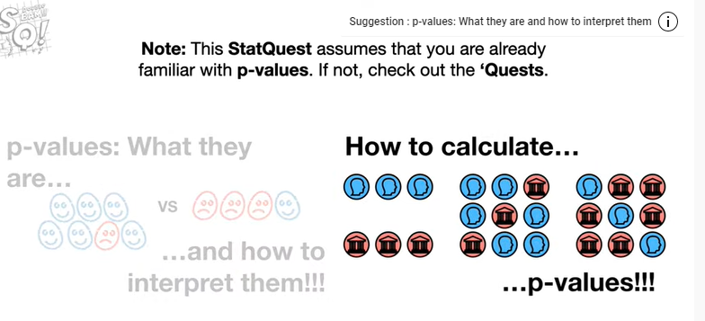
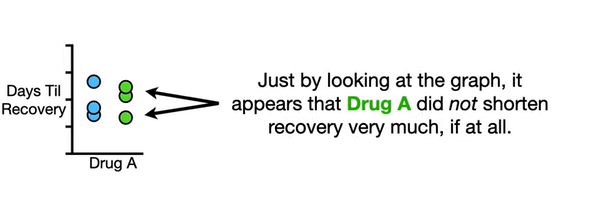
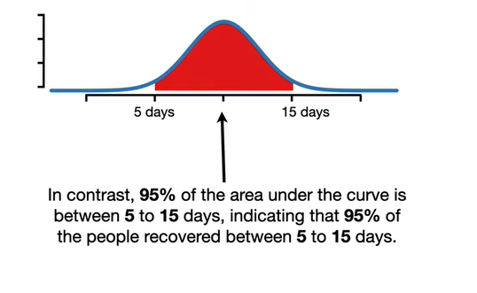
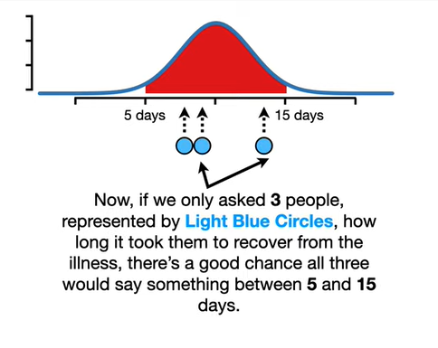
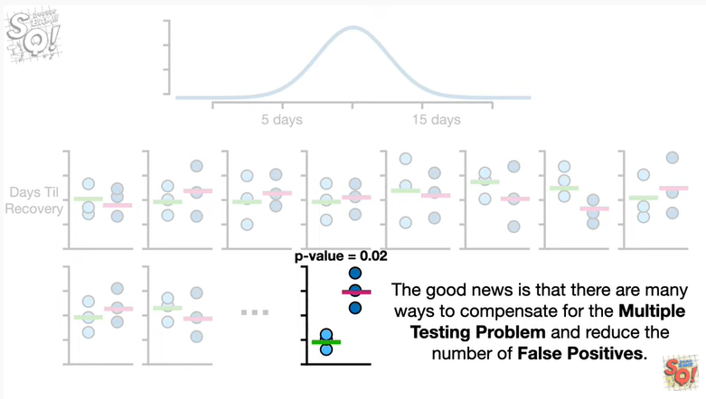
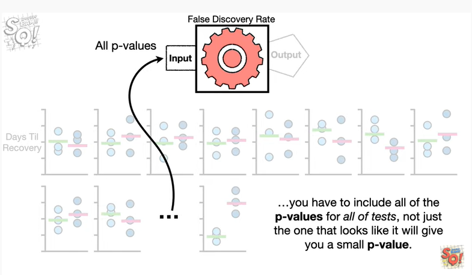
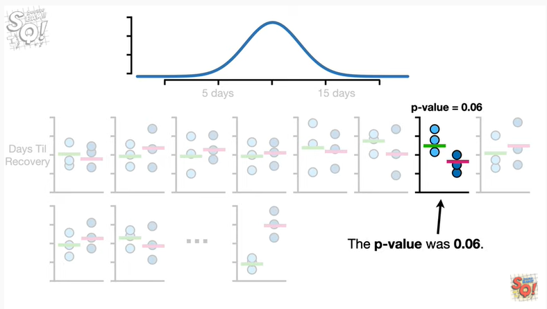
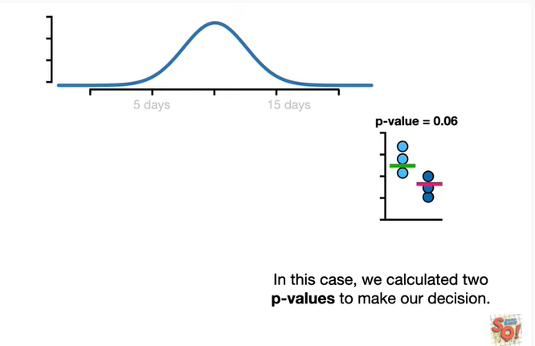

<https://www.youtube.com/watch?v=HDCOUXE3HMM&list=PLblh5JKOoLUK0FLuzwntyYI10UQFUhsY9&index=12>

Today we\'re gonna talk about P hacking what it is and how to avoid it.

Note : this stack quest assumes that you are already familiar with
p-values if not check out the quests.

Imagine there was a virus and we wanted to develop a drug to reduce the
time it took to recover from it.

So he created a bunch of candidate drugs

and we tested each one to find out if any of them worked.

So we measured how long it took for three people to recover from the
virus without any drugs

and then we gave three people drug a and measured how long it took them
to recover.

Just by looking at the graph it appears that drug a did not shorten
recovery very much if at all.

So we measure how long it takes three more people to recover without any
medicine

and then we give three people drug B and measure how long it takes them
to recover.

Again just by looking at the graph it doesn\'t look like drug B helped
people recover any faster than people without any medicine.

So we just keep testing drugs until we get one that really looks like it
does a good job.

And at long last it looks like drugs Z does a great job reducing the
amount of time it takes to recover from the virus.

So we calculate the means of the two groups

and do a statistical test to compare the means and we get a p-value
equal to 0.02.

And since 0.02 is less than 0.05 we reject the null hypothesis which is
that there is no difference between not taking a drug and taking drugs
Z.

BAM ?

No. No BAM.

We just pee hacked !!!!

p-hacking refers to the misuse and abuse of analysis techniques and
results in being fooled by false positives.

However instead of feeling great shame let\'s learn about pee hacking so
we don\'t do it again.

Imagine we measured recovery times for a whole lot of people who did not
take any drugs to fight the virus.

And then we fit a normal distribution to all of the recovery times.

The red area under the curve indicates the percentage of people that
recovered from the illness within a range of possible values.

For example 2.5 percent of the area under the curve is for durations
less than 5 days indicating a 2.5 percent of the people recovered in
less than 5 days.

In contrast 95 percent of the area under the curve is between 5 and 15
days indicating that 95 percent of the people were covered between 5 to
15 days.

Now if we only asked three people represented by light blue circles how
long it took them to recover from the illness there\'s a good chance all
three would say something between five and fifteen days.

And if we asked a different set of three people represented by dark blue
circles there\'s a good chance all three would also say something
between five and 15 days.

Just like before we can plot these two groups of people on a graph

and we can calculate the mean values for the two groups

and compare those two means and get a p-value equal to zero point eight
six.

And because zero point eight six is greater than 0.05 we would fail to
see a significant difference between the two groups of observations.

In other words the p-value did not convince us that the observations
came from two different distributions

and that makes sense because both groups of people came from the exact
same distribution.

Now imagine we asked another group of three people how long it took them
to recover

And we plotted their recovery times and mean value on a graph.

Then we asked another group of three people how long it took them to
recover

and we plotted their recovery times and mean value on the graph.

Again we do a test to compare the two means and we get a p-value equal
to zero point six three.

And since 0.63 is greater than 0.05 we would fail to see a significant
difference between the two groups of observations.

And again this is good because both sets of observations came from the
exact same distribution.

Now imagine we just keep taking two groups of three from the same
distribution and testing to see if they are different

note these two groups almost look like they could be different but the p
value equals 0.06 which is greater than the standard threshold for
significance 0.05.

So we just keep going

and sooner or later we will get something like this.

When we compare the two means the p-value equals zero point zero two.

And that tells us that there is a statistically significant difference
between the two groups

suggesting that the data came from two different distributions which is
incorrect.

Since we know that both samples came from the same distribution the
small p-value is a false positive.

Note : you may remember from the stat quest on interpreting p-values
that setting the threshold for significance to 0.05

means that approximately 5% of the statistical tests we do on data
gathered from the same distribution will result in false positives.

That means if we did 100 tests we would expect about 5 false positives
or 5 percent.

And if we did 10,000 tests we would expect about 500 false positives.

In other words the more tests we do the more false positives we have to
deal with.

Oh no it\'s the dreaded terminology alert doing a lot of tests and
ending up with false positives is called the multiple testing problem.

The good news is that there are many ways to compensate for the multiple
testing problem and reduce the number of false positives.

One popular method is called the false discovery rate.

Shameless self-promotion.

I have a whole stack quest on the false discovery rate the link is in
the description below.

The main idea is that you input the p-values for every single comparison

d ppppp boop boop

and then the false discovery rate does some surprisingly simple
mathematics

and outcome adjusted p-values that are usually larger than the original
p-values.

And ultimately some of the tests that were false positives before end up
with adjusted p-values greater than 0.05.

Like I said I have a whole stack quest on this method if you want to
know more details.

The important thing to know now however is that in order for false
discovery rates or any other method that compensates for multiple
testing to work properly

you have to include all of the p-values for all of the tests not just
the one that looks like it will give you a small p-value.

In other words don\'t cherry-pick your data and only do tests that look
good.

BAM !!!

Now let\'s talk about a slightly less obvious form of p-hacking.

Remember these two groups ?

The p-value was 0.06.

Now we know that both groups came from the same distribution

but typically when we are doing experiments we don\'t know if they both
came from the same distribution or different ones.

And let\'s be honest we usually hope that the observations come from two
different distributions.

In this example we are looking for a new drug to help people so we want
to see an improvement.

So when we get data like this where the p-value is close to 0.05 but not
less than it is very tempting to think hmm I wonder if the p-value will
get smaller if I add more data

So we add one more measurement to each group

and now when we calculate the p-value we get zero point zero two which
is less than 0.05 so we can report a statistically significant
difference.

Hooray.

We got what we wanted right ?

No we P hacked again !

Wah wah.

When a p-value is close to 0.05 like what we had with the original data

there\'s a surprisingly high probability that just adding one new
measurement to both groups

will result in a false positive.

In other words even though using a threshold of 0.05 should only result
in 5% of the bogus test giving us false positives

the theory assumes that we only calculate a single p-value to make a
decision.

In this case we calculated two p-values to make our decision.

The one at the start which was 0.06

then because the first p-value is close to 0.05

we added more data and calculated a second p-value.

In this case we know all of the measurements came from the exact same
distribution so we know this is a false positive.

So how do we keep from making this mistake ?

In order to avoid making this mistake we need to determine the proper
sample size before doing the experiment

and that means we need to do a power analysis.

A power analysis is performed before doing an experiment and tells us
how many replicates we need in order to have a relatively high
probability of correctly rejecting the null hypothesis.

Cool !!!

Where can I learn more about doing a power analysis ??

In the next stack quests we\'ll talk about power and power analyses to
determine the appropriate sample size.

BAM !!!

In summary

if you have a bunch of things you want to test out like a bunch of
different drugs that might help people recover from a virus

don\'t just collect all the data but only calculate a p-value for the
one time things look different.

Instead calculate a p-value for each test and adjust all of the p-values
with something like the false discovery rate.

This will help reduce the probability of reporting a false positive.

And when you do a test and get a p-value close to 0.05 but not quite
less than 0.05

don\'t just add more observations to the data you already have.

Instead use the data you have for a power analysis to determine the
correct sample size.

This will help prevent you from being fooled by a false positive.

Double BAM !!!
