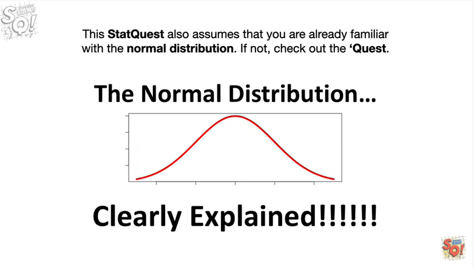
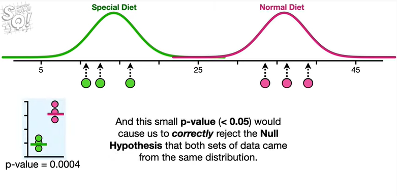
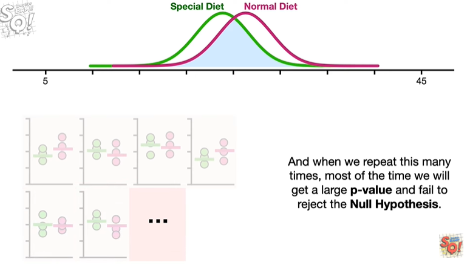

<https://www.youtube.com/watch?v=Rsc5znwR5FA&list=PLblh5JKOoLUK0FLuzwntyYI10UQFUhsY9&index=13>

Today we\'re gonna talk about statistical power and it\'s gonna be
clearly explained.

Note this stat quest assumes that you are already familiar with p-values
if not check out the quests.

This stat quest also assumes that you are already familiar with the
normal distribution.

If not check out the quest.

Let\'s start with two distributions.

The one on the Left represents the weights of mice on a special diet

and the one on the right represents the weights of mice eating normal
Mouse food.

Since there\'s only a little bit of overlap

it\'s pretty easy to see the difference between these two diets.

Most of the mice on the special diet weigh less than the mice on the
normal diet.

And if we collect a small set of measurements from the special diet

and another small set of measurements from the normal diet

and plot these points on a graph and compare their means

then in this case we\'ll get a p-value equal to zero point zero zero
zero four.

And this small p-value less than 0.05 would cause us to correctly reject
the null hypothesis that both sets of data came from the same
distribution.

In other words if this distribution which is somewhere between the
special and normal diets said all data a tums from me then.

Then the small p-value would say in a loud and confident voice

I reject your hypothesis !!!

If we repeated this experiment a bunch of times there\'s a high
probability that each statistical test will correctly give us a small
p-value.

In other words there is a high probability that the null hypothesis that
all of the data came from the same distribution

will be correctly rejected.

But every once in a while we will get something like this where the data
overlap

and when this happens we will get a large p-value greater than 0.05

and that means that even though we know the data came from two different
distributions

we cannot correctly reject the null hypothesis that all of the data
comes from the same distribution.

So the large p-value says in a very small and meek voice.

Dang I can\'t reject the null hypothesis.

That said because these distributions are so far apart

and there is so little overlap

the probability of correctly rejecting the null hypothesis is high.

Power is the probability that we will correctly reject the null
hypothesis.

Alternatively you could say that power is the probability that we will
correctly get a small p-value (\<0.05).

In this example because we have a high probability of correctly getting
a small p-value and rejecting the null hypothesis

we have a large amount of power.

BAM !!!

Note : if there was no difference between the special diet and the
normal diet and they both shared the same distribution

and we collected one set of measurements for mice on the special diet

and one set of measurements for mice on the normal diet then the null
hypothesis that both datasets came from the same distribution would be
true in this case there is no such thing as correctly rejecting the null
hypothesis.

So the concept of power the probability that we will correctly reject
the null hypothesis doesn\'t apply in this situation.

In contrast if this special diet wasn\'t very good at helping mice lose
weight but it still made a difference

then even though there is a lot of overlap

we have two distinct distributions

and that means power the probability that we correctly reject the null
hypothesis, applies.

If we were to weigh three mice on the special diet

and three mice on the normal diet

and plot these points on a graph and compare their averages

then in this case we will get a p-value equal to 0.34

that means we will fail to reject the null hypothesis that both groups
come from the same distribution.

This is a bummer because in this case we know the data comes from two
different distributions.

And when we repeat this many times most of the time we will get a large
p-value and fail to reject the null hypothesis.

However every once in a while we will get something like this where the
data do not overlap

and we will correctly get a small p-value (\<0.05)

when this happens even though the null hypothesis says all day today
comes from me.

The small p-value will say in a loud and confident voice

I reject the null hypothesis !!!

So out of all these tests this was the only one that gave us a p-value
small enough that we correctly rejected the null hypothesis.

And that means when there is a lot of overlap between the two
distributions and we have a small sample size we have a relatively low
power.

Medium BAM.

The good news is that we can always increase power by increasing the
number of measurements we collect

and a power analysis will tell us how many measurements we need to
collect to have a good amount of power.

Shameless self-promotion.

We\'ll talk more about how and why we can increase power in the stat
quest on power analyses.

BAM !!!

In summary

power is the probability that we will correctly reject the null
hypothesis.

When we have two distributions that have very little overlap

we will have a lot of power because there is a high probability that we
will correctly reject the null hypothesis.

However when the two distributions overlap a lot

and if we have a small sample size we will have a small amount of power.

However if we want more power we can increase the sample size.

Lastly a power analysis will tell us how many measurements to collect to
have a good amount of power.

Double BAM !!!
