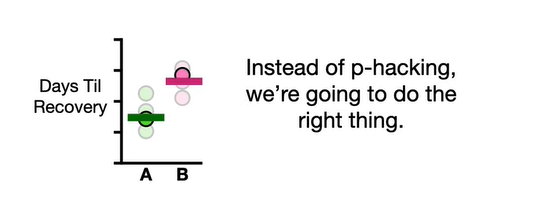
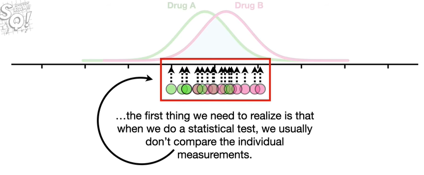
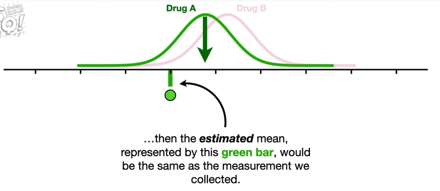
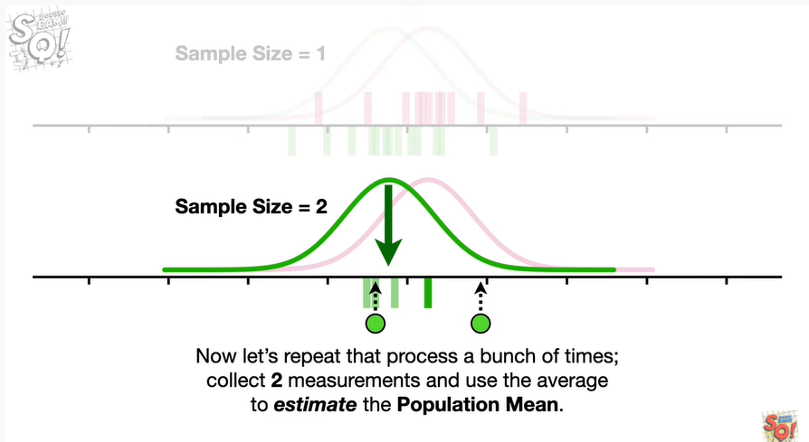
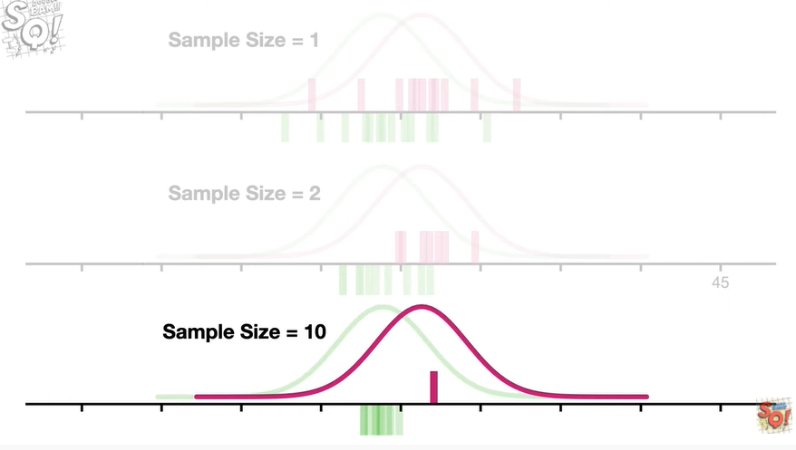

<https://www.youtube.com/watch?v=VX_M3tIyiYk&list=PLblh5JKOoLUK0FLuzwntyYI10UQFUhsY9&index=14>

Today we\'re going to talk about power analysis and it\'s going to be
clearly explained.

Note : this stat quest assumes that you are already familiar with what
power means.

If not check out the quest.

It would also be helpful if you understood the difference between
population parameters and estimated population parameters.

If not check out the quest.

Lastly because we do a power analysis to avoid p hacking, you should be
familiar with that topic as well.

Imagine there was a virus

and we had two drugs that we could use to treat it.

So we see how long it takes for three people using drug a to recover
from the virus

and we see how long it takes three people using drug b to recover.

Just looking at the data makes us think that drug a might be better
since those people tended to recover from the virus more quickly.

So we calculate the means for both drugs

and do a statistical test to compare the means and get a p-value equal
to 0.06.

Because the p-value is greater than 0.05 the threshold that we are using
to define a statistically significant difference

we can\'t say that drug a is better than drug b.

In other words even though we suspect that the measurements for drug a
represent this distribution

and the measurements for drug b represent this other separate
distribution

because the p-value 0.06 is greater than 0.05 we cannot reject the idea
that maybe all of the measurements represent the same distribution in
the middle.

Because we suspect that the measurements represent two different
distributions and the p-value 0.06 is just a little bit bigger than
0.05.

it is tempting to give one more person drug A and give another person
drug b

and recalculate the means

and then redo the statistical test.

However we must resist this temptation because that would be p hacking
and we don\'t want to do that.

Instead of p hacking we\'re going to do the right thing.

We\'re going to do a power analysis to determine the sample size for the
next time we do this experiment.

A power analysis determines what sample size will ensure a high
probability that we will correctly reject the null hypothesis that there
is no difference between the two groups.

In other words if we use the sample size recommended by the power
analysis we will know that regardless of the p-value we used enough data
to make a good decision.

Power is affected by several things however there are two main factors :

one how much overlap there is between the two distributions we want to
identify with our study

two the sample size the number of measurements we collect from each
group.

For example if i want to have power equal to 0.8 meaning i want to have
at least an 80 chance of correctly rejecting the null hypothesis

then if there is very little overlap a small sample size will give me
power equal to 0.8.

However the more overlap there is between the two distributions

the larger the sample size needs to be in order to have power equal to
0.8.

To understand the relationship between overlap and sample size

the first thing we need to realize is that when we do a statistical test
we usually don\'t compare the individual measurements.

Instead we compare summaries of the data for example we often compare
the means.

So let\'s see what happens when we calculate means with different sample
sizes.

First let\'s focus on the distribution for drug A.

The population mean for drug A is represented by this green arrow.

Typically when we do an experiment we don\'t know the population mean
and instead have to estimate it.

So if we collected one measurement and use that one measurement

to estimate the population mean for drug A

then the estimated mean represented by this green bar would be the same
as the measurement we collected.

Now let\'s get rid of the measurement but keep the estimated mean

and collect a new measurement

and use it to estimate the population mean.

Now let\'s collect more measurements and use each one to estimate the
population mean.

Note : we occasionally get a wonky point that is really far from the
population mean

and when that happens the estimated mean is also pretty wonky and really
far from the population mean.

Now compared to the population mean for the distribution

we see that the estimated means are all over the place.

In other words there\'s a lot of variation in the estimated means.

And all this variation makes it hard to be confident that any single
estimated mean is a good estimate of the population mean.

Sure some of the estimated means are close to the population mean

but others are pretty far away.

And since 25 of the area under the curve is relatively far from the mean
and off to the left

25 of the measurements should be far from the mean and off to the left

and since in this case a single measurement is the same as the estimated
mean 25 percent of the estimated means should be pretty far off to the
left.

Likewise another 25 percent of the estimated means should be pretty far
off to the right.

In summary when we only use one measurement to estimate the population
mean the probability that we\'ll get something far from it is too high
for us to be confident that we have a good estimate.

Now let\'s do the same thing for drug B

collect one measurement and use that to estimate the population mean.

Now let\'s do that a bunch of times

just like before compared to the population mean for the distribution

the estimated means are all over the place.

And just like before fifty percent of the estimated mean should be
pretty far to the left or right of the population mean.

And when we only use one measurement to estimate the population mean the
probability that we\'ll get something far from it is too high for us to
be confident in our estimate.

And because we don\'t have a lot of confidence in the estimated means
we\'ll end up with a relatively large p-value.

And that means we will not correctly reject the null hypothesis.

In other words if this distribution said all data comes from me

then due to all of the variation in the estimated means we\'d say in a
small meek voice

dang i can\'t reject the null hypothesis.

Bam !

Now let\'s collect two measurements at one time

and use the average to estimate the population mean.

Now let\'s repeat that process a bunch of times collect two measurements
and use the average to estimate the population mean.

Note : just like before we occasionally get a wonky point that is really
far from the population mean.

However the other point we measured compensates for the wonky point and
prevents the estimated mean from being too far from the population mean.

In other words even though there is a 25 probability that we will get a
measurement way out on the left side

there is a 75 probability that the next measurement will be in this
range and pull the estimated mean back to the population mean.

In summary when we use more than one measurement to estimate the
population mean

extreme measurements have less effect on how far the estimated mean is
from the population mean

and as a result the estimated means are closer to the population mean

compared to the means we estimated with a single observation.

This suggests that we should have more confidence that averages
estimated with two observations will be closer to the population mean
than averages estimated with one observation.

Now let\'s collect two measurements each time for drug b and use their
average to estimate the population mean.

Again when we use two measurements we can have more confidence that the
estimated means are closer to the population mean

compared to the means we estimated with a single observation.

Bam !!!

Now imagine we did the same thing only this time we collected 10
measurements

and used them to estimate the population mean.

Then we repeated that process collected 10 measurements and then
estimated the population mean a bunch of times

then we did the same thing for drug b.

Now we see that the more measurements we use for each estimate the
closer they are to the population main

and the more confidence we can have that an individual estimated mean
will be close to the population mean.

In this example the estimated means are so close to the population means
that they no longer overlap.

And that suggests there is a high probability that we will correctly
reject the null hypothesis that both samples were taken from the same
distribution.

In other words even when the distributions overlap if the sample size is
large we can have high power.

Bam !!

Note : although we used normal distributions in this example

the central limit theorem tells us that these results apply to any
underlying distribution.

Shameless self-promotion.

For more details about the central limit theorem check out the quest.

The link is in the description below.

Now at long last let\'s talk about how to actually do a power analysis.

First remember that a power analysis will tell us what sample size we
need to have power.

So the first thing we need to decide is how much power we want.

Although we can pick any value between 0 and 1 for power a common value
is 0.8 so let\'s use that.

That means we want an 80 probability that we will correctly reject the
null hypothesis.

The second thing we need to do is determine the threshold for
significance often called alpha.

We can use any value between 0 and 1 but a very common threshold is 0.05
so we\'ll use that.

Lastly we need to estimate the overlap between the two distributions.

Overlap is affected by both the distance between the population means

and the standard deviations.

A common way to combine the distance between the means and the standard
deviations into a single metric

is to calculate an effect size which is also called d.

In the numerator we have the estimated difference in the means

and in the denominator we have the pooled estimated standard deviations.

One of the simplest ways to pool the estimated standard deviations

is the square root of the sum of the squared standard deviations divided
by 2

where the green s represents the estimated standard deviation for the
green distribution

and the purple s represents the estimated standard deviation for the
purple distribution.

Note : there are tons of other ways to calculate effect sizes and this
is just one of them

so when you do a power analysis you may have to do a little research
about how to estimate the overlap.

However in general the mean and standard deviations can be estimated
with prior data a literature search or in a worst case scenario an
educated guess.

In this case the original data suggests that the difference between the
two means is ten

and the estimated standard deviations are seven and six

so we plug those into the formula for the pooled standard deviation

and we get six point five

so the effect size is 1.5.

Once we know the effect size and the amount of power we want and the
threshold for significance

we google statistics power calculator pretty much every statistics
department in the world has one online.

Then we plug in the numbers.

I got sample size equals nine this means that if i get nine measurements
per group i will have an eighty percent chance that i will correctly
reject the null hypothesis.

Double bam !!!

In summary

when two distributions overlap we need a relatively large sample size to
have a lot of power.

When the sample size is small

we have low confidence that the estimated means

are close to the population means

and that lack of confidence is reflected in a low probability that we
will correctly reject the null hypothesis.

In contrast when we increase the sample size

we have more confidence that the estimated means are close to the
population means

because extreme observations have less effect on the location of the
estimated means

and the closer the estimated means are to the population means the less
the means from the different distributions will overlap

and that increases the probability that we will correctly reject the
null hypothesis.

And when you have a high probability that we will correctly reject the
null hypothesis you have high power.

Triple bam !!!
