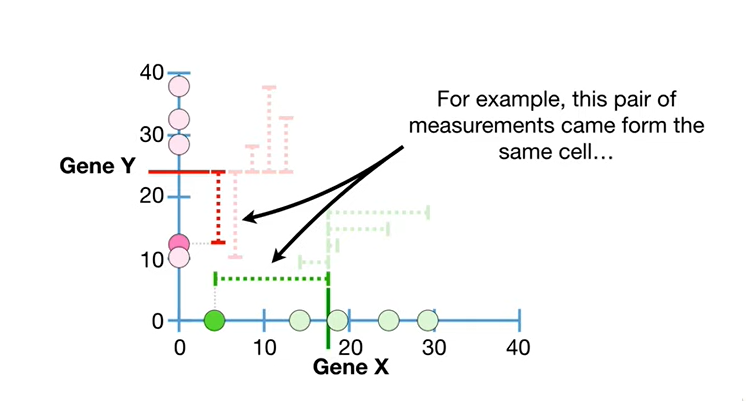
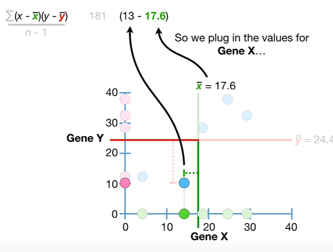

<https://www.youtube.com/watch?v=qtaqvPAeEJY&list=PLblh5JKOoLUK0FLuzwntyYI10UQFUhsY9&index=15>

Today we\'re going to talk about covariance and this is part 1 in a
two-part series on covariance and correlation.

Note : this stack quest assumes that you are already familiar with the
concept of variance.

If not check out the quest.

The link is in the description below.

In the stack quest on variance we\'ve started with the number of mRNA
transcripts for gene X from 5 different cells.

And if mRNA transcripts aren\'t your thing you could think that we
counted the number of green apples in five different grocery stores.

Then we estimated the mean x-bar

and then we estimated the variance.

De Do Boop BAM.

And that\'s our review of variance.

Now imagine that in addition to counting mRNA transcripts for gene X we
also counted gene Y transcripts in the same 5 cells.

Alternatively you can imagine we counted the number of red apples in the
same 5 grocery stores.

Note : if you\'re wondering why gene Y is perpendicular to gene X don\'t
sweat it the reason will become clear in just a bit.

anyway just like we did for gene X we can estimate the mean for gene y

and since gene Y is on the y axis we will use Y bar to represent its
mean value

and we can estimate the variance T 2 2 2 2
2 2 2 2 2 2 2

BAM !!!

So far we\'ve estimated the mean and variance for two different genes
measured in the same five cells.

Alternatively you could imagine we estimated the mean and variance for
two different types of apples counted in the same five grocery stores.

Since these measurements were taken from the same cells or the same
grocery stores we can look at them in pairs.

For example this pair of measurements came from the same cell

and both measurements are less than their respective mean values.

This pair of measurements came from another cell

and both measurements are greater than their respective mean values.

Since the measurements were taken in pairs the question is : do the
measurements taken as pairs tell us something that the individual
measurements do not ?

Covariance is one way to try to answer this question.

Since the measurements came from the same cells or grocery stores we can
plot each pair as a single dot by combining the values on the x and y
axes.

Now generally speaking we see that cells with relatively low values for
gene X also have relatively low values for gene Y

and cells with relatively high values for gene X also have relatively
high values for gene Y.

This relationship low measurements for both genes and some cells and
high measurements for both genes and other cells can be summarized with
this line.

Note : the line that represents this particular relationship has a
positive slope

and it reflects the positive trend where the values for gene X and gene
Y increase together.

In other words if you told me that there were a lot of transcripts for
gene X in a cell

then the trend suggests that the same cell should have a large number of
transcripts for gene Y.

Likewise if you told me that you had a low value for gene Y

then the trend suggests that the same cell should have a small number of
transcripts for gene X.

If the data had looked like this

and relatively low values for gene X correspondent with relatively high
values for gene Y

and relatively high values for gene X correspondent with relatively low
values for gene Y

then the relationship would have a negative slope

and reflect the negative trend that the values for gene X increase as
the values for gene y decrease.

If the data had looked like this

and every value for gene X was paired with the same value for gene Y

then there would be no trend positive or negative between gene X and
gene Y.

This is because if you told me that you got the same measurement for
gene Y found in all of the other cells

then we would not know if the same cell should have a relatively small
value for gene X

or a relatively large value

or any other value.

Likewise if every value for Jean Y was paired with the same value for
Jean X there would be no relationship.

This is because if you told me that you got the same measurement for
gene X found in all of the other cells

then we would not know if the same cell should have a relatively small
value for gene T

or a relatively large value

or any other value.

The main idea behind covariance is that it can classify three types of
relationships.

1\. relationships with positive trends.

2\. relationships with negative trends

and 3. times when there is no relationship because there is no trend.

Okay we just covered the main idea behind covariance.

It\'s so important that I\'m going to repeat it, covariants can classify
these three types of relationships :

1.  relationships with positive trends

2.  relationships with negative trends

3.  and 3 times when there is no relationship because there is no trend.

BAM !!!

The other main idea behind covariance is kind of a bummer.

Covariance in and of itself is not very interesting.

What I mean by this is that you will never calculate covariance and be
done for the day.

Instead covariance is a computational stepping-stone to something that
is interesting like correlation.

Like repeating myself let me repeat the second main idea behind
covariance.

Covariance is a computational stepping-stone to something that is
interesting like correlation.

La covariance est un tremplin informatique vers quelque chose qui est
intéressant, comme la corrélation

So let\'s talk about how covariance is calculated

covariance is calculated with a slightly nasty looking thing

to get an intuitive sense for how covariance is calculated let\'s go
back to the mean value for gene X

and extend the green line to the top of the graph

and then extend the red line that represents the mean for Jean why to
the edge of the graph.

Now let\'s focus on the leftmost data point.

Since it\'s to the left of the solid green line we see that it is less
than the mean value for gene X

and since it is below the solid red line we see that it is less than the
mean value for gene y.

Now let\'s plug in the gene X measurement for this cell

and the main value for gene X

and that gives us this difference

which is negative since it is to the left of the mean.

Now let\'s plug in the gene Y measurement for this same cell

and the mean value for gene Y and that gives us this difference

which is negative because it is below the mean

and since both differences are negative

multiplying them together gives us a positive value.

Now we do the same thing for the next data point.

Again since it is to the left of the solid green line we can see that it
is less than the mean for gene X

and since it is below the solid red line we can see that it is less than
the mean for gene Y

so we plug in the values for gene X

and that gives us a negative difference.

Now we plug in the values for gene Y

and that gives us another negative difference.

Again since both differences are negative multiplying them together
gives us a positive value.

So we see that when the values for gene X and gene Y are both less than
their respective averages we end up with positive values.

BAM !!!

The remaining three cells are to the right of the solid green line so we
see that they are all greater than the average value for gene X

and they are all above the solid red line so we see that they are also
greater than the average value for gene y

thus when we plug in the values

and do the math

we end up with positive values

too in the math I\'m doing the math hip-hip-hooray I\'m doing the math
hip hip hooray hip hip hooray.

So we see that when both values are greater than their respective means
we end up with positive numbers.

In summary data in these two quadrants contribute positive values to the
total covariance.

Bamm.

Hooray.

We\'ve calculated these terms for each cell

the Sigma tells us to add up each term

and then we divide by the number of measurements in which in this case
is 5-1

and ultimately we end up with a covariance equal to 116.

Since the covariance value 116 is positive it means that the slope of
the relationship between gene X and gene Y is positive.

In other words when the covariance value is positive we classify the
trend as positive.

Double bam !!!

Note : the covariance value itself isn\'t very easy to interpret and
depends on the context.

For example the covariance value does not tell us if the slope of the
line representing the relationship is steep

or not steep.

It just tells us that the slope is positive.

More importantly the covariance value doesn\'t tell us if the points are
relatively close to the dotted line

or relatively far from the dotted line.

Again it just tells us that the slope of the relationship is positive.

Note we\'ll talk about why the covariance value is so hard to interpret
later.

And remember even though covariance is hard to interpret it is a
computational stepping stone to more interesting things.

BAM !!!

Now let\'s imagine we got different values for gene Y.

Just like before we can graph the data using pairs of X and y-axis
values.

The mean value for gene X is the same as before seventeen point six

and the mean value for jean y is 20 point 2.

Now let\'s focus on the data point on the far left.

Since the measurement for gene X is to the left of the solid green line
we can see that it is less than the mean value.

However the measurement for gene Y is above the solid red line so we see
that it is greater than the mean value.

Thus when we plug in the numbers and do the math

we end up with a negative number.

And the same thing happens to the next data point

we end up with a negative number.

So if one value is less than its mean and one value is more than its
mean we end up with a negative number.

BAM !!!

Likewise these cells also result in negative numbers because they are
greater than gene X\'s mean and less than gene Y's mean.

In summary data in these quadrants contribute negative values to the
covariance.

Now we add up each term

and then we divide by the number of measurements in which is 5-1.

And ultimately we end up with a covariance equal to negative 100 5.15.

Since the covariance value negative 100 5.15 is negative it means that
the slope of the relationship between gene X and Gen Y is negative.

Again covariance doesn\'t tell us if the slope is steep or not

and more importantly covariance doesn\'t tell us if the points

or relatively close to the line or relatively far

just that the slope is negative.

BAM !!

Now let\'s calculate the covariance for when there is no trend.

In this case every value for gene X corresponds to the same value for
gene Y.

First we calculate the means

then we do the math for the first point

the difference from gene X\'s average is negative 14 point 6

and the difference from jean Weis average

is zero and anything times zero is zero.

So the value for the first data point is zero.

Likewise because the differences between the gene y-values in the gene y
average are all 0 all of the remaining terms are 0

Doing the rest of the math gives us 0 in the numerator and the whole
thing equals 0.

Likewise when every value for Jean Y corresponds to the same value for
gene X the covariance equals zero.

In this last case we can see that even though there are multiple values
for gene x and y there is still no trend because as gene X increases
gene Y increases and decreases.

In other words the negative value for this point

is cancelled out by this positive point

and this positive point

is canceled out by this negative point

and the covariance equals zero.

So we see that the covariance equals zero when there is no relationship
between gene X and gene y.

Double BAM !!!

Now let\'s talk about why the covariance value is hard to interpret.

To see why the covariance value is difficult to interpret let\'s go all
the way back to looking at just gene X

and calculate the covariance between gene X and itself.

Just like before we can plot the data

and mean value for gene X is the same as before 17.6

and we use 17.6 on the y-axis as well.

Now we are ready to calculate the covariance.

Note : in this case the same data are on both axes and that means x
equals y and x bar equals y bar

so we can replace Y with X and y bar with X bar

and then we can multiply X minus X bar times X minus X bar

and we are left with a formula for estimating variance.

In other words the covariance for gene X with itself is the same thing
as the estimated variance for gene X.

Now when we do the math we get 102.

Since the covariance value is positive we know that the relationship
between gene X and itself has a positive slope.

So let\'s move the graph and the covariance value over here

and see what happens when we multiply the data by two.

Now the X and y axis labels on the right are twice what they are on the
left

and the new mean values are twice what they were before

but the relative positions of the data did not change

and each dot still falls on the same straight line with positive slope.

In other words the only thing that changed was the scale that the data
is on.

However when we do the math we get covariance equals four hundred eight

which is four times what we got before.

Thus we see that the covariance value changes even when the relationship
does not.

In other words covariance values are sensitive to the scale of the data
and this makes them difficult to interpret.

The sensitivity to scale also prevents the covariance value from telling
us if the data are close to the dotted line that represents the
relationship

or far from it.

In this example the covariance on the left when each point is on the
dotted line is 102

and the covariance on the right when the data are relatively far from
the dotted line is 381.

So in this case when the data are far from the line the covariance is
larger.

Now let\'s just change the scale on the right hand side

and recalculate the covariance

and now the covariance is less for the data that does not fall on the
line.

If you\'re thinking I sure wish there was something to describe
relationships that wasn\'t sensitive to the scale of the data then
you\'re in luck.

Calculating covariance is the first step in calculating correlation.

Correlation describes relationships and is not sensitive to the scale of
the data

and we\'ll talk about correlation more in the next video in this series.

It\'s also worth mentioning that covariance values are used as stepping
stones in a wide variety of analyses.

For example covariance values were used for principal component analysis
PCA and are still used in other settings as computational
stepping-stones to other more interesting things.

BAM.

In summary covariance is a way to classify three types of relationships.

1\. when the covariance is positive it means the relationship has a
positive slope

2\. when the covariance is negative it means the relationship has a
negative slope.

and 3. when covariance equals zero there is no relationship because
there is no trend.

The covariance value itself is difficult to interpret however it is
useful for calculating correlations and in other computational settings.
