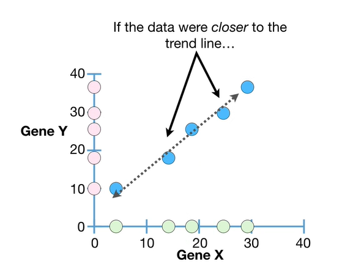
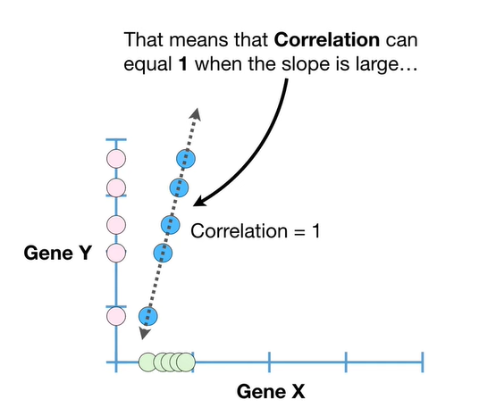
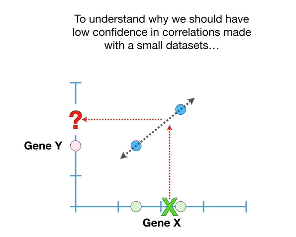
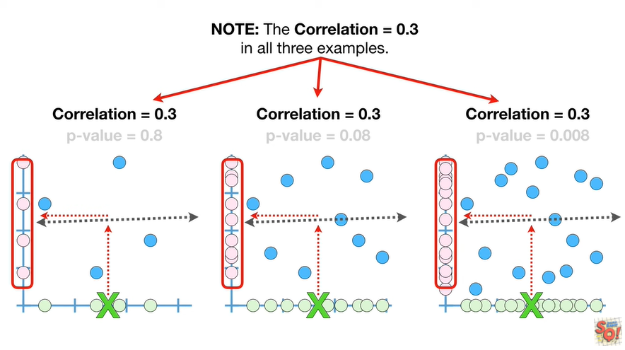
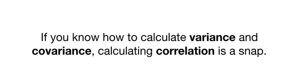
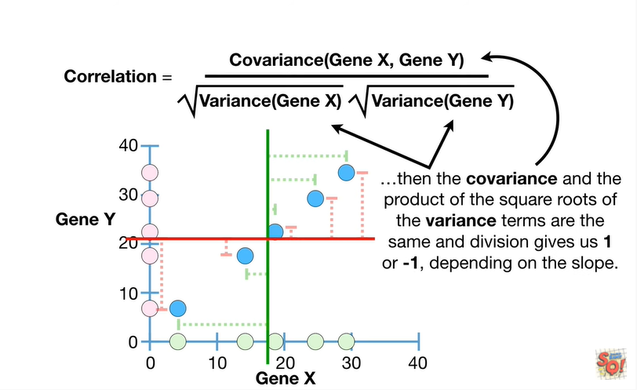
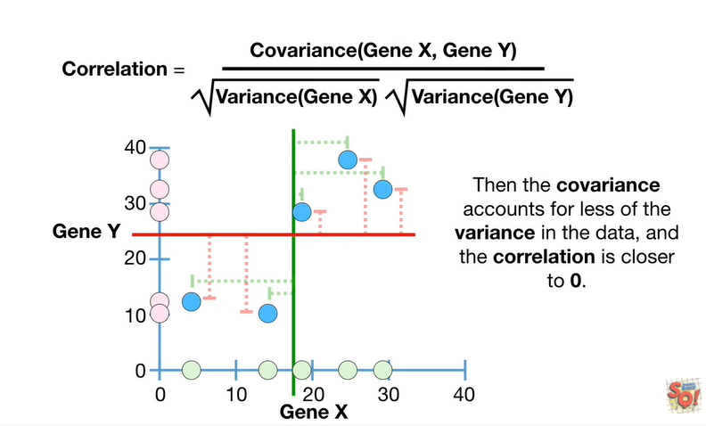
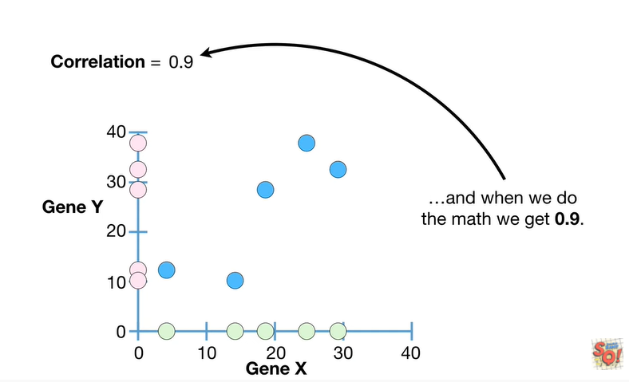
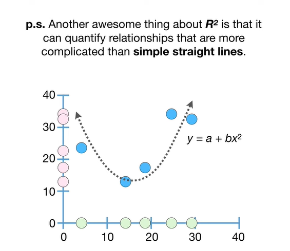
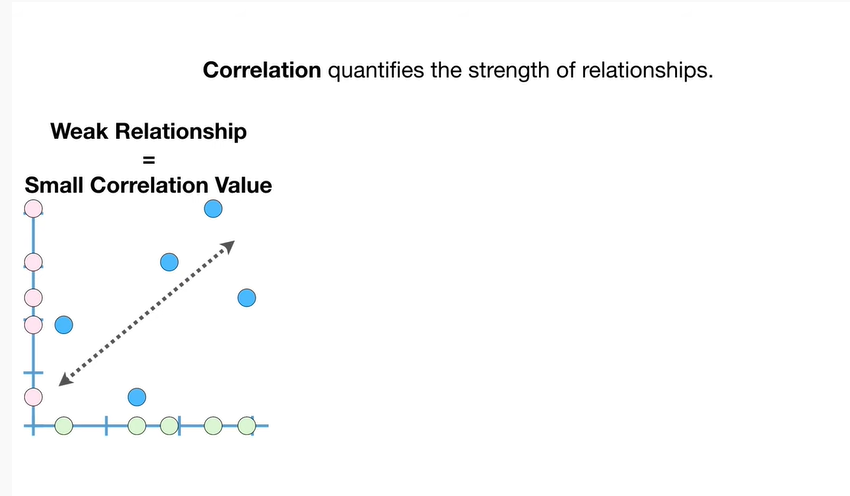

<https://www.youtube.com/watch?v=xZ_z8KWkhXE&list=PLblh5JKOoLUK0FLuzwntyYI10UQFUhsY9&index=16>

Today is part two in our series on covariance and correlation.

This time we\'re going to talk about correlation.

However before we dive deep into correlation, I want to talk about
relationships.

Not the fun and/or confusing kind we sometimes find ourselves in will
you hold my hand um you don\'t have a hand you\'re just a stick figure
dang.

Instead I want to talk about the relationships between data on the
x-axis

and data on the y-axis.

In this example we\'re looking at mRNA transcripts from gene X in five
different cells on the x-axis

and from gene Y, in the same five different cells, on the y-axis.

However if mRNA transcripts doesn\'t mean anything to you imagine we
went into five different grocery stores and put the number of green
apples on the x-axis in the number of red apples on the y-axis

Each pair of measurements were taken from a single cell or grocery store
and can be represented by a blue dot.

We can see that in general relatively low values for gene X are paired
with relatively low values for gene Y

and relatively high values for gene X are paired with relatively high
values for gene y.

We can use a straight line with a positive slope to represent this
trend.

And if someone told us that they collected a new measurement for gene X,
20

then we can use the line to predict that when gene X equals 20

then the value for gene Y should be somewhere around 27.

Alternatively if someone gave us a value for gene Y

we could use the trend to predict a range of values for gene X.

In both cases we made guesses based on the trend we observed in the
data.

If the data were closer to the trend line

then given a gene X value we might guess that the value for gene Y falls
in a smaller range.

In this case the closer the data are to the line the more gene X can
tell us about gene y.

Alternatively we could say that the relationship between gene X and gene
Y is relatively strong.

The data were further from the trend line

then we might guess that the value for gene Y falls in a larger range.

In this case we could say that the values for gene X tell us less about
the values for gene y.

Alternatively we could say that the relationship between gene X and gene
Y is relatively weak.

Note : just to be clear all we are saying is that we observed that low
values for gene X

tend to be paired with low values for gene Y

and that high values for gene X tend to be paired with relatively high
values for gene Y

and that this observation suggests a trend

that we can use to make predictions and inferences aka educated guesses.

We are not saying that a low value for gene X

causes gene Y to have a low value

or that a high value for gene Y

causes gene X to have a high value.

In other words we are not ruling out the possibility that something else
causes the trend that we observe.

Small bam.

so far we have looked at a relatively weak relationship

and a relatively strong relationship.

We can quantify the strength of a relationship with correlation.

In other words these data with a relatively weak relationship have a
small correlation value

these data with a moderate relationship have a moderate correlation
value

and these data with a strong relationship have a relatively large
correlation value.

The maximum value for correlation is 1.

Correlation equals one when a straight line with a positive slope can go
through the center of every data point.

This means that if someone gave us a value for gene X

then we could guess that gene y had a value in a very very narrow range.

Note : correlation does not depend on the scale of the data.

In fact I intentionally omitted putting numbers on the axes because they
do not affect correlation at all.

In other words regardless of the scale of the data correlation equals
one when a straight line with a positive slope can go through all of the
data.

That means that correlation can equal one when the slope is large

and when the slope is small.

Note : when a straight line with a positive slope goes through the data
correlation equals one regardless of how much data we have.

For example if we only had two data points

then we can draw a straight line with a positive slope by just
connecting the two dots

and then correlation equals one and that makes the relationship appear
strong

but we should not have any confidence in predictions made with this line

because we have so little data.

To understand why we should have low confidence in correlations made
with small datasets.

let\'s start with an empty graph

and draw two random points on it

then just like before we could draw a straight line that goes through
the center of each point just by connecting the dots

and that means correlation equals one for these two randomly drawn dots.

In fact we can always draw a straight line between any two random dots.

Now let\'s go back to the original data and imagine that instead of two
pairs of measurements

we had three pairs of measurements.

Now just like before since we can draw a straight line through all three
points correlation equals one.

however now we can have more confidence in the predictions we make with
this line.

This is because if we started with an empty graph and drew three random
points on it

then even though it\'s easy to draw a straight line to connect any two
points

there is a very small chance that we will be able to draw a straight
line through all three points.

Ultimately the probability that we can connect three randomly drawn
points with a straight line is very small

and thus we can have more confidence that the observed correlation
isn\'t just the result of random chance.

In general the more data we have

the more confidence we have in the predictions we make with the line

because the probability that we can draw a straight line through the
same number of randomly placed points gets smaller and smaller with each
additional point.

Note : we could draw a squiggly line that connects all of the dots

but when we\'re talking about correlation were only talking about using
straight lines.

Oh no it\'s the dreaded terminology alert !!!

For correlation a p-value tells us the probability that randomly drawn
dots will result in a similarly strong relationship or stronger.

Thus the smaller the p-value the more confidence we have in the
predictions we make with the line.

In this case the p-value is crazy small 2.2 times 10 to the negative 16

which means that the probability of random data creating a similarly
strong or stronger relationship is crazy small.

To summarize what we\'ve talked about so far.

The maximum value for correlation, 1, occurs whenever you can draw a
straight line with a positive slope that goes through all of the data

and our confidence in how useful the relationship is depends on how much
data we have.

Of these three examples we should have the least confidence in this
relationship since it is supported by the least amount of data

and we should have the most confidence in this relationship since it is
supported by the most data and has the smallest p-value.

BAM !!!

When a straight line with a negative slope can go through the center of
every data point then the correlation equals negative one.

Since a straight line can go through all of the data points correlation
equals negative one implies that there is a strong relationship in the
data

and if someone gives us a value for gene X

then we can guess a value for gene Y within a very narrow range.

Just like before our confidence in that guess which we quantify with a
p-value depends on how much data we have.

If we had a lot of data we could have a lot of confidence in the guess
because the p-value would be super small

and the less data we have the less confidence we have in the guess
because the p-value gets larger.

Just like before as long as a straight line goes through all of the data
and the slope of the line is negative correlation equals negative one
when the slope is large

and when the slope is small.

BAM !!!

So far we\'ve seen that when the slope of the line is negative the
strongest relationship has correlation equal to negative one

and when the slope of the line is positive the strongest relationship
has correlation equal to one.

In both cases if a straight line cannot go through all of the data then
we will get correlation values closer to zero

and the worse the fit the closer the correlation gets to zero

and when there is no relationship that we can represent with a straight
line correlation equals zero.

When correlation equals zero a value on the x-axis

doesn\'t tell us anything about what to expect on the y-axis

because there is no reason to choose one value over another.

BAM !!!

As long as the correlation value is not zero

we can still use the line to make inferences

but our guesses become more refined the closer the correlation values
get to negative one or one

and just like before our confidence in our inferences depends on the
amount of data we have collected and the p-value.

In the left graph we have very little confidence in the trim because we
have very little data and the p value equals 0.8.

In the middle we have moderate confidence in the trend because we have
more data and the p value equals 0.08.

On the right we have a lot of confidence in the trend because we have
even more data in the p value equals zero point zero zero eight.

Note : the correlation equals zero point three in all three examples.

In this case increasing the sample size did not increase correlation and
that means adding data did not refine our guests.

All it did was increase our confidence in the guess.

Thus our guesses will probably be pretty bad in all three cases.

However we\'ll have the most confidence in the bad guest that came from
this data.

In other words just because you have a lot of data and you have a lot of
confidence in your guess

if the correlation value is small your guests will still be bad.

Double bam !!!

If you know how to calculate variance and covariance calculating
correlation is a snap.

Note : if you\'re not already familiar with the concepts of variance and
covariance check out the quests the links are in the description below.

If this were the data

then the correlation equals the covariance of gene X and gene Y divided
by the square root of the variance for gene X times the square root of
the variance for gene y.

As we saw in the stat quest on covariance the numerator can be any value
between positive and negative infinity depending on

whether the slope of the line that represents the relationship is
positive or negative.

How far the data are spread out around the means

and the scale of the data.

Thus when we calculate correlation the denominator squeezes the
covariance to be a number from negative 1 to 1.

In other words the denominator ensures that the scale of the data does
not affect the correlation value and this makes correlations much easier
to interpret.

When the data all fall on a straight line with a positive or negative
slope

then the covariance and the product of the square root of the variance
terms are the same and division gives us 1 or negative 1 depending on
the slope.

When the data do not fall on a straight line with a positive or negative
slope.

Then the covariance accounts for less of the variance in the data and
the correlation is closer to zero.

As we saw in the stat quest on covariance the covariance value for this
data is 116

so the denominator will squeeze 116 down to a value from negative 1 to
1.

The variance in the gene X data is 100 1.8

and the variants in the gene Y data is 160 point 3

and when we do the math we get 0.9.

Like I mentioned earlier we can quantify our confidence in this
relationship with a p-value.

The smaller the p-value the more confidence we can have in the guesses
we make.

In this case the p-value is 0.03.

That means that there is a 3% chance that random data could produce a
similarly strong relationship or stronger.

Triple bam !!!!

Before we go there\'s one last important thing I want to mention about
correlation.

Even though correlation values are way easier to interpret then
covariance values they are still not super easy to interpret.

For example it\'s not super obvious that this relationship where
correlation equals zero point nine is twice as good as making
predictions as

this relationship where correlation equals zero point six four.

The good news is that R squared which is related to correlation solves
this problem.

The better news is that if you want to learn more about r-squared, you
can check out these quests.

The links are in the description below.

PS : another awesome thing about R squared is that it can quantify
relationships that are more complicated than simple straight lines.

In summary

correlation quantifies the strengths of relationships if you have a weak
relationship then you will have a small correlation value.

if you have a moderate relationship then you\'ll have a moderate
correlation value

and if you have a strong relationship then you will have a large
correlation value.

Correlation values go from negative one which is the strongest linear
relationship with a negative slope

to one which is the strongest linear relationship with a positive slope.

In both cases if a straight line cannot go through all of the data then
we will get correlation values closer to zero

and the worse the fit the closer the correlation values get to zero

and when there is no relationship that we can represent with a straight
line correlation equals zero.

Lastly our confidence in the inferences depends on the amount of data we
have collected and the p-value the more data we have the smaller the
p-value.

And the more confidence we have in our inferences.

BAM !!!!
