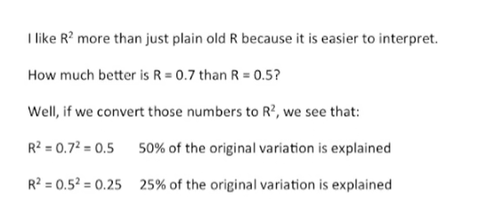

<https://www.youtube.com/watch?v=2AQKmw14mHM&list=PLblh5JKOoLUK0FLuzwntyYI10UQFUhsY9&index=17>

In this video we\'re going to talk about R squared.

R squared is a metric of correlation that is easy to compute and
intuitive to interpret.

Most of us are already familiar with correlation and the standard metric
of.

It plain old our correlation values that are close to 1 or negative 1
are good and tell you that two quantitative variables for example weight
and size are strongly related.

Correlation value is close to zero are lame.

Some of you may be asking why should we care about r-squared ?

We already have regular are some of you might just be asking what is R
squared ?

R squared is very similar to its hipper cousin are but interpretation is
easier.

For example it\'s not obvious that when R equals 0.7 that\'s twice as
good a correlation as when R equals 0.5.

However R squared equals 0.7 is what it looks like it\'s 1.4 times as
good as R squared equals 0.5.

The other thing that I like about R squared is that it\'s easy and
intuitive to calculate.

Let\'s start with an example.

Here were plotting Mouse weight on the y-axis with high weights towards
the top and low weights towards the bottom and mouse identification
numbers on the x-axis with ID numbers 1 through 7.

We can calculate the mean or average of the mouse weights and plot it as
a line that spans the graph.

We can calculate the variation of the data around this mean as the sum
of the squared differences of the weight for each Mouse I where I as an
individual Mouse represented by a red dot and the mean.

The difference between each data point is squared so that the points
below the mean don\'t cancel out the points above the mean.

Now what if instead of ordering our mice by their identification number
we ordered them by their size instead of using identification number on
the x-axis ?

We have mouse size with the smallest size on the left side and the
largest size on the right side.

All we have done is reorder the data on the x-axis.

The mean and variation are the exact same as before.

Here we show the mean again as a black bar that spans the graph in the
exact same location as it was before.

Also the distances between the dots and the line have not changed just
the order of the dots.

Here\'s a question for you given that we know an individual Mouse\'s
size is the mean or average weight the best way to predict that
individual Mouse\'s weight ?

Well the answer is no.

We can do way better.

All we have to do is fit a line to the data.

Now we can predict weight with our line.

You tell me you have a large Mouse, I can look at my line and make a
good guess about the weight.

Here\'s another question : does the blue line that we just drew fit the
data better than the mean ?

If so how much better ?

By eye it looks like the blue line fits the data better than the mean.

How do we quantify that difference ?

r-squared.

In the bottom of the graph I\'ve drawn the equation for R squared.

We\'re going to walk through it one step at a time :

\- the first part of the equation is just the variation around the mean.
We already calculated that it\'s just the sum of the squared differences
of the actual data values from the mean

\- the second part of the equation is the variation around our new blue
line. This is calculated in a very similar way here we just want the sum
of the squared differences between the actual data points and our new
blue line.

The numerator which is the difference between the variation around the
mean and the variation around the blue line is then divided by the
variation around the mean.

This makes our squared range from zero to one because the variation
around the line will never be greater than the variation around the mean
and it will never be less than zero.

This division also makes our squared a percentage and we\'ll talk more
about that in just a second.

Now we\'ll walk through an example where we calculate things one step at
a time.

First we\'ll start with the variation around the mean in this case that
equals 32.

The variation around the blue line is only six which is what we
suspected since it appears to fit the data much better.

Once we\'ve calculated the variation around the mean and the variation
around our blue line we can plug these values in to our formula for R
squared.

After plugging in our values we get R squared equals 32 minus 6 over 32.

After subtracting 6 from 32 we get 26 doing the division 26 divided by
32 gives us zero point 81 or 81 percent.

This means that there is 81 percent less variation around the line than
the mean.

In other words the size weight relationship accounts for 81 percent of
the total variation.

This means that most of the variation in the data is explained by the
size weight relationship.

Here\'s another example.

In this example we\'re comparing two possibly uncorrelated variables on
the y-axis we have mouse weighed again but on the x-axis we now have
time spent sniffing a rock-like.

Before we calculate the variation around the mean and just like before
we got 32.

However this time when we calculated the variation around the blue line
we got a much larger value 30.

Now we just plug those values into our formula for R squared.

By doing the math we see that R squared equals 0.06 or 6%.

Thus there is only 6% less variation around the line than the mean.

In other words the sniff weight relationship accounts for only 6% of the
total variation.

This means that hardly any of the variation in the data is explained by
the sniff weight relationship.

Now when someone says this statistically significant R squared was 0.9
you can think to yourself : very good the relationship between the two
variables explains 90% of the variation in the data.

And when someone else says the statistically significant R squared was
0.01 you can think to yourself dag who cares if that relationship is
significant it only accounts for 1% of the variation in the data.

Something else must explain the remaining 99%.

What about plain old R ?

How is it related to R squared ?

R squared is just the square of our R.

When someone says the statistically significant R was 0.9 and we\'re
talking about just plain old are you can think to yourself 0.9 times or
point 9 equals zero point eight one very good the relationship between
the two variables explains 81 percent of the variation in the data.

And when someone else says the statistically significant are that\'s
plain old R was 0.5 you can think to yourself 0.5 times 0.5 equals 0.25
the relationship accounts for 25% of the variation in the data.

That\'s good if there are a million other things accounting for the
remaining 75% and bad if there\'s only one thing.

I like R squared more than just plain old R, because it\'s easier to
interpret.

Here\'s an example how much better as R equals 0.7 then R equals 0.5.

Well if we convert those numbers to R squared we see that when R squared
equals zero point seven squared it actually equals zero point five which
means 50% of the original variation is explained by the relationship.

When R squared equals 0.5 squared which equals 0.25 we see that only 25%
of the original variation is explained by the relationship with R
squared.

It\'s easy to see that the first correlation is twice as good as the
second explaining 50% of the original variation is twice as good as only
explaining 25% of the original variation.

That said our squared does not indicate the direction of the correlation
because squared numbers are never negative if the direction of the
correlation isn\'t obvious you can say the two variables were positively
or negatively correlated.

With R squared equals dot dot dot whatever that value may be these are
the two main ideas for R squared.

R squared is the percentage of variation explained by the relationship
between two variables.

And also if someone gives you a value for plain old are just squared in
your head you\'ll understand what\'s going on a whole lot better.

