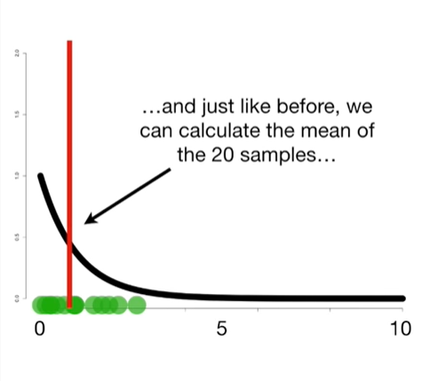
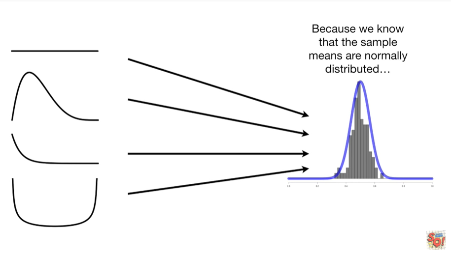

<https://www.youtube.com/watch?v=YAlJCEDH2uY&list=PLblh5JKOoLUK0FLuzwntyYI10UQFUhsY9&index=18>

Today we\'re going to talk about the central limit theorem and it\'s
gonna be clearly explained.

Note : for this stat quest to make any sense at all you should be
familiar with the normal distribution.

If not check out the normal distribution clearly explained.

It would also be helpful if you were familiar with the concept of
sampling from a statistical distribution if not check out : sampling
from a statistical distribution clearly explained.

The central limit theorem is the basis for a lot of statistics and the
good news is that it\'s a pretty simple concept.

In this stat quest I\'ll explain what the central limit theorem is and
why it\'s important.

Like most things in statistics, I think the central limit theorem is
easiest to understand if we look at some examples.

So let\'s start with a uniform distribution.

This one goes from zero

to one.

It\'s called the uniform distribution because there is an equal
probability of selecting values between zero and one.

The probabilities are all equal and thus are uniform.

We can collect 20 random samples from this uniform distribution

and then calculate the mean of the samples.

And on the right we can draw a histogram of the mean value.

Since we only have one mean value the histogram isn\'t very interesting

but after we collect ten more samples and collect ten more means

the histogram starts to look a little more interesting.

Here\'s the histogram after collecting 20 samples in calculating 20
means

30 means

40 means

50 means

60 means

70 means

80 means

90 means

and 100 means.

After adding 100 means to the histogram it\'s pretty easy to see that
these means are normally distributed.

However to make it easy to see that the means are normally distributed
we can overlay a normal distribution.

You might have noticed that in the last two slides I put means are
normally distributed in bold.

I did this because this is what the central limit theorem is all about.

Even though these means were calculated using data from a uniform
distribution

the means themselves are not uniformly distributed instead the means are
normally distributed.

BAM !!!!

Here\'s another example.

This time we\'ll start with an exponential distribution

just like before we can collect 20 random samples from this exponential
distribution

and just like before we can calculate the mean of the Tawney samples

and lastly we can draw a histogram of that mean over here on the right.

After we collect ten samples and calculate 10 means the histogram starts
to look a little more interesting.

Here\'s the histogram after 20 mins

30 means

40 means

50 means

60 means

70 means

80 means

90 means

and 100 means.

After adding 100 means to the histogram we can see that they are
normally distributed.

Even though these means were calculated using data from an exponential
distribution

the means themselves are not exponentially distributed.

Instead the means are normally distributed.

BAM !!!!

So far we have seen that the means calculated from samples taken from a
uniform distribution

are normally distributed.

And means calculated from samples taken from an exponential distribution

are also normally distributed.

Well it turns out that it doesn\'t matter what distribution you start
with

if you collect samples from those distributions

the means will be normally distributed\*.

Yes there\'s a little asterisk here that means there\'s some fine print
that will come later for now just know it\'s really fine print and not
worth spending too much time worrying about.

Double BAM !!!!

Cool but what are the practical implications of knowing that the means
are normally distributed ?

When we do an experiment we don\'t always know what distribution our
data comes from.

To this the central limit theorem says who cares ???

The sample means will be normally distributed.

Because we know that the sample means are normally distributed

we don\'t need to worry too much about the distribution that the samples
came from.

We can use the means normal distribution to make confidence intervals

do t-tests where we ask if there\'s a difference between the means from
two samples

and ANOVA, where we ask if there is a difference among the means.

From three or more samples and pretty much any statistical test that
uses the sample mean.

Triple bam !!!!

Note : out there in the wild some folks say that in order for the
central limit theorem to be true the sample size must be at least 30.

This is just a rule of thumb and generally considered safe however as
you can see in the examples here where I use a sample size of 20 the
rule was meant to be broken.

Here\'s the fine print in order for the central limit theorem to work at
all you have to be able to calculate a mean from your sample.

Off the top of my head I can think of only one distribution the Koshi
distribution that doesn\'t have a sample mean and after doing
biostatistics for 20 years I\'ve never come across it in practice.

That said, if you know of distributions that don\'t have means put them
in the comments below and tell us what they\'re used for I\'m curious
about how common this occurs.
