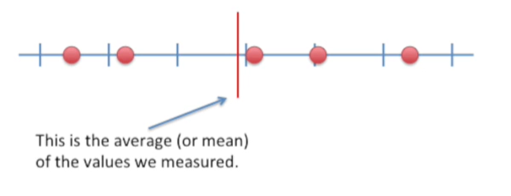

<https://www.youtube.com/watch?v=A82brFpdr9g&list=PLblh5JKOoLUK0FLuzwntyYI10UQFUhsY9&index=19>

This time we\'re going to talk about the standard deviation versus the
standard error.

These terms are often confused.

So let\'s clear them up once.

And for all I think the easiest way to understand the differences
between the standard deviation and the standard error is to look at an
example.

For the sake of this example imagine we weighed five mice.

This is the average or mean of the values we measured.

This is the standard deviation on both sides of the mean.

It quantifies how much the data are spread out.

Now imagine we did the exact same experiment weighed five mice five
separate times using different mice each time.

This would result in five means or averages one for each set of
measurements.

We would also have five separate standard deviations around the means
one for each set of measurements.

They quantify how much the measurements are spread around their means.

Here\'s what it would look like if we plotted all five means on the same
number line.

This is the mean of the means.

And this is the standard deviation on both sides of the mean of the
means.

It\'s a little bit of a tongue twister they\'re the standard deviation
of the means is called the standard error.

And that\'s all there is to it.

It\'s just that simple.

Now let\'s summarize the differences between the standard deviation and
the standard error.

The standard deviation quantifies the variation within a set of
measurements.

The standard error quantifies the variation in the means from multiple
sets of measurements.

The confusing thing is that the standard error can be estimated from a
single set of measurements.

Even though it describes the means for multiple sets.

Thus even if you only have a single set of measurements, you are often
given the option to plot the standard error.

In almost all cases you should plot the standard deviation since graphs
are usually intended to describe the data that you measured.

For more information on standard errors check out the stat quest on
standard errors.

Also the stat quest on p-value pitfalls and power calculations.

I provided links to those in the description below.
