<https://www.youtube.com/watch?v=oI3hZJqXJuc&list=PLblh5JKOoLUK0FLuzwntyYI10UQFUhsY9&index=2>

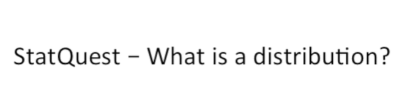

Today we\'re going to be talking about what a distribution is.

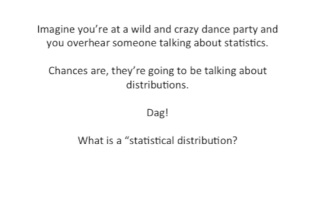

Imagine you\'re at a wild and crazy dance party and you overhear someone
talking about statistics.

Chances are they\'re going to be talking about distributions.

Dagg !

What is a statistical distribution ?

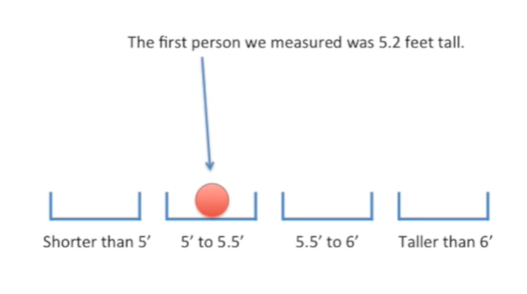

Imagine we measured the height of a lot of people the first person we
measured was 5.2 feet tall.

So we put that measurement in a bin that spans from five feet to 5.5
feet.

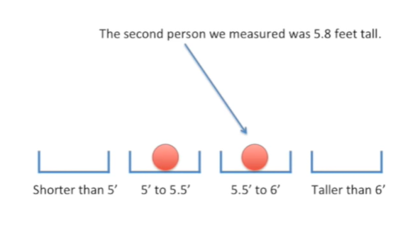

The second person we measured was five point eight feet tall.

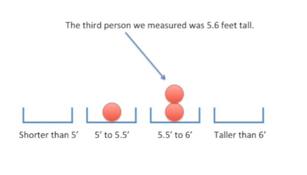

The third person we measured was five point six feet tall.

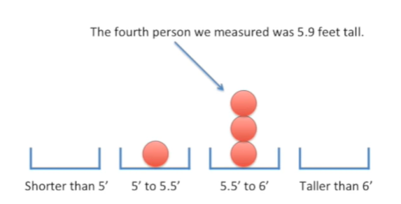

The fourth person we measured was 5.9 feet tall.

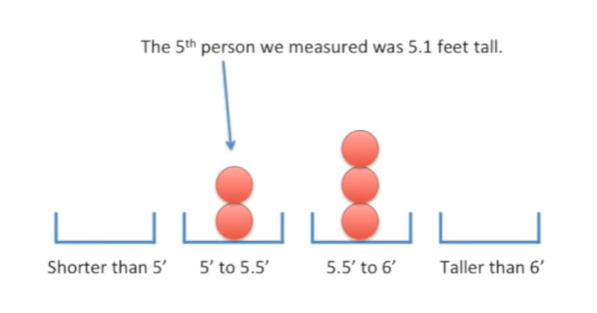

The fifth person we measured was only 5.1 feet tall.

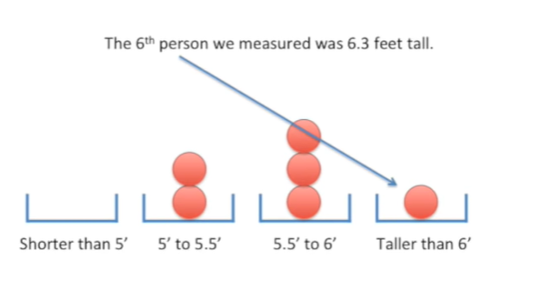

And the sixth person we measured with 6.3 feet tall.

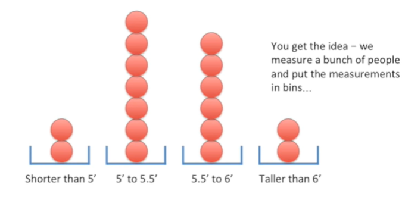

Okay you get the idea we measure a bunch of people and put the
measurements in bins

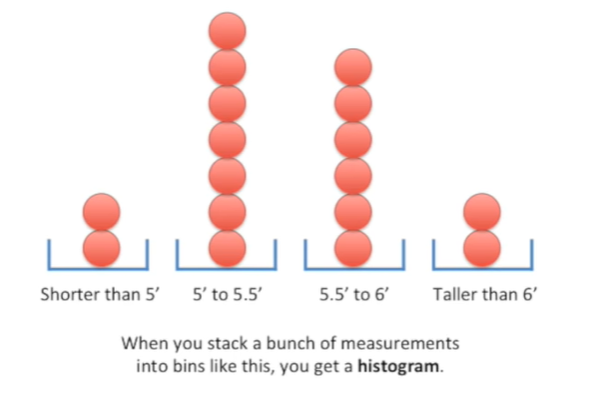

when you stack a bunch of measurements in two bins like this you get a
histogram.

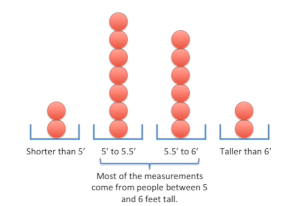

Most of the measurements come from people between five and six feet
tall.

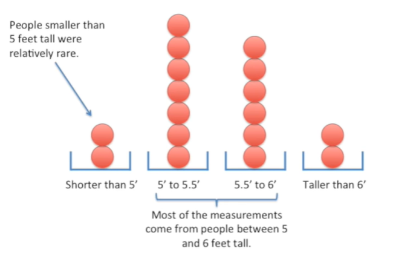

People smaller than five feet tall were relatively rare.

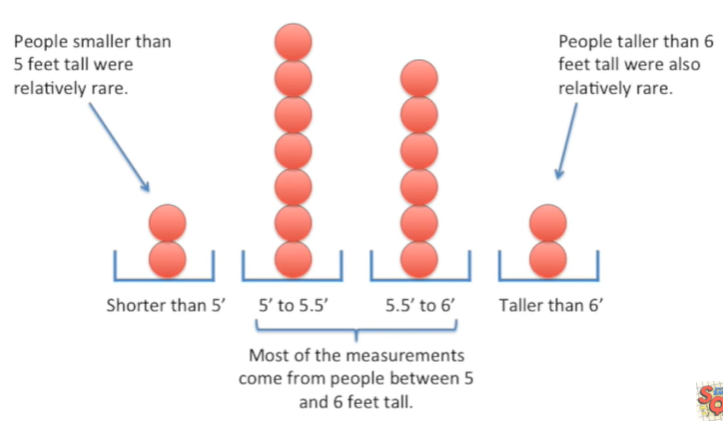

People taller than six feet tall were also relatively rare.

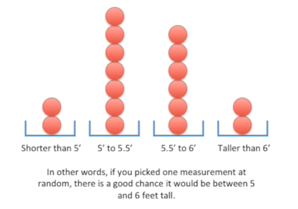

In other words if you picked one measurement at random there\'s a good
chance it would be between five and six feet tall.

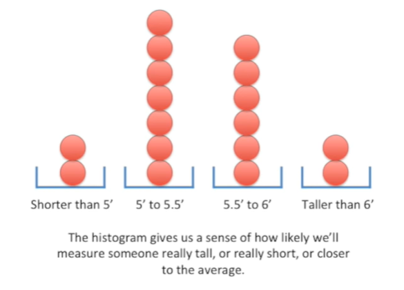

The histogram gives us a sense of how likely will measure someone really
tall or really short or closer to the average.

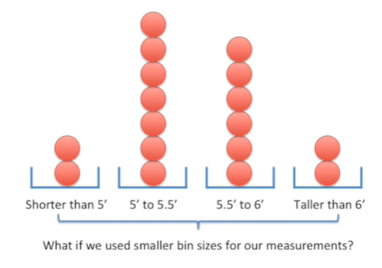

What if we use smaller bin sizes for our measurements ?

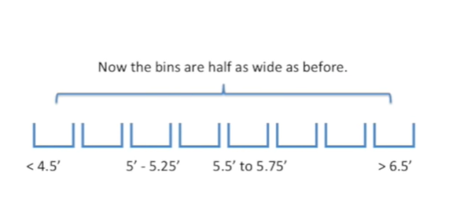

Now the bends are half as wide as before.

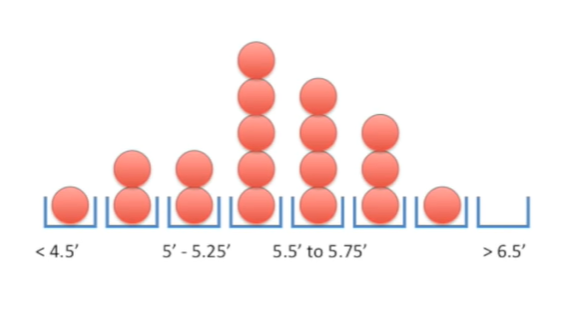

And here\'s how our data stacks up in the smaller binds.

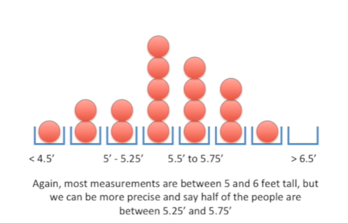

Again most measurements are between five and six feet tall, but we can
be more precise and say half the people are between five point to five
feet tall and five point seven five feet tall.

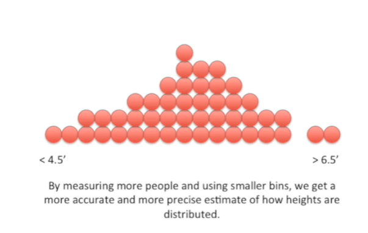

By measuring more people and using smaller bins, we get a more accurate
and more precise estimate of how Heights are distributed.

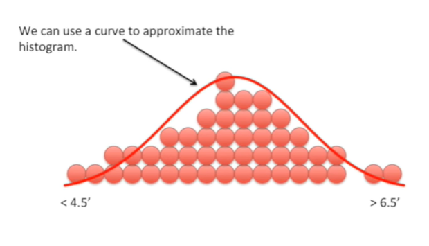

We can use a curve to approximate the histogram.

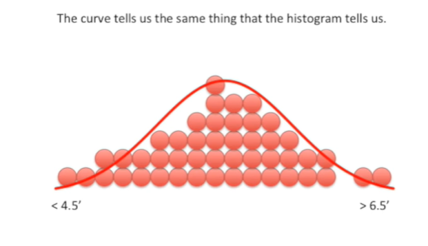

The curve tells us the same thing that the histogram tells us.

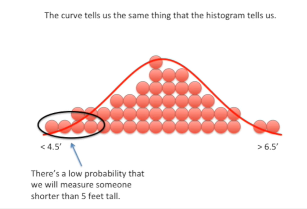

There\'s a low probability that we will measure someone shorter than
five feet tall.

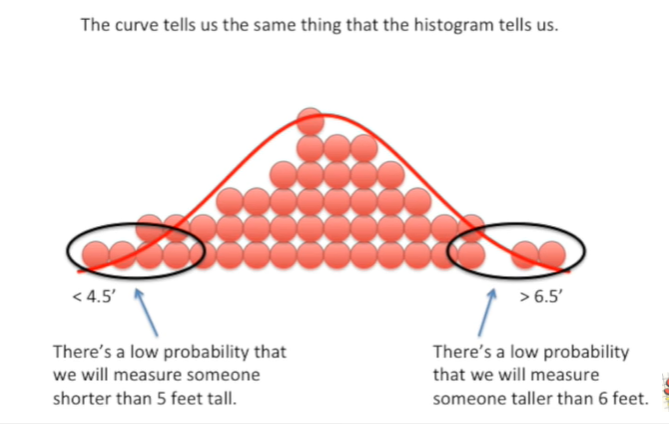

There\'s a low probability that we will measure someone taller than six
feet.

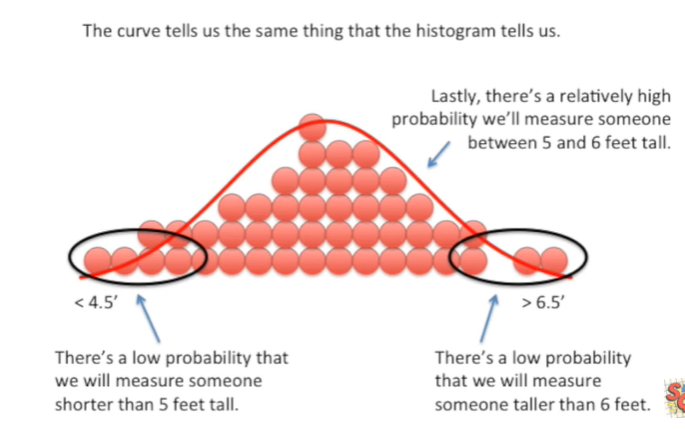

Lastly there\'s a relatively high probability will measure someone
between five and six feet tall.

However the curve has a few advantages over the histogram.

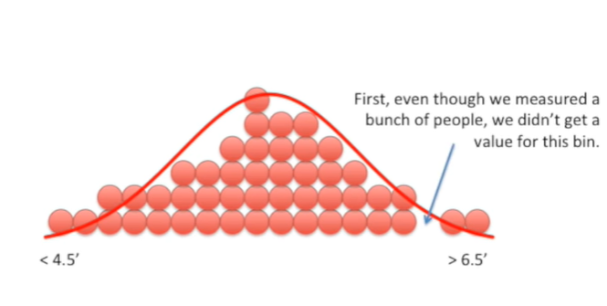

First even though we measured a bunch of people we didn\'t get a value
for this bin.

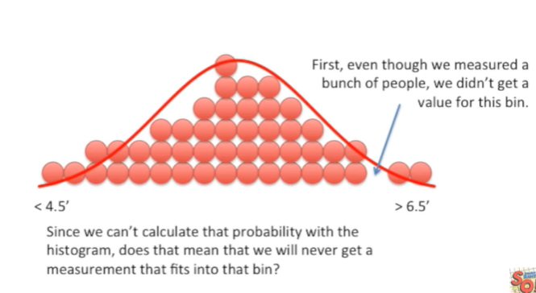

Since we can\'t calculate that probability with the histogram does that
mean we will never get a measurement that fits into that bin ?

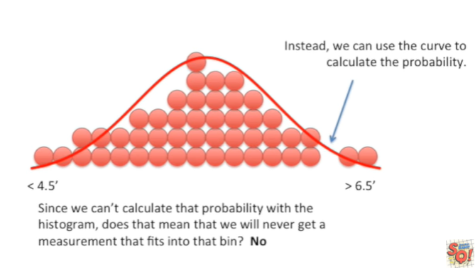

No.

Instead we can use the curve to calculate the probability.

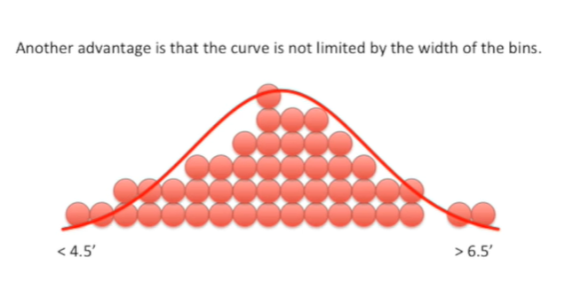

Another advantage is that the curve is not limited by the width of the
bins.

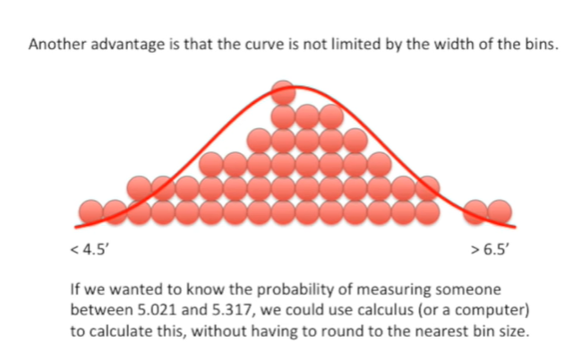

If we wanted to know the probability of measuring someone between five
point zero to one and five point three one seven we could use calculus
or a computer to calculate this without having to round to the nearest
bin size.

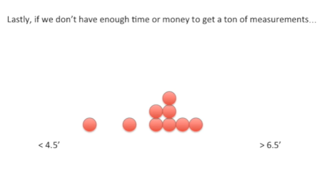

Lastly if we don\'t have enough time or money to get a ton of
measurements.

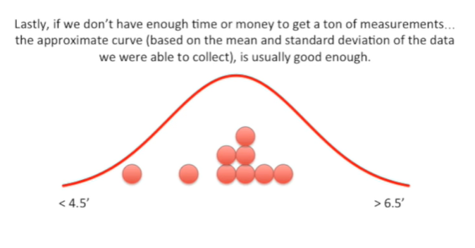

The approximate curve based on the mean and standard deviation of the
data that we were able to collect is usually good enough.

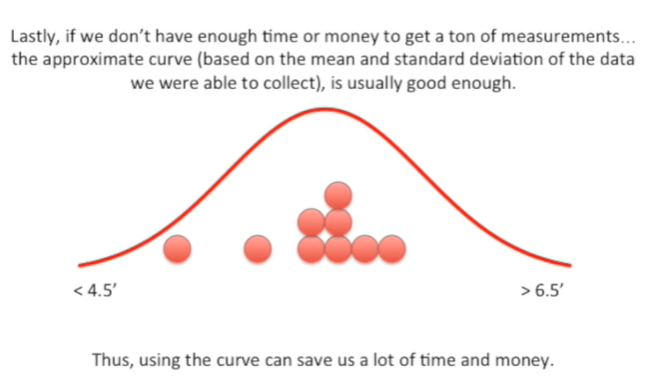

Thus using the curve can save us a lot of time and money.

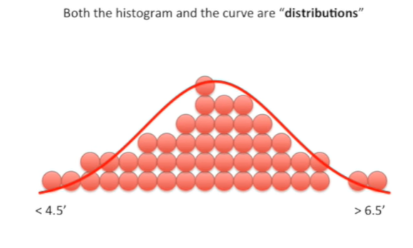

Both the histogram and the curve our distributions.

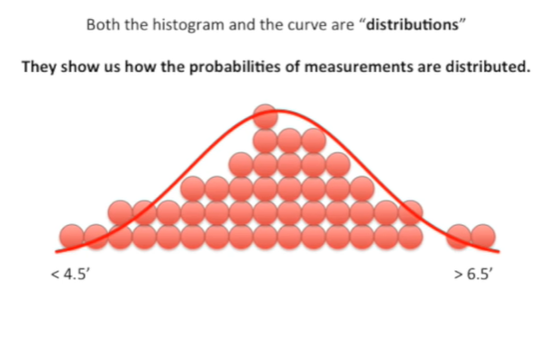

They show us how the probabilities of measurements are distributed.

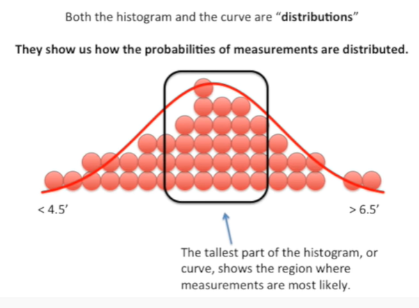

The tallest part of the histogram or curve shows the region where
measurements are most likely.

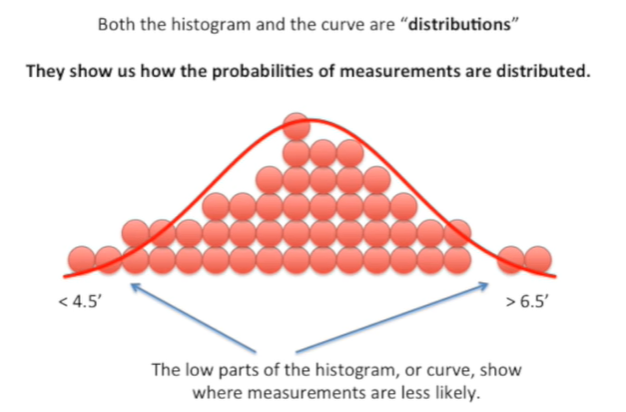

The low parts of the histogram or curve show where measurements are less
likely.

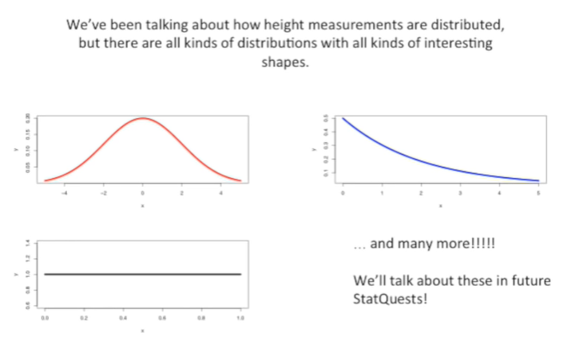

We\'ve been talking about how height measurements are distributed but
there are all kinds of distributions with all kinds of interesting
shapes.

We\'ll talk about these in future stat quests the end tune in next time
for another exciting stat quest.
