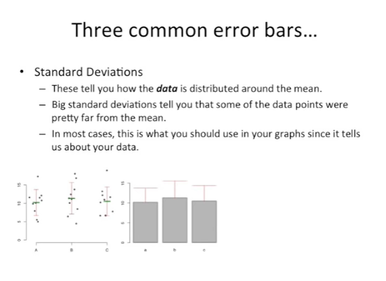

<https://www.youtube.com/watch?v=XNgt7F6FqDU&list=PLblh5JKOoLUK0FLuzwntyYI10UQFUhsY9&index=20>

This time we\'re gonna talk about standard errors.

And we\'re also gonna have a bootstrapping bonus.

We\'ll start by talking about error bars which are very closely related
to standard errors.

For example you might collect measurements from three samples labeled A,
B and C and plot them on a scatter plot. Just like we see here, you
could then calculate the means for the three data sets.

And we Illustrated those here with three green horizontal bars
approximately halfway up the clusters of data points.

After that we could calculate the standard deviations and add those to
the graph and we\'ve shown those here with red error bars.

In manuscripts and presentations people often don\'t display the
original data but instead just show the mean and the standard deviation.

And what\'s called a dynamite plot because each column in the plot looks
like it\'s the igniter for a stick of dynamite.

There are three common types of error bars :

\- the first type of standard deviations which we just saw, and I\'m
sure you\'re all familiar with these, tell you how the data are
distributed around the mean,

\- big standard deviations tell you that some of the data points were
pretty far from the mean,

\- in most cases you want to use standard deviations in your graphs
since it tells us about your data.

The data points that you collected yourself the second type of error bar
comes from standard errors.

These tell you how the mean is distributed not just the data but the
means which sounds crazy but it\'ll become clear once I draw some
pictures.

The third common type of error bar are confidence intervals .

And these are related to standard errors.

Confidence intervals will be explained more in a future stat quest.

Since this stat quest is all about standard errors, that\'s what we\'re
going to talk about, let\'s start by considering a normal distribution.

In this case we can imagine that we weighed a lot of mice and plotted
the distribution of differences from the mean.

The y-axis is the proportion of the mice that we weighed.

In the x-axis is the difference from the mean.

Most of the mice had weights close to the average.

A few of the mice weighed much less than the average Mouse.

And a few other mice weighed much more than the average Mouse.

Usually you can\'t afford to measure the weight of all the mice.

So you just take a sample.

In this example, we\'ll just assume we took five measurements from the
population rather than measuring all the mice.

Since most of the mice have weights close to the average, most of our
samples are going to be close to zero.

Now, just like we always do, we can calculate the mean and standard
deviation from our sample.

In this case the mean of our sample is minus point two and the standard
deviation is one point nine to three.

And we can plot the mean and standard deviation on our graph.

As the mean plus or minus the standard deviation around the mean.

And for all you stat Questers out there, here\'s a rule of thumb,
remember that

\- one standard deviation on each side of the mean is supposed to cover
about 68% of the data

\- two standard deviations on each side of the mean is supposed to cover
about 95 percent of the data.

This will come in handy later.

The mean is now a lighter color because we\'re going to take additional
samples and overlay additional means and standard deviations on this
same graph.

Here we\'ve taken another five measurements.

And from those five measurements,

we\'ve calculated the mean and the standard deviation.

And here we\'ve plotted that mean plus or minus one standard deviation
on each side.

And now we take another five measurements.

This is the first sample or one of the measurements is relatively
extreme.

However that one measurement doesn\'t sway.

The mean that far from zero.

That is to say the means are relatively close to each other compared to
the raw data.

This is because for a mean to be far from the middle most if not all of
the raw data points would have to be in a single cluster that is far
away from the middle.

For example the sample of purple points all form a cluster that are far
from the middle.

This could happen but very rarely.

What\'s much more likely is to have a sample where most of the points
are close to zero.

And only one or two are far away.

So far we\'ve shown that you can calculate the standard deviations for
each sample.

But now that we have three means we can also calculate the standard
deviation of those means.

Because one standard deviation will cover 68% of the values and two will
cover 95% of the values the standard deviation of the means won\'t be as
wide as the standard deviations of the data.

Here we\'ve plotted the mean of the means plus or minus one standard
deviation of the means.

Notice that this standard deviation is much smaller than the standard
deviations we got from the individual samples.

The standard deviation of the mean is called the standard error of the
mean or more simply the standard error.

The standard error gives us a sense of how much variation we can expect
in our means.

If we took a bunch of independent five measurement samples.

So to review this is how we calculate this an error of the mean.

First you take a bunch of samples each with the same number of
measurements or in in this case in equals five.

The second step is to calculate the mean for each sample.

Here we calculated the mean and standard deviation for each sample but
for the standard error all we need to do is calculate the mean.

Once we\'ve calculated the means for each sample, we can calculate the
standard deviation of the means .

In this case the standard error equals zero point eight six.

Here we notice that the standard error is much less than the standard
deviations because the means aren\'t as widely dispersed.

As the raw data we\'ve shown how to calculate the standard error of the
mean but there are other standard errors.

For example we can also take the standard deviation of the standard
deviations.

This is called the standard error of the standard deviations which I
guess is to avoid a tongue-twister.

It tells us how the standard deviations of multiple samples are
dispersed.

You can calculate the standard deviation of any statistic for example
the median the mode percentiles are anything anything that you can
calculate for multiple samples.

You just calculate the standard deviation and then you have the standard
error of that.

So if we calculated many mediums we could calculate the standard
deviation of those mediums and we have the standard error of those
mediums.

To summarize everything we\'ve talked about, so far know that the
standard error is just the standard deviation of multiple means taken
from the same population.

So if there\'s a population and we can take a bunch of different samples
from it, all we have to do to get the standard error is to calculate the
standard deviation of the means of each sample.

Well at this point you might be wondering if we can calculate standard
errors without spending a lot of time and money on doing the same
experiment a bunch of times.

The good news is the answer is yes.

In rare cases there\'s a formula you can use to estimate the standard
error.

For the mean is 1 the formula for that is very simple, it\'s just the
standard deviation divided by the square root of the sample size.

However there aren\'t many other cases.

The good news again is that we can use something called bootstrapping
for everything else.

Every time we don\'t have a simple formula we can bootstrap it.

The nice thing about bootstrapping is it\'s very simple conceptually and
it\'s easy to make a computer do this work.

Here\'s a bootstrapping example.

Just like before we have an experiment where we took 5 measurements.

As an aside usually for bootstrapping it\'s good to have 10 or more
measurements in a single experiment.

Now we bootstrap our data with the following steps :

\- first we pick a random measurement from the sample that we just took.

This random measurement isn\'t a new measurement that we haven\'t taken
before.

It\'s not a new number that we haven\'t seen, it\'s part of the sample
that we already have.

Now we just write that value down.

In this case, it\'s one point four three.

In step three we just go back to step one and pick a new random
measurement and write that value down

and we do that five times our second measurement is minus one point
three eight.

The third measurement is minus three point one one.

Our fourth measurement is one point four three.

We\'ve already picked that measurement before, but that\'s okay, when
you\'re bootstrapping, you just pick five measurements from your sample,
and it doesn\'t matter if you\'ve picked the same one before.

Our last measurement is minus zero point one zero.

Step four in bootstrapping is to calculate the mean median, mode, or
whatever the statistic.

It is we\'re interested in understanding the standard error of and we
calculate that with our sample.

In this case we\'re interested in the standard error of the mean, so all
we do is calculate the mean from our new bootstrap sample.

The fifth step is to go all the way back to the beginning step one and
repeat that until you have a lot of means or medians or whatever you\'re
interested in calculating.

The standard error of the sixth and final step in the bootstrapping
procedure is to simply calculate the standard deviation of all the means
that we generated in steps one through five.

That\'s all there is to it.

In this case we calculated the standard error of the mean and we\'ve
plotted it as a black line in the graph.

So if there\'s no fancy formula to help us calculate the standard error
we can do it ourselves.

From scratch we can just use bootstrapping and get the job done and
that\'s it.

In this static quest we learned that the standard error is a measure of
how we might expect the means from many different samples to vary from
one sample to another.

We also learned that if we don\'t have a fancy formula for calculating
the standard error we can do it ourselves using bootstrapping.
