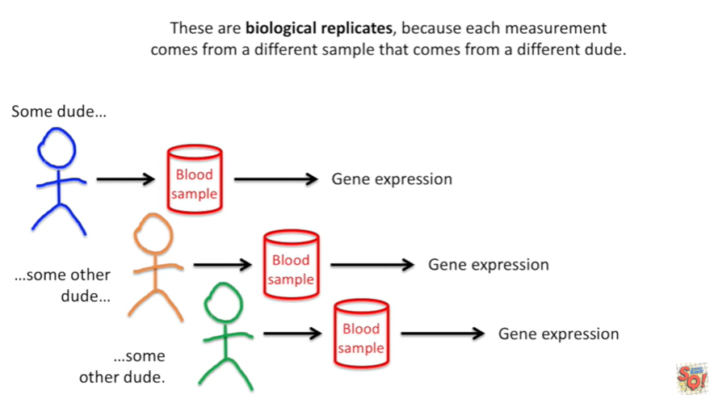

<https://www.youtube.com/watch?v=Exk0OoRG0PQ&list=PLblh5JKOoLUK0FLuzwntyYI10UQFUhsY9&index=22>

Today we\'re going to be talking about technical biological and other
replicates and they\'re going to be clearly explained.

Let\'s start off with some dude and let\'s take a blood sample.

From that dude and using that sample let\'s measure gene expression and
let\'s measure it again and again and again.

These are technical replicates because every single experiment is
performed on the exact same sample.

Technical replicates give us two things

1\. they give us an accurate measurement of this dudes gene expression.

If we wanted to tell a story about just this dude (and we didn\'t want
to generalize a result to a broader population), technical replicates
would be the way to go !

Technical replicates also tell us how accurately were measuring gene
expression.

If the numbers were way different after each technical replicate we
would know not to trust any single measurement.

If we wanted to publish a paper about how awesome our new method is,
we\'d use technical replicates.

Here\'s another example.

Again we start with some dude.

However now we take three samples at the same time and we measure the
gene expression in each individual sample.

These are still considered technical replicates because they only tell
us about an individual.

However these tell more of a story about the individual than the method.

This is because there can be variation in the samples that the method is
not responsible for.

Now let\'s look at taking samples from three dudes.

We\'ve got some dude, some other dude and some other dude.

Once we get the samples we measure gene expression in each one.

These are biological replicates, because each measurement comes from a
different sample that comes from a different dude.

Biological replicates tell us about the gene expression in a group of
dudes (or animals or plants or cell lines etc).

This particular experiment tells us about gene expression in dudes.

It doesn\'t tell us about gene expression in ladies.

If I only wanted my result to tell a story about dudes (because I\'m
interested in gene expression from the y-chromosome) then this would be
fine.

But if I wanted to have a result that generalized to dudes and ladies I
would need to measure gene expression in ladies, too.

The same thing can be said about different ethnicities if I only measure
gene expression in blue dudes, than my result would only tell a story
about blue dudes and not orange, or green dudes or dudes in general.

You can mix biological and technical replicates but the wisdom of doing
this depends on the type of experiment. Sometimes you get more bang for
your buck if you add more biological replicates and ignore technical
replicates.

For example when doing RNA seek, it\'s better to do biological
replicates rather than technical replicates.

I have a stat quest that explains why this is.

So check it out.

Fundamentally it depends on how much is already known about the type of
experiment you want to perform.

In summary :

1\. technical replicates are just repetition of the same experiment on
the same person.

That means we can take one sample from one person and do a bunch of
replicates on that one sample or we could take a bunch of samples from
that one person and do experiments on each sample.

In both cases there are technical replicates.

2\. biological replicates use different biological sources of samples ie
different people different plants (or different cell lines.

Decide which story you want to tell) to determine what types of
replicates you need to perform.

Do you want to talk about an individual or a method ?

Use technical replicates.

Do you want to talk about a group ?

Use biological replicates.
