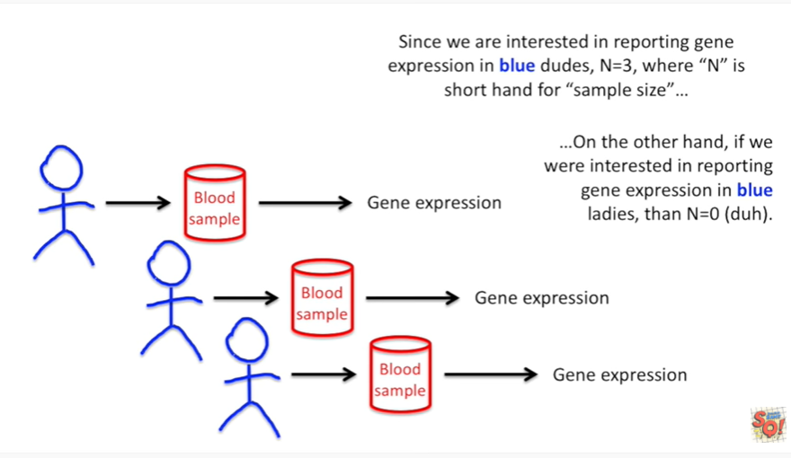
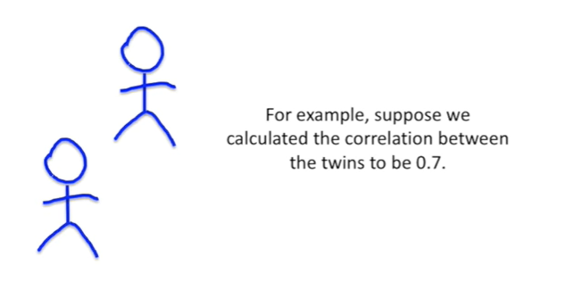

<https://www.youtube.com/watch?v=67zCIqdeXpo&list=PLblh5JKOoLUK0FLuzwntyYI10UQFUhsY9&index=23>

Today we\'re going to be talking about sample size and effective sample
size, they\'re gonna be clearly explained.

This stat quest builds on what we learned in the stat quest on technical
and biological replicates.

So if you\'re not already familiar with those concepts, you better check
that stat quest out ASAP.

Let\'s start with a simple example.

Let\'s imagine we are interested in testing a hypothesis about gene
expression in blue dudes.

If you\'re a mouse geneticist you can think of blue dudes as a specific
strain of mouse.

If you\'re interested in trees you can think of blue dudes as a specific
type of tree.

We start with a blue dude

And then we take a blood sample and then we use that blood sample to
measure gene expression.

Then we do the same thing with another blue dude.

And then lastly we do the same thing with a third blue dude.

We\'ve got 3 measurements from three separate blue dudes.

Since we\'re interested in reporting gene expression in blue dudes, n
equals three, where n is short hand for 'sample size'.

On the other hand, if we\'re interested in reporting gene expression in
blue ladies, then N equals zero.

Duh !!!

If we measure gene expression twice in each blue dude and we still
wanted to report a result that applied to dudes the sample size would
still be three.

These pairs of measurements are technical replicates and tell us about
the accuracy of our method for measuring gene expression.

They don\'t tell us about differences between blue dudes.

If we were interested in describing the accuracy of our method for
measuring gene expression and were not interested in describing dudes
then we would count the technical replicates.

In this case N equals four.

Technical replicates only count when we want to describe a method (and
not people or mice or something else).

So far so good !

Everything is pretty straight forward.

Now let\'s look at something a little more complicated.

Let\'s imagine we wanted to test a hypothesis that applied to dudes in
general (not just blue dudes).

In this case it is important that in addition to blue dudes, we measure
orange dudes and green dudes.

And here in equals 3.

Still no big deal, but what if the blue dude had a twin ?

And we added that due to the study and we measured his gene expression.

What\'s the sample size now is it 3 or 4 ?

It\'s actually somewhere in between.

While these twins are clearly two different and separate people their
genomes are the same and thus their gene expression will be highly
correlated compared to the other dudes in the study.

If we know (or can calculate) the correlation between the twins we can
calculate their effective sample size.

For example, suppose we calculated the correlation between the twins to
be 0.7.

The equation for the effective sample size is : the number of samples
divided by one plus the number of samples minus one times the
correlation.

So we plug in the numbers for the number of samples and the correlation

and then we do the math we end up with 1 point 1 8.

When the correlation is high between the twins, instead of being counted
as two people, they are counted as one point 1 8 people.

Now let\'s see what happens when the correlation is low.

This time it\'s equal to 0.1.

Again we can use the equation for the effective sample size to figure
out how many people.

These two people actually are first plug in the numbers t

hen do the math in this case we got 1 point 8 2 just a little bit less
than 2.

When the correlation is low between the twins they almost count as much
as two people.

In practice calculating the effective sample size can be more
complicated but you get the general idea samples that are highly
correlated don\'t count as individual samples.

In summary :

1\. if we want to report about the accuracy of a method the sample size
is just the number of technical replicates.

In this case N equals 3.

If we want to report about blue dudes or a specific strain of mouse or
tree or whatever then the sample size is the number of blue dudes.

In this case N equals 3.

If we want to report about all kinds of dudes or all kinds of mice we
need to take correlations into account when calculating the sample size.

If the correlation between blue dudes is 0.7 the effective sample size
is three point one eight.

If the correlation between blue dudes is zero point one, the effective
sample size is three point eight two.
