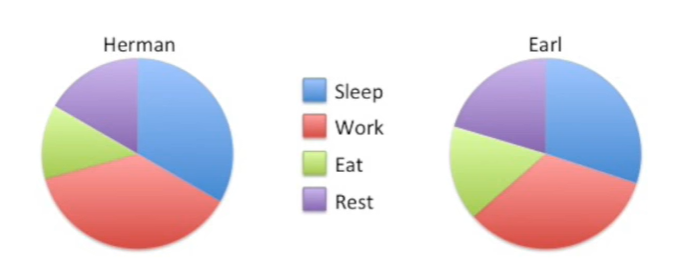
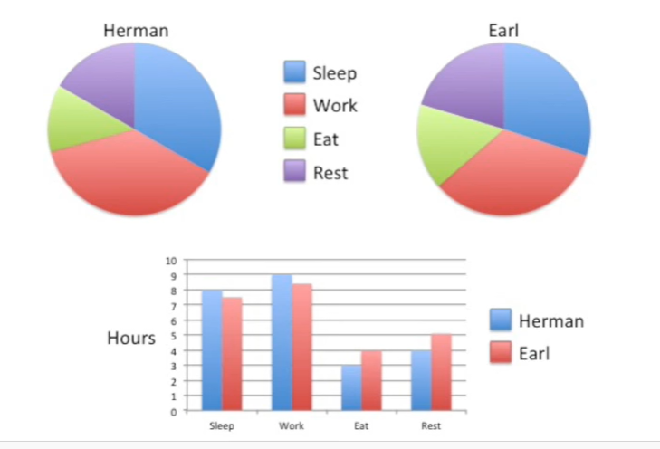

<https://www.youtube.com/watch?v=RiEZ_hEf96A&list=PLblh5JKOoLUK0FLuzwntyYI10UQFUhsY9&index=24>

Today we\'re going to talk about pie charts vs. bar charts.

I typically prefer that if you\'re going to if you want to present data
as a pie chart that what you do is use a bar chart instead.

And so to keep this quick I\'m just gonna show you some examples of why
I think a bar chart is better than a pie chart.

Here\'s a pie chart showing how much Hermon sleeps, work,s eats and
rests.

What I don\'t like about this chart is it\'s hard to tell how much more
time Herman spins sleeping or working.

They both look very similar in size.

With a bar chart it\'s obvious that Herman spends an hour more working
each day than he spends sleeping.

We can also easily see that he spends an hour more resting than eating.

The bar chart makes this obvious.

With two pie charts the data become even more difficult to interpret.

Here we have Herman versus Earl.

Here\'s a question : does Earl work more than Herman ?

And if so how much more with pie charts, this question is surprisingly
difficult to answer.

In contrast with a bar chart, it\'s much easier to answer this question
and others like it.

Here we see that Herman sleeps about 30 minutes longer than Earl.

We also see that Herman works about 40 minutes longer than Earl.

Earl eats for an hour longer than Herman and Earl also rests an hour
longer than Herman.

This is why I like bar charts more than pie charts.

So next time you\'re thinking about drawing a pie chart consider drawing
a bar chart instead.

It saves space and it\'s easier to interpret.
