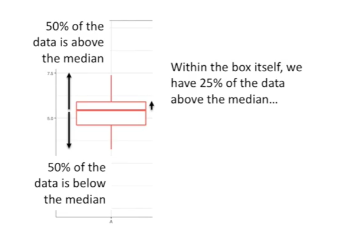

<https://www.youtube.com/watch?v=fHLhBnmwUM0&list=PLblh5JKOoLUK0FLuzwntyYI10UQFUhsY9&index=25>

Today we\'re going to be talking about box plots.

Box plots are bad to the bone check them out.

Sometimes box plots are called 'box and whisker' plots.

Here\'s the box and here the whiskers.

The line in the middle of the box is the median value.

50% of the data is above the median,

50% of the data is below the median.

Medians are useful because they\'re not as swayed by outliers as the
typical mean or average is.

George Carlin, host of the children\'s television show, shining time
station, once said :

\- think of how stupid the average person is and realize that half of
them are stupider than that.

\- I think mr. Carlin was referring to the median, not the average, but
that\'s okay. It\'s still funny.

Within the box itself we have 25% of the data above the median

and 25% of the data below the median

so 50% of the data is within the box.

Outliers are plotted as dots beyond the whiskers.

Totes bad-to-the-bone !!!!

It\'s common to overlay the original data onto the box plots.

Now it\'s easy to see that this guy didn\'t get many measurements.

And this guy got tons of measurements.

This means we\'ll be more confident in the statistics calculated from
this guy.

Super totes bad-to-the-bone!!!!

Bask  in the awesomeness of boxplots compared to the traditional bar
plots !!!

Both graphs show the exact same data !
