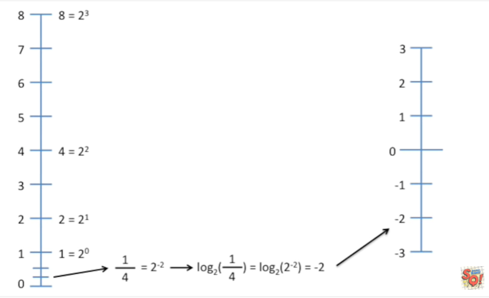
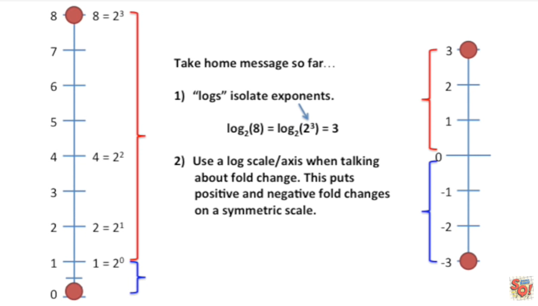
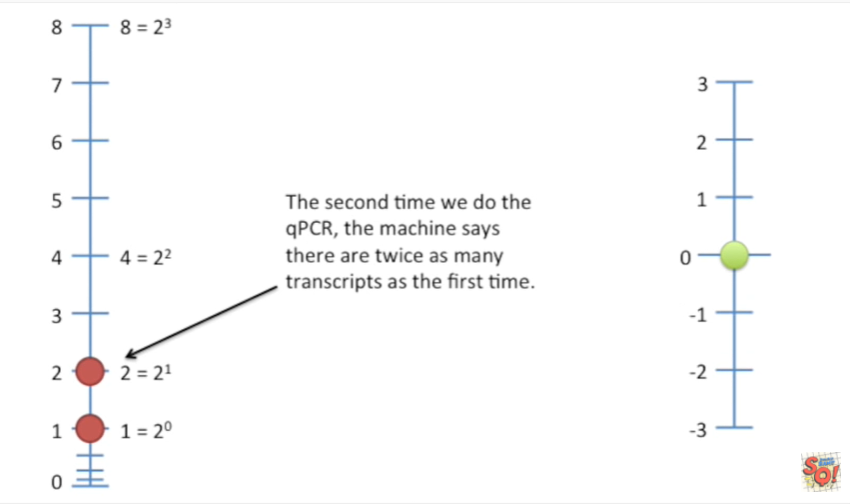
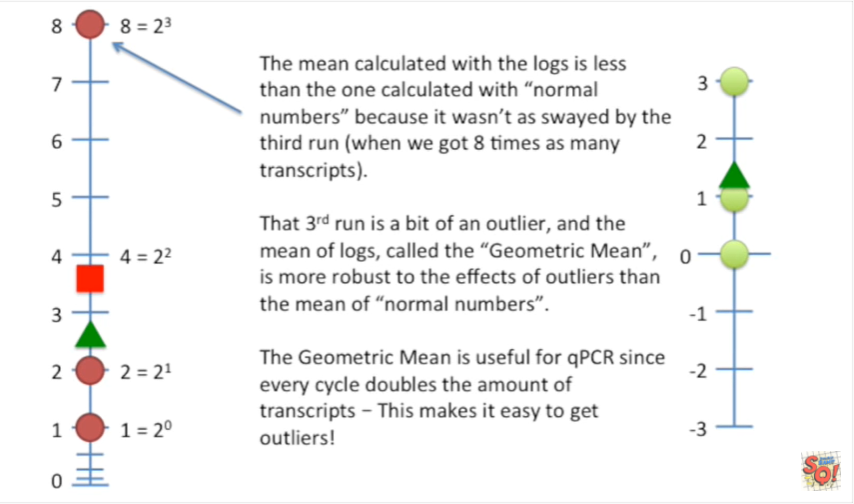
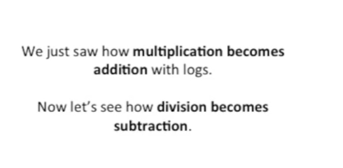
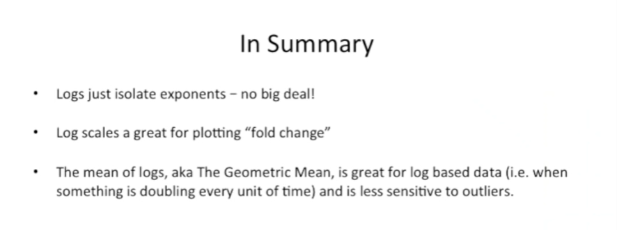
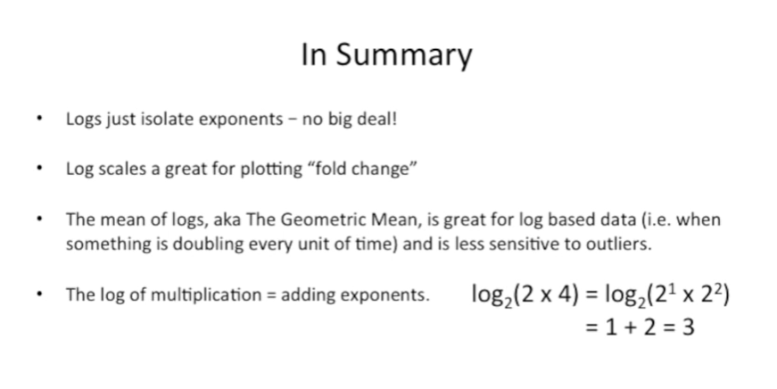
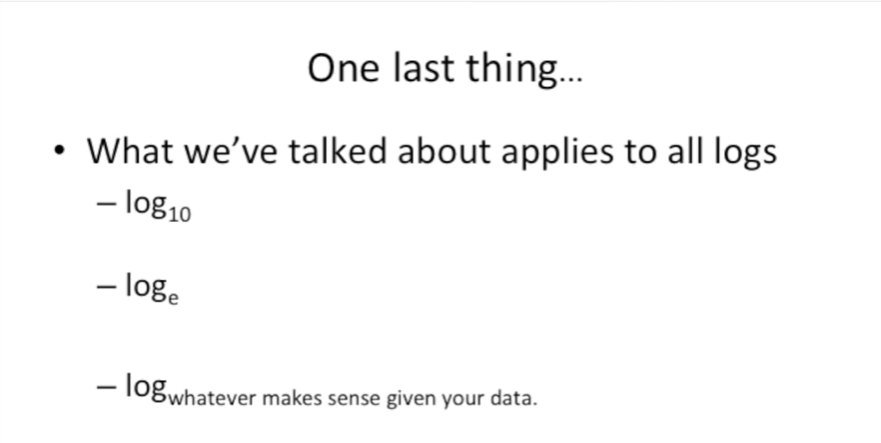

<https://www.youtube.com/watch?v=VSi0Z04fWj0&list=PLblh5JKOoLUK0FLuzwntyYI10UQFUhsY9&index=26>

Today we\'re going to be talking about logs and we\'re going to do
everything we can to make sure that they\'re clearly explained.

Let\'s start with an ordinary number line (going from zero to eight).

It\'s no big deal !

Eight, four, two and one are all easily re-written as powers of two.

The other numbers on the number line like seven six or five, they can
also be written as powers of two.

It just isn\'t as neat and tidy.

Even pie can be written as a power of two.

Now let\'s convert this access into a log base two axis.

To do that you take the log base two of the numbers on the Left.

Let\'s see how that\'s done and to do that.

Let\'s start at the top.

So we\'ll take the log base two of eight the first and really only step
in calculating a log is to simply rewrite the number as a power of two
in this case we rewrite 8 as 2 to the third.

The log base 2 of 2 to the third is just the exponent you need to raise
to by in order to get 8.

In this case the exponent is 3 so the log base 2 of 2 to the 3 equals 3.

The log function just isolates the exponent.

And that means that 3 is the log base 2 equivalent of 8.

On our log base 2 access now let\'s take the log base 2 of 4 first we
rewrite 4 as a power of 2.

And the log function just isolates the exponent since 2 is the exponent
the log base 2 of 2 to the 2 equals 2.

And thus 2 is the log base 2 equivalent of the number 4, on our log
axis.

Now let\'s take the log base 2 of 2 we rewrite 2 as a power of 2 so in
this case that\'s just 2 to the 1.

And again the log function just isolates the exponent.

Thus one is the log base 2 equivalent of the number 2 now we take the
log base 2 of 1

Again say it with me the log function just isolates the exponent.

In this case the exponent equals 0 so the log base 2 of 1 equals 0 and
thus 0 is the log base 2 equivalent of the number 1.

Great !

We\'ve got the top half of our log base 2 scale worked out.

Now let\'s work out the bottom half.

On our normal number line we have one half one half can be re-written as
a power of two this means that the log base 2 of 1/2 is the same as
taking the log base 2 of 2 to the negative 1.

Guess what the log function is just about to do !!!

Isolate the exponent.

Boring we already know about this we know that the log function isolates
the exponent.

BAM !!!

Negative 1 is the log base 2 of ½.

Okay.

Now we\'ve got 1 over 4, on our number line and 1/4 can be re-written as
a power of 2 2 to the negative 2.

So the log base 2 of 1/4 equals the log base 2 of 2 to the negative 2,
isolate the exponent.

Double BAM !!!

And thus negative 2 is the log base 2 equivalent of ¼.

so now you get the idea the log function just isolates the exponent so
for 1 over 8 if we can rewrite that as a power of 2 which we can because
we can rewrite any number as a power up to we have the log base 2 of 2.

To the negative 3 which equals the exponent negative 3 and negative 3
then is the equivalent on the log to scale of 1 over 8.

Notice how much space is between 1 and 8

and how little space is between 1 & 1 over 8.

A measurement way up here is 8 times greater than 1.

And a measurement down here is 8 times less than 1.

Even though both measurements represent the same magnitude in full
change relative to 1 the distance from 1 is not symmetric.

In contrast the magnitude is equidistant on the log axis.

This is why fold changes should always be plotted on log axes.

So the take-home message so far is :

\- 1. logs isolate exponents.

For example the log base 2 of 8 equals the log base 2 of 2 to the 3rd
and if you isolate the exponent you get 3 the other part of the
take-home message is that you should

\- 2. use a log scale or access when talking about fold change. This
puts positive and negative fold changes on a symmetric scale.

eight fold up is the same distance from zero as

eight fold down.

Here\'s the weird thing there is no value for log base 2 of zero.

This is because there is no exponent, X, for 2 such that 2 to the x
equals zero.

If we set X to negative 1000 we just get 1 over 2 to the 1000th.

This is a tiny number but it\'s still greater than 0.

If we set X to negative 1 million we just get 1 over 2 to 1 million.

This is a super tiny number but it\'s still greater than 0 !!!

Just so you know R, a programming language that a lot of people used to
do stats and I\'d be willing to guess that most other programming
languages do the same thing defines log base 2 of 0 to be equal to
negative infinity.

Intuitively this makes sense because 1 over 2 to infinity equals the
smallest number you can imagine .

And in my mind the smallest number I can imagine is 0.

Here\'s an example of when using log base 2 is super cool.

qPCR or real-time PCR.

If you don\'t know what PCR is don\'t worry about it just imagine that
it\'s a process where after each step whatever it\'s measuring doubles.

The log base 2 makes sense with this data because each time the machine
goes through a cycle, the number of PCR products doubles.

The first time we do the qPCR we get a baseline for the number of
transcripts for a gene.

We\'ll set this to 1.

In log base 2, land, 0 becomes our baseline.

This is because the log base 2 of 2 to the 0 equals 0.

The second time we do the qPCR, the machine says there are twice as many
transcripts as the first time.

In other words the difference between the first and second runs was one
cycle in the machine.

The third time we do the qPCR the machine says there are eight times as
many transcripts as the first time.

In other words there was a difference of three cycles between the first
run and the last run.

Now here\'s a question : what\'s the average of the three runs ?

The average is 3.7 if we look at the quantities of transcripts.

The average is 1.3 if we look at the differences in cycles.

If we raise two by 1.3 (the mean of the logs) to convert back to normal
numbers, we get 2 to the 1.3 equals 2.5.

The mean calculated with the logs is less than the one calculated with
normal numbers because it wasn\'t as swayed by the third run (when we
got eight times as many transcripts) ;

That third run is a bit of an outlier, and the mean of the logs, called
the geometric mean, is more robust to the effects of outliers than the
mean of normal numbers.

The geometric mean is useful for qPCR since every cycles doubles the
amount of transcripts - this makes it easy to get outliers !

Now that we know all about log scales, let\'s (really briefly) talk
about arithmetic with logs.

Let\'s start with normal multiplication two times four equals eight.

No big deal, we already saw how two four and eight can be re-written as
powers of two.

When we express numbers as powers of two instead of multiplying the
numbers, we simply add their exponents.

Multiplying numbers is the same as adding their exponents (after
converting the numbers to powers of two).

This works even when the numbers aren\'t power of two friendly.

First you rewrite the numbers as powers of two

and then we add the exponents together.

Again multiplying numbers is the same as adding their exponents (after
converting the numbers to powers of two ).

Now let\'s talk about the log base 2 of 2 times 4 and the log base 2 of
3 times 5.

I\'ll give you a hint logs just isolate exponents.

We\'ll start with the power of 2 friendly numbers.

First we just wrap everything up in log base 2 functions.

Second we rewrite the numbers as powers of 2 just like a normal
multiplication.

We add the exponents together.

The log function just isolates the exponents.

This shows that the log of multiplied exponents is just the sum of their
exponent.

Now let\'s look at numbers that are not power of two friendly.

First wrap everything up in log base two functions.

Then rewrite the numbers as powers of two.

add the exponents together.

And then isolate the exponents.

That\'s really all there is to it.

Again we see that the log of multiplied numbers

We just saw how multiplication becomes addition with logs.

Now let\'s see how division become subtraction.

We will start with normal division just like before we\'re going to
rewrite everything as powers of two.

And we can rewrite the division as multiplication.

And we can rewrite the fractions by flipping the sign on the exponents.

Now we just subtract the exponents.

Okay here\'s a pop quiz.

If we wrapped log two functions around everything what would happen ?

We would isolate the exponents.

Thus the log base 2 of 2 divided by 4 is just 1 minus 2 or negative 1.

If we take the log of division we end up with subtraction.

In summary :

\- logs just isolate exponents. There\'s no big deal ! For example log
base 2 of 8 equals the log base 2 of 2 to the 3 which equals 3 because 3
is the exponent for 2.

\- the second thing is that log scales are great for plotting fold
change. This is because 8 fold up is the same distance from 0 as 8 fold
down everything symmetrical.

\- the third thing we learned is that the mean of logs aka the geometric
mean is great for log based data when something is doubling every time
for example and is less sensitive to outliers than the normal mean

\- the fourth thing we learned is that the log of multiplication is just
adding the exponents.

Lastly we learned that the log of division is the same as subtracting
the exponents.

One last thing before we\'re all done.

Here what we\'ve talked about applies to all logs.

This means it applies to log base 10.

Which is useful when things go up or down by powers of 10 like decibels
or earthquakes.

It also applies to the log base E aka the natural log remember E from
math class ?

I don\'t in theory it\'s natural but I always forget why.

However just know that it\'s a number like pi but in this case it\'s
approximately 2.7.

I mention it because the log base E is often the default.

For example the R programming language we mentioned before you just used
log.

It\'s gonna set you up with log base E.

I use it all the time even though I\'m not sure what E is ;

I just know that all logs work the same, so it doesn\'t matter !

And this means that the stuff we\'ve talked about even applies to log to
the base whatever makes sense given your data.

Qo don\'t worry about it too much, if your data triples at each step use
log to the base 3, if it goes up by 7.5 at each step use log to the base
7.5.

No big deal !
