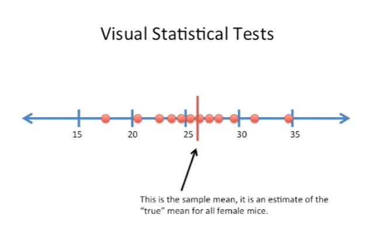
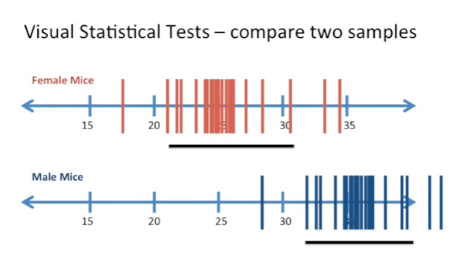

<https://www.youtube.com/watch?v=TqOeMYtOc1w&list=PLblh5JKOoLUK0FLuzwntyYI10UQFUhsY9&index=27>

Today\'s stat quest is all about confidence intervals/

You may have seen or heard of confidence intervals before.

However if you\'re not very confident about them then you\'re not alone.

Many people misunderstand confidence intervals but that\'s only because
they didn\'t learn about bootstrapping.

First now just to clarify there are lots of ways to calculate.

Calculate. center holes and bootstrapping is just one of them but for me
it makes it easiest to understand.

But when you see confidence intervals out there in the wild, you\'re
likely to see a different way to calculate them.

Now even though we just did bootstrapping, your brain might be a little
cloudy and you may have forgotten what it was all about my brains like
that.

So I totally understand that\'s why we\'re gonna do a little bootstrap
refresher.

Imagine we wait a bunch of female mice.

In this case we weighed 12 of them we didn\'t weigh every single female
Mouse on the planet just 12.

Now we can take these 12 measurements and we can use them to calculate
the sample mean.

Now the sample mean is not the mean for all mice the entire planet,
it\'s just the mean of the mice that we sampled.

However we can use bootstrapping.

And the data that we have here to determine what values would be
reasonable for the global worldwide mean of all female mice on the
planet.

Now that we\'ve calculated the sample mean we can bootstrap the sample.

To bootstrap the sample we randomly select 12 weights from the original
sample (and duplicates are okay.

Here\'s an example of a bootstrap sample.

We can see that this measurement on the far left was sampled twice in
our bootstrap sample.

And the measurement to its right wasn\'t included in our bootstrap
sample.

This is called sampling with replacement

Now we calculate the mean of the random sample.

After we\'ve calculated the mean of our first random sample, all we have
to do is repeat steps 1 and 2 until we\'ve calculated a lot of means
sometimes more than 10,000.

And here\'s what it looks like when we\'ve calculated a lot of means,
it\'s maybe a little fewer than 10,000, but you get the idea.

Anyway that\'s all there is to bootstrapping.

Now let\'s talk about confidence intervals.

Usually when you see a confidence interval out in the wild, it\'s called
a 95% confidence interval.

A 95% confidence interval is just an interval that covers 95% of the
means.

So here we have a black bar that spans 95% of the bootstrapped means
that we just calculated.

That\'s it.

That\'s all, the confidence interval is nothing more, nothing less.

Can you guess what a 99% confidence interval is ?

Here\'s a hint it\'s wider than a 95% confidence interval.

Alright I\'ll tell you it\'s just an interval that covers 99% of the
means that you calculated when you bootstrap to the sample.

Now that we know what confidence intervals are, we might ask why are
they useful ?

Well I think confidence intervals are useful because they are
statistical tests performed visually.

Because the interval covers 95% of the means we know that anything
outside of it occurs less than 5% of the time.

That is to say the p-value of anything outside of the confidence
interval is less than 0.05 and thus significantly different.

Here\'s an example of a visual statistical test.

You\'ll remember we originally calculated the sample mean.

The sample mean is an estimate of the true mean for all female mice.

Well with our confidence interval we can figure out.

What the p-value is that the true mean of all female mice not just of
our sample is less than 20 ?

To perform that test we draw our confidence interval which we know
because of bootstrapping or some formula that we use.

We can see that the area left of 20.

So values less than 20 are outside of our 95% confidence interval.

Because the highlighted region is outside of the 95% confidence interval
which contains 95% of the means we know that the probability that the
true mean is in this area has to be less than 0.05.

Thus the p-value is less than 0.05 this is unlikely and because of this
we can say there\'s a statistically significant difference between the
true mean and any value less than 20.

Here\'s another example of a visual statistical test.

In this case we\'re going to compare two samples.

Here we\'ve weighed female mice.

And now we have a sample of male mice.

We\'ve already done the bootstrapping on that sample and here in the
figure we just show the means from that bootstrapping.

Because the 95% confidence intervals do not overlap we know that there
is a statistically significant difference in the weights of female and
male mice.

That is to say we know that the p-value is less than 0.05 just by
looking at the picture.

There is one caveat to that and to illustrate that caveat I\'ve shifted
the means a little bit over to the left so that now the confidence
intervals overlap.

If the confidence intervals overlap, there is still a chance that the
means are significantly different from each other. So in this case you
still have to do the t-test but when the confidence intervals do not
overlap then you can rest assured that there\'s a statistically
significant difference between those two means.
