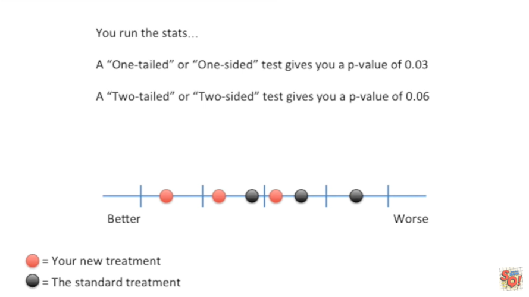

<https://www.youtube.com/watch?v=bsZGt-caXO4&list=PLblh5JKOoLUK0FLuzwntyYI10UQFUhsY9&index=30>

Today we\'re going to be talking about one versus two-tailed tests.

People frequently ask me which one they should use.

So I\'m gonna settle the matter once and for all right here with this
stat quest.

Imagine you\'ve got a new cancer treatment.

You hope that people do better with your new treatment than the standard
treatment.

You do a small clinical trial on six patients and here\'s your data.

The red dots represent people that took your new treatment.

And the black dots represent people that took the standard treatment.

The values range from better to worse.

The data suggests that people who use your new treatment do better than
people on the standard treatment.

However there is a little bit of ambiguity in the results.

So you run the stats

a one-tailed or one-sided test gives you a p-value of 0.03.

Awesome 0.03 is smaller than that pesky 0.05 cutoff that we usually use
to determine significance.

A two-tailed or two-sided test gives you a p-value of 0.06.

DAG !!!

Not so awesome.

Which p-value should you use ?

The one-tailed p-value tests the hypothesis that your treatment is
better than the standard treatment.

Great !!!

That\'s what we wanted, right ?

It\'s certainly tempting but let\'s not jump to conclusions before
learning about the two-tailed p-value.

The two-tailed p-value tests whether the new treatment is better, worse,
and not significantly different.

The one-tailed p-value is smaller because it doesn\'t distinguish
between worse and not significantly different.

Since we\'d want to know if our new treatment was worse than the
standard treatment we should use the two-tailed p-value.

But wait !!!!

Doesn\'t the data being skewed towards the new method being better,
suggests we don\'t need to test if it is worse ?

No good statistical practice means we need to decide what tests and what
p-value we want to use before we do the experiment.

Otherwise were p-hacking.

This increases the probability that we will report bogus results.

Let\'s see why this is !

I started with a standard normal distribution.

Tthe x-axis represents measurements from small to large.

The y-axis represents the probability that I\'ll get certain
measurements.

Most of the time I should get measurements in the middle.

But every now and then I\'ll get a really small measurement or a really
big one.

Then I took a sample from this distribution.

That means a computer picked three numbers that had a high likelihood of
being from the center of the distribution but every now and then one of
them might be really small or really big.

I then took another sample from the exact same distribution.

In most cases a two-tailed t-test on these two samples should give me a
p-value greater than 0.05.

This is because most of the time the samples will overlap.

But every now and then the samples will not overlap and the t-test will
give me a p-value less than 0.05.

This is called a false positive it happens 5% of the time.

I did 10,000 two-tailed t-test on data like this.

5 percent of 10,000 equals 500 so I was expecting 500 false positives.

Here\'s a histogram of the p-values.

The blue line shows that each bin contains about 500 tests.

These are the false positives the tests with p-values less than 0.05.

We pretty much got what we expected.

There were close to 500 false positives.

Then I changed things to mimic switching to a one tailed test when
things looked good.

If sample number one had two or more values that were less than all of
the values in sample number two then I used a one-tailed t-test.

Since these two values are less than all of the values in sample number
two I used a one-tailed t-test.

On this data set here\'s a histogram of the new p-values.

The blue line shows the expected number of p-values per bin.

There are now close to 800 false positives.

The chance of reporting a false positive went from 5 percent to 8
percent even though we\'re using 0.05 as the threshold for significance.

Thus you can\'t wait till you see the data to decide you want to use a
one-tailed p-value.

So let\'s take a step back to before we did the experiment.

What do we want to learn from it ?

With a cancer treatment it\'s obvious we must learn if it improves
things or makes them worse.

But really it\'s the same for all data that has the option for a 1 or
two-tailed p-value.

We always want to know both sides of the story not just one.

So when you have a choice always go with a two-tailed p-value.

Note not all statistical tests have a choice in that case don\'t worry
about it.
