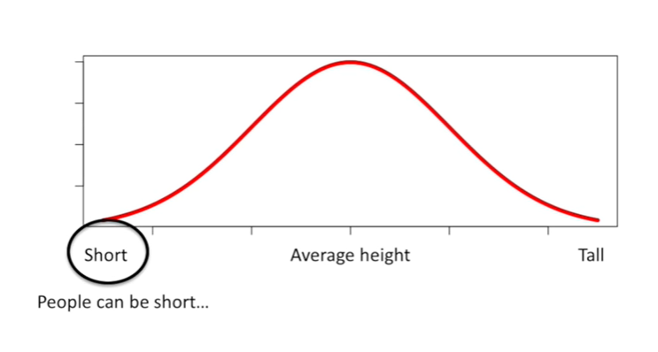
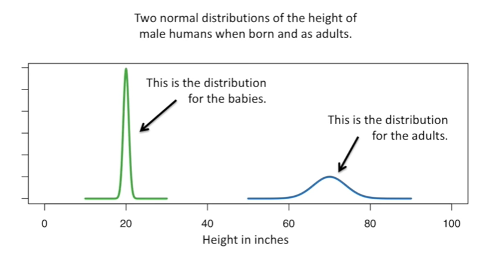
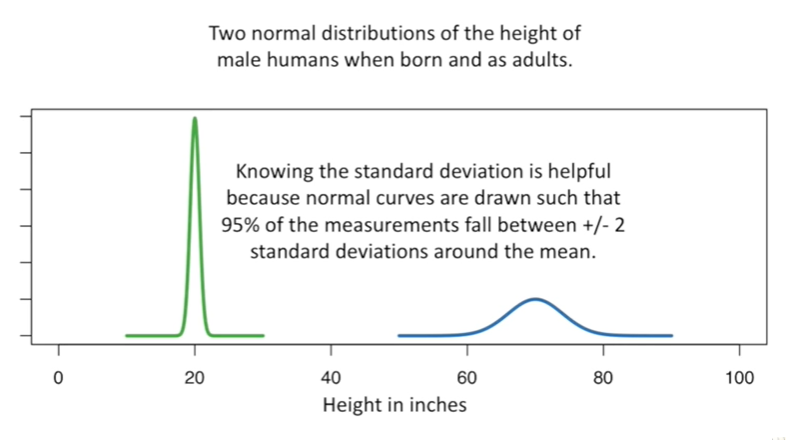

<https://www.youtube.com/watch?v=rzFX5NWojp0&list=PLblh5JKOoLUK0FLuzwntyYI10UQFUhsY9&index=3>

Today we\'re going to be talking about the normal distribution.

This is part one of a handful of stack quests on this distribution
because it\'s so darn important.

Today let\'s just start with the basics.

Chances are you\'ve seen a normal or Gaussian distribution before.

It\'s also called a bell-shaped curve because it\'s a symmetrical curve
that wait for it looks like a bell.

In this example the curve represents human height measurements.

People can be short

average

or tall or anywhere in between.

The y-axis represents the relative probability of observing someone who
is really short or really tall or who has an average height.

For example it\'s relatively rare to see someone who is super short so
the bell-shaped curve is relatively low in this part of the graph

but it\'s quite common to see someone who is close to the average height
so the bell-shaped curve is very tall in this region

and it\'s relatively rare to see someone who is really tall so again the
bell-shaped curve is relatively low in this region.

Here are two normal distributions of the height of male humans when born
and as adults.

This is the distribution for the babies and this is the distribution for
the adults.

The average baby height is 20 inches.

The average adult height is 70 inches.

Normal distributions are always centered on the average value.

Just by looking at the graph we can tell there is a high probability
that a newborn baby will be between 19 and 21 inches tall.

In contrast adults are between 60 and 80 inches tall.

You may have noticed that the curve for babies is way tall compared to
the curve for adults.

This is because there are many more possibilities for adult height than
for babies.

The more options there are for height the less likely any specific
measurement will be one of them.

The width of the curve is defined by the standard deviation.

We can tell just by looking at the curves that babies have a relatively
small standard deviation compared to adults.

The standard deviation for babies is 0.6.

The standard deviation for adults is 4.

Knowing the standard deviation is helpful because normal curves are
drawn such that 95% of the measurements fall between plus or minus two
standard deviations around the mean.

This means that 95% of the baby measurements fall between 20 plus or
minus 1.2 inches.

And 95% of the adult measurements fall between 70 plus or minus 8
inches.

To draw a normal distribution you need to know :

- 1\. the average measurement this tells you where the center of the
  curve goes

- 2\. the standard deviation of the measurements this tells you how wide
  the curve should be. And the width of the curve determines how tall it
  is. The wider the curve, the shorter. The narrower the curve, the
  taller.

The curves then tell us that there is a high probability of measuring a
newborn baby boy within plus or minus 1.2 inches of the mean.

And there\'s a low probability of measuring a man within plus or minus
1.2 inches of the mean.

Lots of things are normally distributed.

We\'ve been talking about height but there\'s also weight commuting
times and many many many many many many many more things.

The normal distribution is kind of magical in that we see it a lot in
nature.

But there\'s a reason for that, and that reason makes it super useful
for statistics as well.

Spoiler alert : it\'s called the central limit theorem.

I\'m already working on a whole stack quest on the central limit theorem
so that\'s something we can all look forward to.
