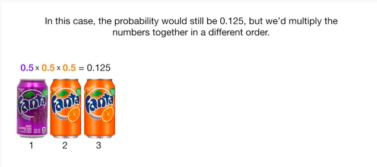
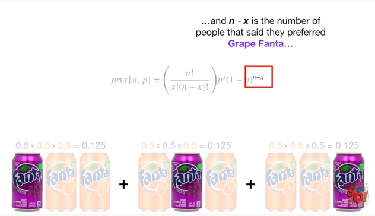
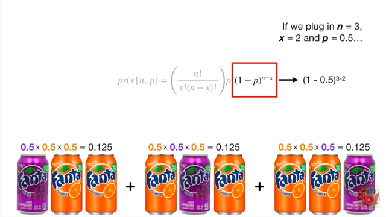
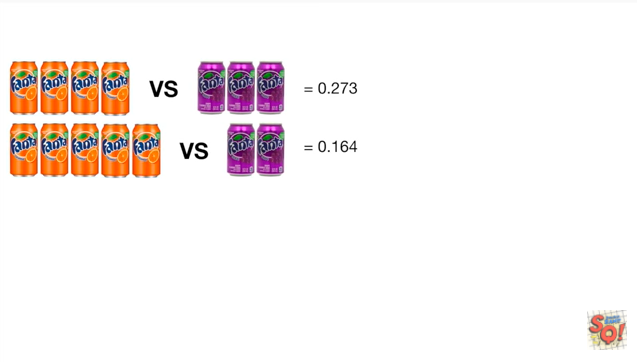

<https://www.youtube.com/watch?v=J8jNoF-K8E8&list=PLblh5JKOoLUK0FLuzwntyYI10UQFUhsY9&index=31>

Today we\'re going to talk about the binomial distribution and the
binomial test and they\'re going to be clearly explained.

Usually when people talk about the binomial distribution they talk about
flipping a coin.

A coin usually has heads

and at least one tail.

For example you can use the binomial distribution to find out the
probability of getting six heads in six tosses.

But who really cares about flipping coins ?

What folks really want to know is whether or not people like orange
Fanta more than grape Fanta.

Which flavor reigned supreme or are they both equally loved ?

To answer this question we can ask a bunch of people which flavor they
prefer.

If everybody but one person said they liked orange Fanta more than grape
Fanta then it would be pretty obvious what people liked most

but what if four people say they like orange Fanta and three people say
they\'d like grape Fanta ?

Is that enough to be confident than most people like orange Fanta ?

Or could it be that people in general don\'t have a preference and these
results are just due to random chance and a small sample size.

Maybe if we surveyed another seven people we might only get three people
who like orange Fanta and for people who like grape Fanta ?

To get to the bottom of this mystery we need to get a sense of what to
expect if there is no preference.

Then we determine if our survey results fit those expectations if not we
can reject the idea that both Fantas are loved equally.

The binomial distribution will tell us what to expect if there is no
preference.

To say the same thing using statistics lingo.

We will use the binomial distribution

aka this nasty looking thing

to model what to expect when there is no preference

then we\'ll see how well this model fits the data if the model is a poor
fit we will reject the idea that both flavors are loved equally.

So let\'s start with a super simple example and assume that I asked
three people if they liked orange Fanta more than grape Fanta.

The first person we asked said they preferred orange Fanta.

The second person we asked also said they preferred orange Fanta.

And the third person we asked said they preferred grape Fanta.

If people really didn\'t prefer one flavor over the other then we will
assume that there is a 50% chance they will pick orange and a 50% chance
they will pick grape.

We can then calculate the probability of the first two people randomly
choosing orange in the third person randomly choosing grape.

Assuming that there is no real preference the probability of the first
person preferring orange Fanta is 0.5.

And the probability of the first two people preferring orange Fanta is
0.5 times 0.5 which equals 0.25.

And the probability of the first two people preferring orange Fanta and
the third person performing grape is 0.5 times 0.5 times 0.5 which
equals 0.125.

Note 0.125 is the probability of the first two people saying they prefer
orange and the third person saying they prefer grape.

It is not the probability that any two out of three people would prefer
orange.

Let me explain.

It could have just as easily been that the first person said they
preferred grape.

In this case the probability would still be 0.125 but we\'d multiply the
numbers together in a different order.

Likewise if the second person said they preferred grape we just multiply
the numbers together in a different order.

So all three of these combinations are equally likely.

And this means that the probability that any two out of three people
prefer orange Fanta is the sum of the three possible orders.

So we just add the three probabilities together

and the probability that any two out of three people would randomly say
they prefer orange Fanta is 0.375.

Alternatively we could have done the math using this nasty-looking
formula.

X is the number of people who preferred orange Fanta in this case X
equals 2

n is the total number of people we asked in this case n equals 3.

Note : n minus X the total number of people we asked minus the number of
people who preferred orange Fanta equals the number of people who said
they prefer grape Fanta.

P is the probability that someone will pick orange Fanta in this case P
equals 0.5.

Note : the probability that someone might prefer grape Fanta is 1 minus
P.

Together this says the probability of X the number of people who say to
prefer orange Fanta given in the number of people we asked and P the
probability of picking orange Fanta

equals this nasty looking thing.

Ooh it\'s got factorials don\'t freak out it looks fancy but it just
boils down to the number of different ways two of three people could say
they prefer orange Fanta.

When we did everything by hand we saw that there were three ways for two
of three people to say they prefer orange Fanta

and if we plug in N equals 3 and x equals 2

and then just do the math

we get

three three ways that two out of three people could prefer orange Fanta
just like when we did it by hand.

So this fancy thing is really no big deal !!!

The next part of the formula P to the X corresponds to the probability
that orange Fanta was chosen two of the three times.

In other words P to the X just consolidates 0.5 times 0.5 into 0.5
squared.

The last part of the equation corresponds to the probability that
someone preferred grape Fanta.

Remember that one minus P is the probability that someone prefers grape
fanta

and n minus X is the number of people that said they preferred grape
Fanta.

If we plug in N equals three x equals two and P equals zero point five

and then do the math we get zero point five.

So this term corresponds to the one person who liked grape Fanta.

Thus these two parts of the equation correspond to zero point five times
zero point five times zero point five.

And the nasty part just multiplies it by three.

Now we can put all the parts together

and plug in x equals to the number of people that preferred orange Fanta
in equals three the number of people we asked and P equals 0.5 the
probability someone would randomly pick orange Fanta

and we get the same probability that two out of three people would
randomly prefer orange Fanta that we got when we did everything by hand
0.375.

In other words the binomial distribution tells us that the probability
that two of three people will prefer orange Fanta due to random chance
is 0.375.

BAM !!!

Calculating the probability of three of three people saying they prefer
orange Fanta by hand is pretty easy since there is only one combination.

But we can just as easily use the fancy formula by plugging in x equals
three

and then we just do the math this term equals one since we are dividing
three factorial by three factorial

and this term is also equal one because anything raised to the zero
power equals one

and then we just keep doing the math

and this means that the probability of three of three people randomly
preferring orange Fanta is 0.125

which is exactly what we got when we did the calculations by hand.

Now that we\'ve seen that we can calculate probabilities with the
binomial distribution let\'s go back to our original question if four
people say they\'d like orange Fanta and three people say they\'d like
grape Fanta can we conclude that people in general prefer orange Fanta ?

Now we plug in x equals for the number of people that preferred orange
Fanta n equals 7 the number of people we asked and P equals 0.5 the
probability someone would randomly pick orange Fanta

and then just do the math

and we get zero point two seven three the probability that four of seven
people would randomly prefer orange Fanta.

Double bam !!!

When you use a binomial distribution to calculate a p-value it\'s called
a binomial test.

So what\'s the p-value for four out of seven people preferring orange
Fanta ?

The p-value is the probability of the observed data four of seven people
prefer orange Fanta plus the probabilities of all other possibilities
that are equally likely or rarer.

This means we need to calculate these probabilities.

These are the observed results of our poll.

And these are rarer possibilities

and we also need to calculate the probabilities of these combinations.

These two possibilities for verses three and three versus four are
equally rare.

If you don\'t believe me plug in the numbers and see.

The remaining possibilities are rarer.

In other words by including possibilities when grape Fanta is preferred
equally or more often we are calculating a two-sided p-value.

If this is blowing your mind don\'t freak out just watch the stat quests
on p-values clearly explained and one and two sided p-values (the links
are in the description below).

We\'ve already calculated the probability that four out of seven people
prefer orange Fanta it\'s zero point two seven three.

For this we just set X to five and plug and chug

and we get zero point one six four

then we get zero point zero five five

and then we get zero point zero zero eight.

Adding the probabilities together gives us 0.5 the probability that
orange Fanta is preferred.

Now we just plug and chug the numbers for when grape Fanta is preferred.

Adding the probabilities together gives us 0.5 the probability that
orange Fanta is not preferred.

The sum of the probabilities of all combinations of events that have an
equal probability or a rarer equals 0.5 plus 0.5 which equals 1.

Which means the p-value for 4 out of 7 people saying that prefer orange
Fanta is 1.

Which means that the model the binomial distribution with P equals 0.5
ie orange Fanta and grape Fanta are both equally loved is a good fit for
the observed data.

Thus we conclude that given the sample size seven we cannot rule out the
possibility that both orange Fanta and grape Fanta are equally loved !!!

Think about that the next time you watch the World Series of baseball.

Triple bam !!!!

One last thing before we\'re done.

The binomial distribution only works when the probability that someone
likes orange Fanta does not change if someone else already said they
liked orange Fanta.

In other words if we asked a bunch of people if they liked orange Fanta
and they all say yes then that should not affect the probability that
the next person also likes orange Fanta.
