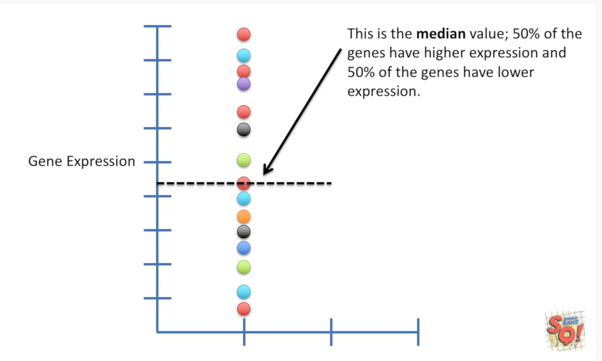
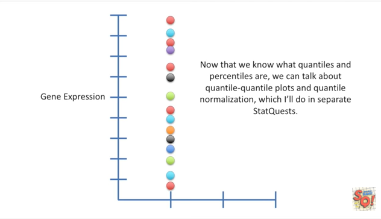

<https://www.youtube.com/watch?v=IFKQLDmRK0Y&list=PLblh5JKOoLUK0FLuzwntyYI10UQFUhsY9&index=32>

Today we\'re going to be talking about quantiles and percentiles and
they\'re gonna be clearly explained.

I thought putting this stat quest together was going to be super easy
but doing a little research sent me down a crazy rabbit hole pretty
much.

Every webpage I looked at had a slightly different explanation.

Part of the problem is that there\'s a difference between how the word
quantile is defined and how quantiles are used in practice.

The other problem is that there\'s a ton of different ways to calculate
quantiles.

The quantile function in R alone has nine different methods.

Let\'s start by talking about the strict definition of quantile.

And then we\'ll move on and talk about how the word is used in practice.

If you can recognize the definition you can skip it and move on to
something more useful !

We\'ll start by measuring expression for a gene.

Then we measure expression for another gene.

We measured expression from 15 genes total.

This is the median value, 50% of the genes have higher expression and
50% of the genes have lower expression.

Technically speaking, the median is a quantile because it splits the
data into groups that contain the same number of data points.

In this example there are seven data points below the line and seven
data points above the line.

Sometimes this quantile the medium is labeled 0.5 since it splits the
data in half and sometimes it\'s labeled 50% since 50% of the data is
above it and 50% is below it .

The median value is 4.5.

Thus the 50 percent or 0.5 quantile value is 4.5.

To summarize this first point.

The median is a quantile because it splits the data into equal sized
groups.

This is called the 0.5 quantile or the 50% quantile.

Regardless of which notation is correct you\'re likely to see both of
them in the wild.

So let\'s just roll with it and not get to been out of shape over the
nomenclature.

Now we\'ve added two more lines.

Together with the first line they divide the data into four equally
sized groups.

These new lines are quantiles because they divide the data into equally
sized groups.

This one is called the 0.25 or 25 percent quantile because 1/4 or 25% of
the points are less than it.

The 25% or 0.25 quantile is 2.5.

This one is called the 0.75 or 75 percent quantile because
three-quarters or 75% of the points are less than it.

The 75 percent or 0.75 quantile is 7.3.

In general quantiles are just the lines that divide data into equally
sized groups.

At least that\'s the technical definition.

And technically speaking percentiles are just quantiles that divide the
data into 100 equally sized groups.

However in practice the terminology is much more flexible.

Even though this data set isn\'t large enough to be divided into 100
groups we still call the median or the fiftieth quantile the fiftieth
percentile.

And this is called the 75th percentile.

And this is called the twenty-fifth percentile.

Often the terms quantile and percentile are used when we divide each
data point into its own group.

Since no values are less than this one at the bottom it\'s called the
zero percent quantile or the zeroth percentile.

This data point is the one divided by fifteen equals seven percent
quantile or the seventh percentile.

I use one divided by fifteen because there\'s one data point of the
fifteen that are less than it.

This data point is the three divided by fifteen or twenty percent
quantile or the twentieth percentile etc etc etc. Calculating quantiles
and percentiles is just a matter of finding out how many values are less
than the value you\'re interested in.

one last thing before we move on.

So far I\'ve shown you one way to calculate the quantiles and
percentiles however there are many more.

R\'s quantile function provides nine different ways to calculate
quantiles each one resulting in slightly different results.

What this means is that if your data set is small don\'t put too much
stock in the quantiles since they can change a lot from method to method
and sample to sample.

However when your data set is large then all of the methods give fairly
similar results.

Now that we know what quantiles and percentiles are we can talk about
quantile quantile plots and quantile normalization which I\'ll cover in
separate stat quests.
