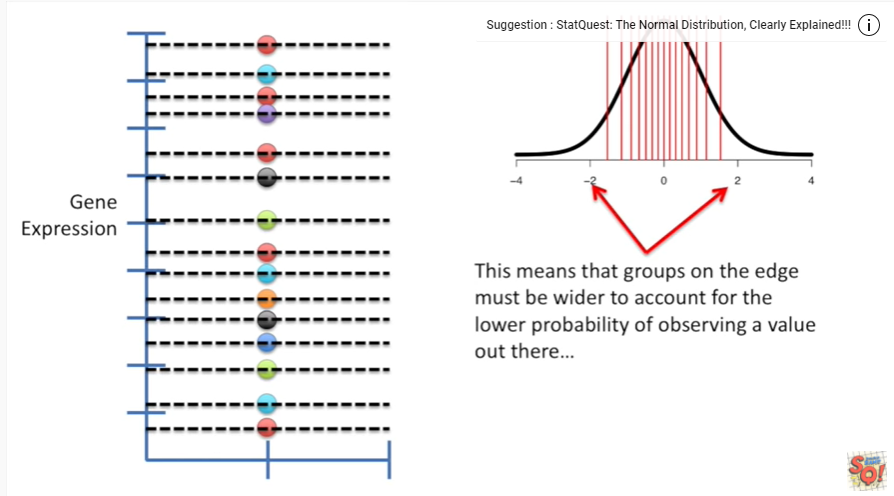
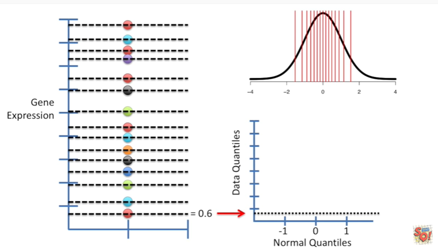

<https://www.youtube.com/watch?v=okjYjClSjOg&list=PLblh5JKOoLUK0FLuzwntyYI10UQFUhsY9&index=33>

Today we\'re gonna be talking about quantile, quantile plots.

These are called QQ plots sometimes and they\'re gonna be clearly
explained.

This stat quest assumes you already know what a quantile is if you
don\'t.

Nno big deal !

Just check out the stat quest on quantiles and percentiles and then you
can watch this one in or make a lot more sense.

We\'ll start with this data set where we measured expression in 15
genes, total.

One question we might have is is this data normally distributed ?

A QQ plot will help answer that question.

Step 1 give each point its own quantile.

Step 2 get yourself a normal curve any normal curve will do.

Step 3 add the same number of quantiles to the curve as you created for
the data .

That is to say there are 15 lines dividing the data into equal sized
groups

and there are 15 lines dividing the normal curve into equal sized
groups.

For the normal curve equal sized groups means that there is an equal
probability of observing a value within each group.

This means that groups on the edge must be wider to account for the
lower probability of observing a value out there

and groups in the middle are narrower since there is a higher
probability of observing a value in that region.

Step 4 now plot your QQ graph !!!

A QQ graph has two axes

one for the quantiles that we generated from our data set and one for
the quantiles we generated from the normal distribution.

We\'ll start with the smallest quantile in our data set this quantile is
at 0.6 and our data set.

And so we\'ll draw a dotted line on the QQ plot to indicate that
location then we draw a vertical line representing the position of the
smallest quantile in the normal distribution.

This quantile is at negative 1.5.

So that\'s where our vertical dotted line goes now all we do is put a
dot where those two lines intersect.

Now we move on to the second quantile in the data set that we collected.

This one is at one point one.

So we have a horizontal dotted line at one point one in our quantile
quantile graph.

Then we draw a vertical line at the location of the second quantile in
the normal distribution.

This quantile is at negative 1.2.

So we draw a vertical line at negative 1.2 then we draw a dot where the
two lines intersect

The third quantile in the data set that we collected is at 1.9.

So we draw a horizontal line at 1.9.

And the 3rd quantile in our normal distribution is at negative zero
point 8 9.

So we draw a vertical line at that position and then we draw a dot where
the two lines intersect.

And then we just do the same thing over and over.

Again for each quantile until we have all the quantiles represented in
our quantile quantile graph.

Hooray !!!

Now we\'ve got dots showing where the quantiles from our data set
intersected with the quantiles from the normal distribution on our
graph.

Now we see how well the dots fit a straight line

if the data were normally distributed most of the points would be on the
line.

This would mean that both the data set and the normal distribution have
comparable quantiles.

In this case the fit is not awesome

so we should compare the data that we collected to another distribution.

What if we compare our data to a uniform distribution ?

The process is the same :

Step 1 give each point its own quantile.

Step 2 get yourself a uniform distribution.

Any old uniform distribution will do.

Step 3 add the same number of quantiles to the distribution as you
created for your data.

Step 4 now plot your QQ graph !!!

Just like before we\'ve got the data quantiles on the y axis and the
distribution quantiles on the x axis.

Now we draw a straight line that goes through the points in the graph
and look.

The points are much closer to the line in the QQ plot indicating that
the uniform distribution is a better fit.

So if you\'re ever wondering which distribution matches your data well
you could use QQ plots to answer that question ok.

One last thing before we\'re done !

What if we want to compare the original data set to another one this
second one is much smaller.

The new data set only has four quartiles quartiles are just quantiles
when you only have four of them.

So we determine four quartiles for the original data set and compare
those .

And just like we did when we compared the data set that we gathered to
the normal distribution and the uniform distribution we plot a QQ plot
by drawing horizontal and vertical lines representing the quantiles from
the two data sets that we collected.

And where the two lines intersect we draw a dot and we just repeat this
process for each pair of quantiles until we have all the quantiles
represented on the graph.

Hooray !!

Now we\'ve got all the quantiles plotted on our QQ graph.

Now at a straight line to determine how similar the distributions are.

With just a few quantiles in our plot it\'s hard to have a definitive
answer about whether or not the two data sets have similar
distributions.

But you get the idea if we collected more data we\'d have more quantiles
and would know more.
