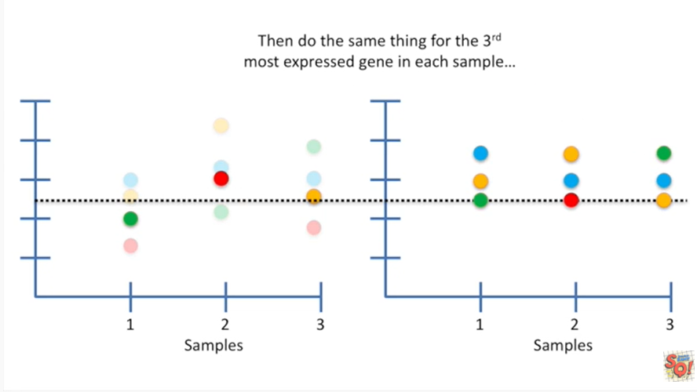

<https://www.youtube.com/watch?v=ecjN6Xpv6SE&list=PLblh5JKOoLUK0FLuzwntyYI10UQFUhsY9&index=34>

Today we\'re going to be talking about quantile normalization and it\'s
going to be clearly explained.

Imagine we have some data from a microarray experiment.

If you\'re not familiar with microarrays here\'s the scoop :

1\. Microarrays measure how active genes are in a sample.

2\. They do that by measuring the intensity of different colors of
light.

3\. If you have a better light bulb for one experiment, every
measurement might be brighter than every measurement from another
experiment.

Thus we need to normalize the data to account for this technical
difference between experiments which has nothing to do with biology.

This is just an example of the type of data you might want to quantile
normalize.

However there are lots of other types of data so if you are doing
microarray experiments well it still might be useful to pay attention
and see how this is done because it might apply to some other data set
that you\'re working with.

Here\'s our data in this graph each color represents a different gene.

These are different from the colors that are scanned in the actual
microarray experiment.

At this point those colors have already been converted into intensity
values and that\'s what we\'re looking at.

Here each gene has its own color and the value on the y-axis represents
the intensity that.

That gene had on a microarray.

By the way the word microarray is really hard to articulate.

Unless you\'re super focused on your pronunciation.

So I hope I don\'t mess it up too many times in this stat quest.

Okay back to the good stuff.

These are the mean values for each sample.

Each sample has a different mean value suggesting that we need to
compensate for different overall intensities of light.

Quantile normalization corrects for this technical artifact.

So let\'s do it so that.

We can keep track of how this method works.

We\'ll keep the raw data on the left side and the quantile normalized
data on the right side.

You start by focusing on the most highly expressed gene in each sample.

Then calculate the mean value.

Now you extend the mean value into the new plot.

The quantile normalized value for the genes with the highest expression
is their mean value.

Now focus on the next most highly expressed gene in each sample

then calculate the mean value.

Extend the mean value into the new plot.

The quantile normalized value for the genes with the next highest
expression is their mean value.

Then do the same thing for the third most Express gene in each sample.

And so on and so on finally you do the same thing for the least Express
gene in each sample.

Hooray !!

Now we\'ve quantile normalized the data.

After quantile normalization the values for each sample are the same

but the original gene orders are preserved.

So in sample one the red gene has the lowest expression value in the raw
data set and also the quantile normalized data set.

And in sample two the green gene has the lowest expression values in
both the raw data and in the normalized data.

Lastly in sample number three the red gene has the lowest expression
values in both the raw data and the normalized data.

BAM !!!

They call it quantile normalization because the normalized data sets
have identical quartiles.

Double bam !!!
