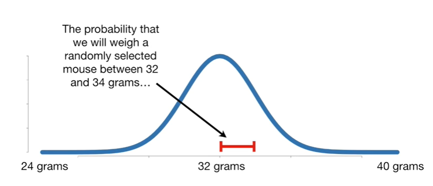
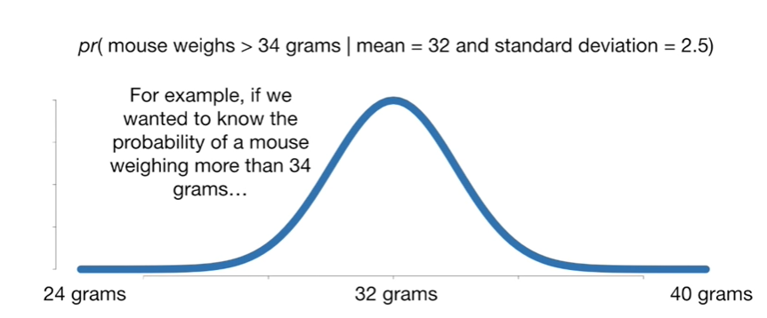
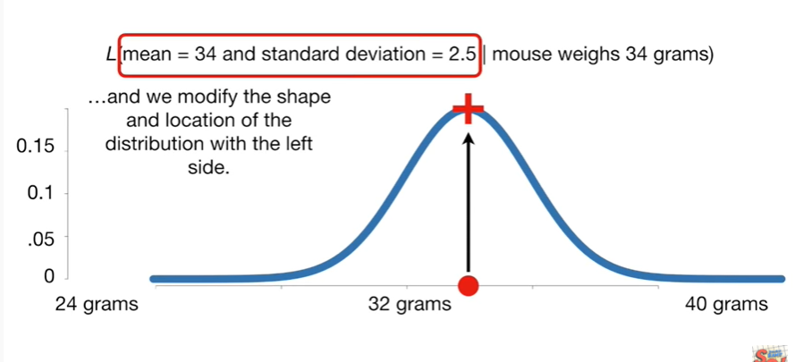
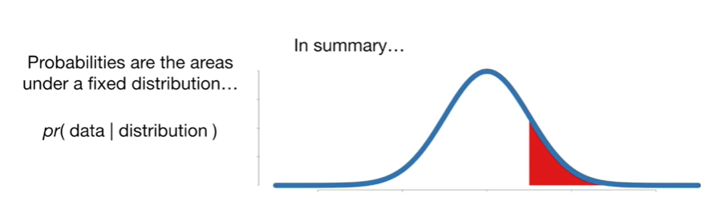

<https://www.youtube.com/watch?v=pYxNSUDSFH4&list=PLblh5JKOoLUK0FLuzwntyYI10UQFUhsY9&index=35>

Today we\'re gonna be talking about the difference between probability
and likelihood.

These are two closely related concepts that are very easy to get
confused.

Even I mix them up from time to time so enough of this jibber-jabber.

Let\'s get down to it for me the easiest way to understand the
difference between probability and likelihood is.

To just see it in pictures.

So let\'s start by looking at probability with respect to a normal
distribution keeping in mind that this concept applies to all continuous
distributions.

In this case let\'s imagine that this is a distribution of Mouse
weights.

It has a mean of 32 grams

and a standard deviation of 2.5.

On the low end we have 24 grams

and on the high end we have 40 grams.

The probability that we will weigh a randomly selected Mouse between 32
and 34 grams

is the area under the curve between 32 and 34 grams.

In this case the area under the curve equals zero point 2 9 meaning
there\'s a 29% chance a randomly selected Mouse will weigh between 32
and 34 grams.

Mathematically we say this with the following notation.

The probability of weighing a mouse between 32 and 34 grams

given the mean of the distribution is 32 and the standard deviation is
2.5.

And all this equals zero point two nine.

This is the part of the equation we change if we are interested in
different Mouse weights.

For example if we wanted to know the probability of a mouse weighing
more than 34 grams

we would change the bit on the left side to reflect this.

The right side which defines the shape and location of the distribution
stays the same.

So when we talk about probabilities we are talking about.

A distribution that\'s described by the right side of this equation

and the area under the curve that is described on the left side.

Using the same distribution

we can change the left side to get a new probability !

BAM !!

Now that we have probability worked out let\'s talk about likelihood.

To talk about likelihood you assume that you have already weighed your
mouse or mice if you have weighed more than one.

So here\'s our mouse it weighs 34 grams.

The likelihood of weighing a 34 gram Mouse is

this point on the curve

and that value is 0.12.

Mathematically we say this with the following notation.

The likelihood of a distribution with mean equals 32 and the standard
deviation equals 2.5

given

we weighed a 34 gram Mouse

and all that equals 0.12.

If we shifted the distribution over so that the mean was 34 grams

the new likelihood would be zero point two one

so with likelihoods the measurements on the right side are fixed

and we modify the shape and location of the distribution with the left
side.

Double bam !!!

In summary :

Probabilities are the areas under a fixed distribution

and mathematically we have the probability of data given a distribution

Likelihoods are the y-axis values for fixed data points with
distributions that can be moved

mathematically this is written as the likelihood of a distribution given
data.

If you want to see the actual equations check out the stat quest that
derives the maximum likelihood estimator for the exponential
distribution.
