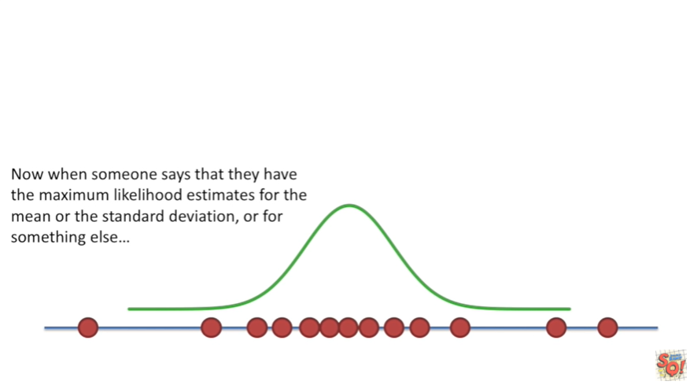

<https://www.youtube.com/watch?v=XepXtl9YKwc&list=PLblh5JKOoLUK0FLuzwntyYI10UQFUhsY9&index=36>

Today we\'re going to be talking about maximum likelihood.

Let\'s say we weighed a bunch of mice.

The goal of maximum likelihood is to find the optimal way to fit a
distribution to the data.

There are lots of different types of distributions for different types
of data.

Here\'s a normal distribution.

Here\'s what an exponential distribution looks like.

And here\'s what a gamma distribution looks like and there are many
more.

The reason you want to fit a distribution to your data is it can be
easier to work with and it is also more general it applies to every
experiment of the same type.

In this case we think the weights might be normally distributed.

That means we think it came from this type of distribution :

normally distributed means a number of things :

1\. first we expect most of the measurements.

For example Mouse weights to be close to the mean or average and we see
low and behold in our data set.

Most of the mice weigh close to the average.

We also expect the measurements to be relatively symmetrical around the
mean.

Although the measurements are not perfectly symmetrical around the mean
they are not crazy skewed to one side either.

This is pretty good normal distributions come in all kinds of shapes and
sizes.

They can be skinny, medium or large boned.

Once we settle on the shape we have to figure out where to Center the
thing.

Is one location better the another ?

Before we get too technical let\'s just pick any old normal distribution
and see how well it fits the data.

This distribution says most of the values you measure should be near my
average !

The distributions average is the black dotted line in this case that\'s
different from the average of the actual measurements !

Unfortunately most of the values we measured are far from the
distributions average.

According to a normal distribution with a mean value over here

the probability or likelihood of observing all these weights is low.

What if we shifted the normal distribution over so that its mean was the
same as the average weight ?

According to a normal distribution with a mean value here

the probability or likelihood of observing these weights is relatively
high.

If we kept shifting the normal distribution over

then the probability or likelihood of observing these measurements would
go down again.

We can plot the likelihood of observing the data over the location of
the center of the distribution.

We start on the left side

and we calculate the likelihood of observing the data and then we shift
the distribution to the right and recalculate.

We just do this all the way down the data once we\'ve tried all the
possible locations we could Center the normal distribution on.

We want the location that maximizes the likelihood of observing the
weights we measured .

This location for the mean maximizes the likelihood of observing the
weights we measured.

Thus it is the maximum likelihood estimate for the mean.

In this case we\'re specifically talking about the mean of the
distribution not the mean of the data however with a normal distribution
those two things are the same great

Now we have figured out the maximum likelihood estimate for the me.

Now we have to figure out the maximum likelihood estimate for the
standard deviation.

Again we can plot the likelihood of observing the data over different
values for the standard deviation.

Now we found the standard deviation that maximizes the likelihood of
observing the weights we measured.

This is the normal distribution that has been fit to the data by using
the maximum likelihood estimations for the mean and the standard
deviation.

Now when someone says that they have the maximum likelihood estimates
for the mean or the standard deviation or for something else

you know that they found the value for the mean or the standard
deviation or for whatever that maximizes the likelihood that you
observed.

The things that you observed.

Terminology alert !

In everyday conversation probability and likelihood mean the same thing.

However in stats land likelihood specifically refers to this situation
we\'ve covered here where you are trying to find the optimal value for
the mean or standard deviation for a distribution given a bunch of
observed measurements. This is how we fit a distribution to data.
