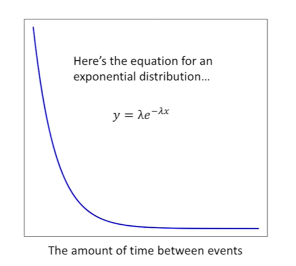
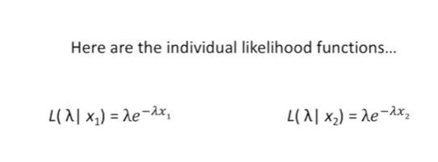

<https://www.youtube.com/watch?v=p3T-_LMrvBc&list=PLblh5JKOoLUK0FLuzwntyYI10UQFUhsY9&index=37>

Today we\'re going to be talking about the exponential distribution and
its maximum likelihood estimate.

W e\'ll start with a brief introduction of the distribution and what
it\'s used for.

And then we\'ll dive into the math and nitty-gritty of how maximum
likelihood is applied to it.

So what is the exponential distribution.

It\'s a statistical distribution that models the time between events.
For example how long will you wait before you get another text message
or how much time will pass before the next person views this video.

Here\'s what an exponential distribution looks like the x-axis is the
amount of time between events.

The y-axis is scaled so that the total area under the curve equals 1.

If we were interested in the probability of an event like someone
viewing this video happening within 0 to 5 seconds we solved for the
area under the curve from x equals 0 to x equals 5 seconds.

Here\'s the equation for an exponential distribution.

You plug in some value for X

and out comes a value for y .

Lambda is called the rate parameter and it is proportional to how
quickly things happen.

In this graph lambda equals 1 and this models an event happening like
someone watching this video on average every second.

Here lambda equals two and this models someone watching the video on
average twice every second.

Here lambda equals 0.5 and this models someone watching this video on
average once every two seconds.

The goal of maximum likelihood is given a set of measurements to find an
optimal value for lambda.

So assume I collected a lot of data about how much time passed between
views of this video.

X sub 1 equals the amount of time that passed between the first and
second views.

X sub 2 equals the amount of time that passed between the second and
third views.

X sub 3 equals the amount of time that passed between the third and
fourth views.

Etc etc etc

Here are the n measurements.

For now let\'s assume we already have a good value for lambda.

What\'s the likelihood of lambda given our first measurement X sub 1.

Here\'s the likelihood function we have the likelihood of lambda

given that we have this measurement X sub 1

and the likelihood equals this equation this equation is just the
equation for the curve with X sub 1 plugged into it.

If X sub 1 was here

the likelihood of lambda would be this value on the y-axis.

Similarly the likelihood of lambda given the second measurement X sub 2
is just the equation for the curve with X sub 2 plugged into it.

If X sub 2 was here

the likelihood of lambda would be this value on the y-axis.

What is the likelihood of lambda given both X sub 1 and X sub 2.

Well here are the individual likelihood functions

and here\'s the combined likelihood function.

Because we are interested in X sub 1 and X sub 2 we multiply the 2
likelihood functions together.

Here I\'ve just plugged in the 2 likelihood equations

and now I\'ve pulled the two lambdas out

and lastly I can add the exponents together.

Thus this equation is the likelihood of lambda given X sub 1 and X sub 2
.

Bam !!!

What is the likelihood of lambda ?

Given all of the data X sub 1 X sub 2 all the way to X sub n.

Here\'s the likelihood function that includes all of the data we have
collected it is equal to the product of all the individual likelihoods.

Here I\'ve just plugged in all the individual likelihood equations and
now I\'ve just pulled out all of the lambdas and lastly I\'ve added all
of the exponents together.

Thus this equation is the likelihood of lambda given all of the data X
sub 1 X sub 2 all the way to X sub M.

BAM !!!

What if we don\'t have a good value for lambda.

Well we try different values for lambda to find a good one

to find the maximum likelihood we

one take the derivative of this

and to solve for lambda when the derivative is set to be equal to zero.

Here\'s a graph of the likelihood using different values for lambda.

At the maximum likelihood the slope and thus the derivative will be
equal to zero to.

Find the maximum likelihood estimate for lambda.

Step 1 we take the derivative of the likelihood function.

Any time you have a function with an exponential in it it\'s almost
always easier to take the derivative of the log of that function.

So that\'s what we\'re going to do.

We can do this because the derivative of a function and the derivative
of the log of a function equals zero at the same place so for the
purposes of finding where the derivative equals zero the original
function and its log are interchangeable.

Since we are now working with the log of the function we can split up
the multiplication into addition.

Next we move lambdas exponent in to be in front of the log

and the log of the exponential function reduces to just its exponent.

If any of this fancy log stuff is confusing you check out the stat quest
on logs.

Finally we take the derivative of both parts of the equation with
respect to lambda.

Now we move on to step two set the derivative to be zero and solve for
lambda.

Here I added X sub 1 plus X sub 2 plus all the way to X sub n to both
sides causing the term to cancel out on the right side of the equal
sign.

Then I just multiplied both sides by lambda

and lastly I divided both sides by X sub 1 plus X sub 2 plus all the way
to X sub n

This is the maximum likelihood estimate for lambda.

Double BAM !!!

Now whenever we collect a lot of data about how much time takes place
between events we just plug those values into this equation and we\'ll
get the maximum likelihood estimate for lambda and then we can fit an
exponential distribution to our data.

For example if two seconds pass between the first and second times this
video was watched

then X sub 1 would equal 2

and of 2.5 seconds passed between the second and third times this video
was watched

then X sub 2 would equal 2.5

and 1.5 seconds passed between the third and fourth times this video was
watched

then X sub 3 would equal 1.5.

If that\'s all our data then we just plug in to 2.5 and 1.5 into the
formula for the maximum likelihood estimate for lambda and solve for
lambda.

Thus given the data the maximum likelihood estimate for lambda is 0.5.

And this is what an exponential distribution looks like when lambda
equals 0.5.
