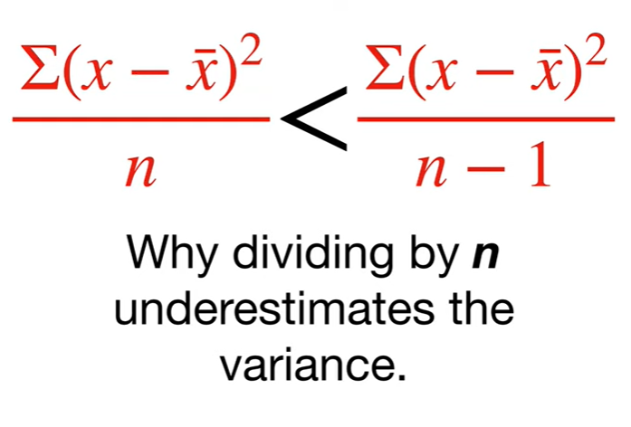
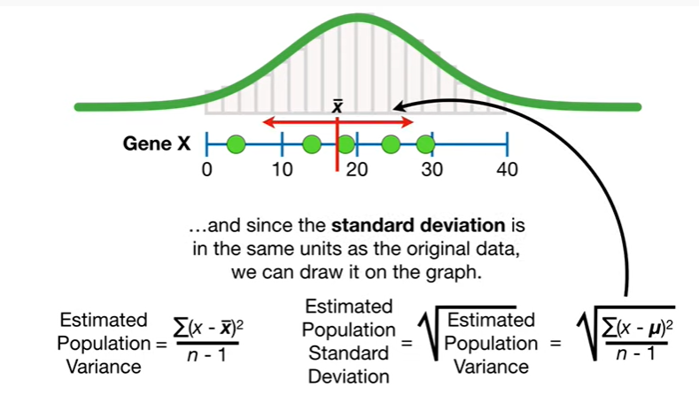
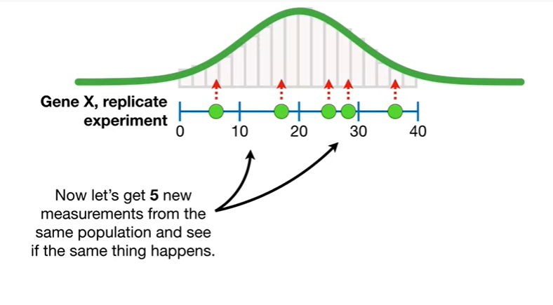
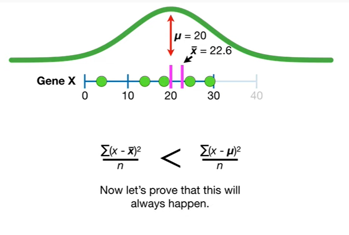
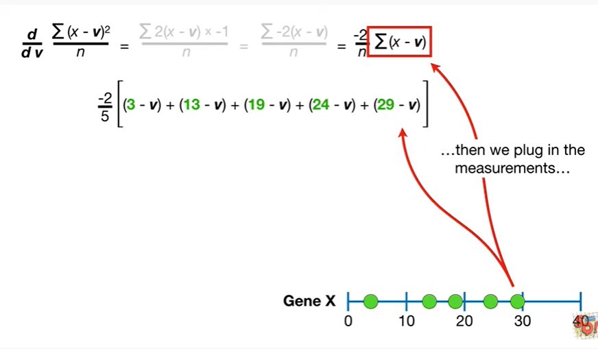
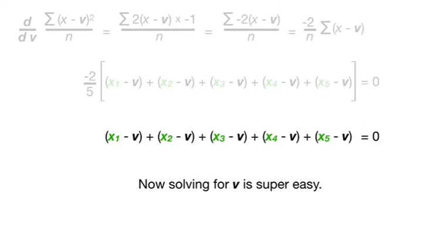
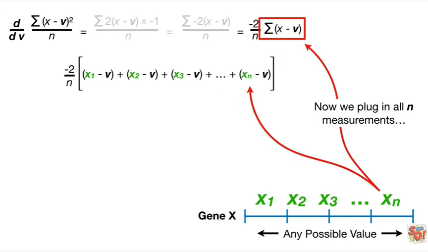
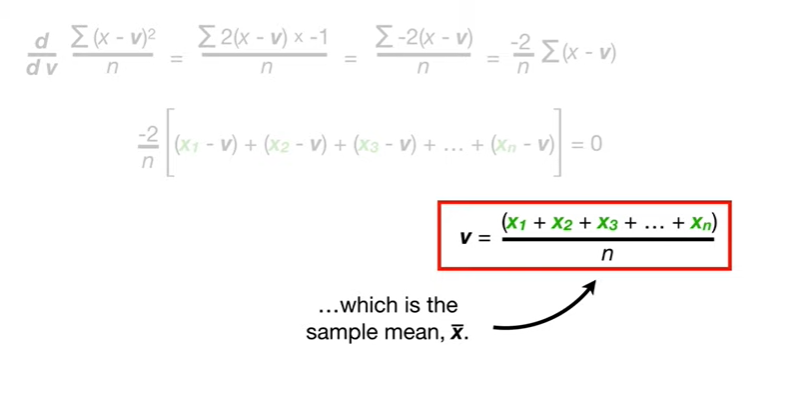
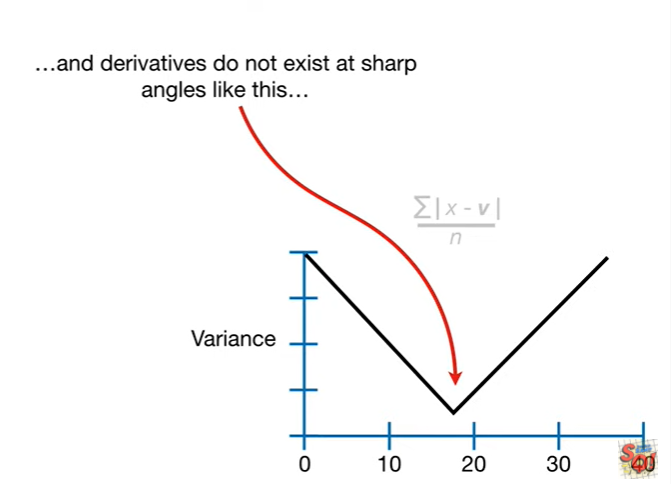

<https://www.youtube.com/watch?v=sHRBg6BhKjI&list=PLblh5JKOoLUK0FLuzwntyYI10UQFUhsY9&index=38>

Today we\'re going to talk about why dividing by n underestimates the
variance.

This stack quest assumes you already understand why we want to estimate
population parameters.

If not check out the quest.

Also this stack quest picks up from where we left off when we gave an
overview of how to estimate the mean variance and standard deviation.

If you haven\'t seen that one you might want to check it out getting up
from where we left off

In the stat quest on the mean variance and standard deviation we
measured gene X in five different liver cells

and then we collected data from more liver cells

until we had the entire population of liver cells

and we used all of that data to draw a histogram

and then we fit a normal curve to the histogram.

That meant we calculated the population mean mu.

The population mean mu equals the sum of the measurements divided by the
number of measurements which equals the average measurement mu.

And we calculated the population variance in standard deviation the
population variance is the average of the squared distances between the
data and the population mean

and the population standard deviation is just the square root of the
variance.

Since the standard deviation is in the same units as the original data
we can draw it on the graph.

However since we rarely if ever have enough time and money to measure
every single thing in a population

we almost always estimate the population mean.

The estimated population mean x-bar equals the sum of the measurements
divided by the number of measurements and that equals the average
measurement x-bar

and we estimate the variation and standard deviation.

The estimated population variance is the sum of the squared differences
divided by n minus 1.

And the standard deviation is just the square root of the variance

and since the standard deviation is in the same units as the original
data we can draw it on the graph.

We also mentioned that dividing by IDI minus one compensates for the
fact that we are calculating differences from the sample mean instead of
the population mean.

Otherwise we would consistently underestimate the variance around the
population mean.

Then I said I\'d give more details about why dividing by n
underestimates the population variance in a future stat quest !

The future is now.

BAM !!!!

To understand why dividing by n underestimates the population variance
we\'ll start with a few simple examples and then we\'ll dive into the
math and prove it once and for all.

In this first example I want to replace the sample mean x-bar with zero
and see what happens.

Now we square the differences between the measurements and zero

calculate the average

and that gives us 391.

BAM !!!

Now let\'s plot that value on a graph.

The y-axis on this graph corresponds to the value we just calculated.

Tt is the variance around a specific point.

And the x-axis corresponds to that point.

Now let\'s move the purple line over to five

and square the differences between the measurements and five

and then calculate the average

and that gives us 240.

And we can plot that point on the graph.

Here\'s another point

and another.

And this is the variance around the sample mean.

Remember right now we are dividing by n not n minus 1.

This is the variance around the population mean

and here are a few more points.

Note : the point with the smallest variance

corresponds to the sample mean x-bar

and this point with a slightly larger variance

corresponds to the population mean.

So in this case when we plug in the population mean and divide by n we
get a larger variance

then when we plug in the sample mean and divide by n.

In other words when we use the sample mean we underestimated the
variance we got with the population mean.

BAM !!!

Now let\'s get 5 new measurements from the same population and see if
the same thing happens .

When we divide by n with a smallest variance be around the sample mean ?

So just like before let\'s replace the sample mean x-bar with zero and
see what happens.

Now square the differences between the measurements and zero

calculate the average

that gives us 616.

And just like before we can plot variances on the graph.

Here\'s another point and another and another.

This is the variance around the population mean

and this is the variance around the sample mean.

And here are a few more points.

Just like before we see that the minimum variance is at the sample mean.

So just like before when we plug in the population mean and divide by n
we get a larger variance

then when we plug in the sample mean and divide by n.

So again when we use the sample mean and divided by n we underestimated
the variance calculated around the population mean.

BAM !!!

So far we have seen two simple examples where using the sample mean and
dividing by n underestimated the variance as we got with the population
mean.

Now let\'s prove that this will always happen.

First let\'s go back to the original data

and the graph that we drew with it.

The first thing we do is realize that even though we only calculated
variance around a handful of points

we can replace X bar with an unknown value V

and use this formula to graph all possible values for V.

Note : to emphasize the fact that we are plugging in different values
for V I\'ve modified the X axis label.

No we can take the derivative of this formula with respect to the
unknown value V

and use it to determine the slope of the curve at different values for V

and the slope equals zero then we found the value for V that gives us
the smallest variance.

So let\'s move this to the upper left hand corner and solve for the
derivative !!!!

The first thing we do is use

the chain rule what the chain rule

to solve for the derivative of X minus V squared.

So we bring the square down to the front

and then we multiply everything by the derivative of X minus V which is
negative one

because the derivative of X with respect to V is zero and the derivative
of negative V is negative one

and that gives us the derivative with respect to v.

Now we simplify by multiplying 2 and negative 1.

Lastly we can simplify things just a little more by moving the negative
2 and 1 divided by n outside of the summation.

This is the derivative with respect to the unknown value, v.

BAM !

Just to remind you the derivative corresponds to the slope of the Purple
Line

and we want to find the value for V such that the slope of the Purple
Line equals zero because that is where we will find the minimum
variance.

To make this as clear as possible we will find where the derivative is
zero and the variance is minimized three different ways.

First we\'ll find where the variance is minimized using the observed
data

then we\'ll find where the variance is minimized for any five
measurements

and then we\'ll show how to find the minimum variance for any sample
regardless of size.

So let\'s start by plugging the data into the derivative.

The first thing we do is plug in 5 for n since we have 5 measurements

then we plug in the measurements.

Since we want to find the value for V where the slope equals zero

and the derivative is the slope

we set the derivative equal to zero

and solve for v.

Note : this negative 2/5 is the only thing making it hard to solve for
V, so

we multiply both sides by 5 divided by negative 2 to cancel out the
negative 2/5.

Now solving for V is super easy.

boo boo boo boo boo boo boo boo boo.

V is the average of the five measurements

which is the sample mean x-bar

and thus V equals x-bar which equals seventeen point six.

Thus the derivative is zero when V equals x-bar which equals seventeen
point six

and the variance is minimized when V equals x-bar which equals seventeen
point six.

This is why given this data the value around the sample mean

is less than the value around the population mean.

In other words the differences between the data and the sample mean

tend to be smaller than the differences between the data and the
population mean.

Thus the differences around the population mean will result in a larger
average

and the larger average is what we are trying to estimate.

BAM !!

Now let\'s go back to plugging data into the derivative

and replace the data with five unknown values.

These unknown values represent future measurements.

We\'ll call this unknown value X sub one.

Note : even though X sub one, is on the left side of the graph, just
know that it could be any possible value.

And let\'s call this unknown value X sub 2

X sub 3 of four

and X sub 5.

Now let\'s plug the unknown data into the derivative.

Just like before we plug in five four in since we have five measurements

then we plug in the measurements.

Since we want to find the value for V where the slope equals zero we set
the derivative equal to zero

and solve for V.

And just like before we multiply both sides by 5 divided by negative 2
to cancel out the negative 2/5.

Now solving for V is super easy.

boo-boo-boo-boo-boo-boo-boop boom boom

V is the average of the five measurements which is the sample mean x-bar

so no matter what five measurements we start with the value that gives
us the minimum variance is x-bar.

BAM !!!

Now let\'s see what happens when we have any size sample ie a sample
with in measurements.

So let\'s plug the unknown data into the derivative.

Now instead of replacing n with a number, we just leave it, since we
have n measurements.

Now we plug in all in measurements

and set the derivative equal to zero

and solve for V.

First we multiply both sides by n divided by negative 2 to cancel out
the negative 2 divided by N.

Now solving for V is super easy .

V is the average of the end measurements

which is the sample mean x-bar.

So no matter how many measurements we start with the value that gives us
the minimum variance is X bar.

Double BAM !!!

Thus when we divide by n, the value around the sample mean

is always less than the value around the population mean

unless the sample mean is the exact same as the population mean and that
pretty much never happens.

Triple bam !!!

PS : Before we go let\'s talk about why we square the differences
instead of using the absolute value.

Remember when we use the derivative to find the minimal value ?

Doing the calculus and understanding that this formula underestimated
the variance around the population mean was relatively easy.

In contrast if we use the absolute value instead we\'d get a graph that
looked like this

and since we have this sharp angle at the minimum value

and derivatives do not exist at sharp angles like this

then finding the minimum value is much harder with the absolute value
than with the square.

BAM !!!

In summary :

When we only divide by n

we underestimate the variation in the data around the population main.

This is because the differences between the data and the sample mean

tend to be smaller than the differences between the data and the
population mean.

Thus the differences around the population mean will result in a larger
average

and the larger average is what we are trying to estimate.

So, if you are estimating the population variance, divided by n minus
one.

PS : if you\'re wondering why we divide by n minus 1 and not n minus 0.5
or n minus 2

then you\'ll just have to wait for the stat quest on expected values.
