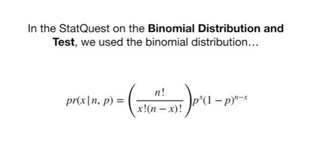
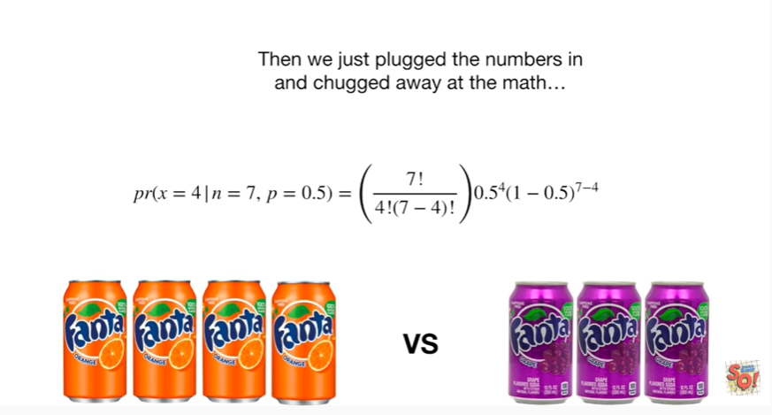
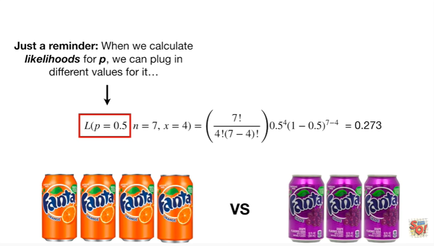
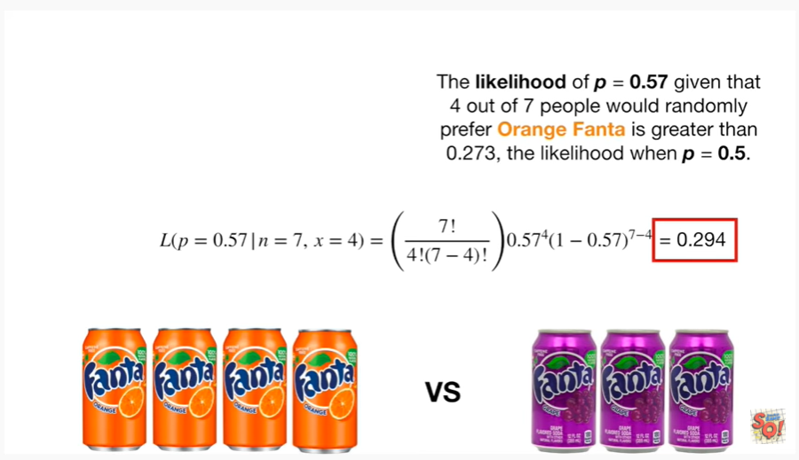
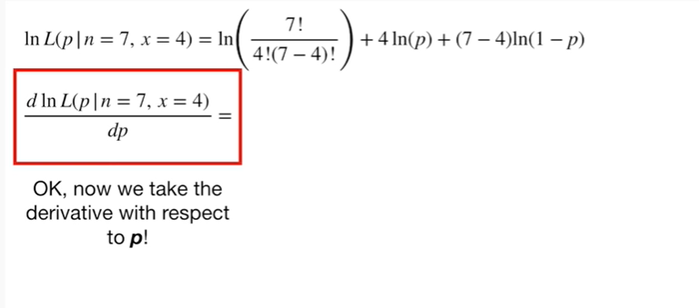
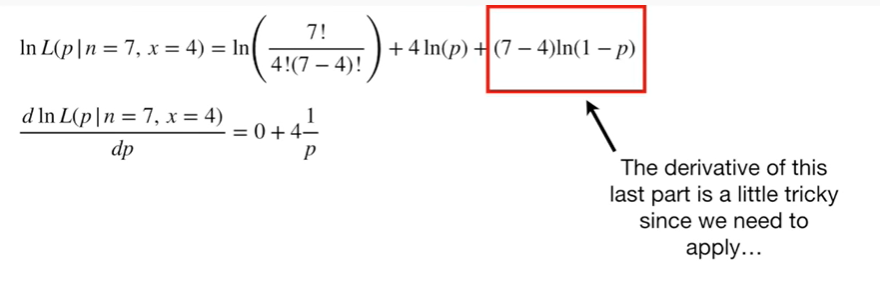
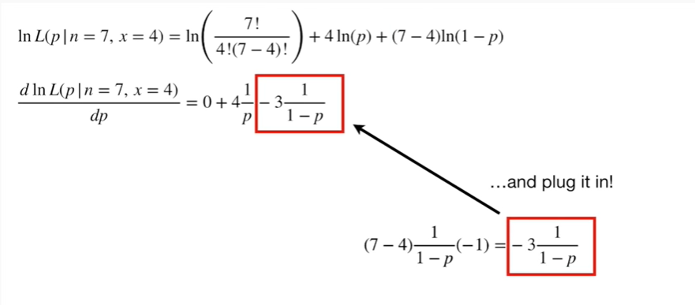
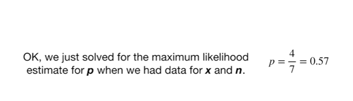
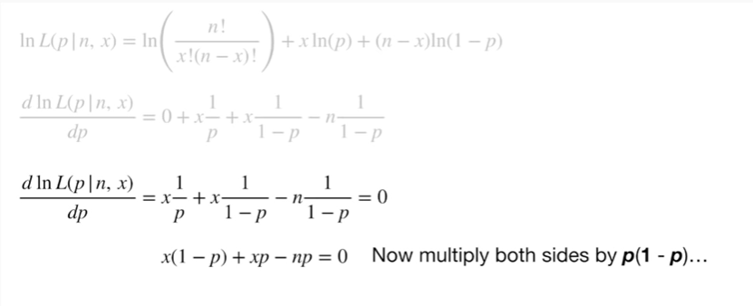
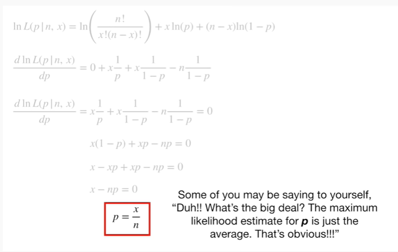

<https://www.youtube.com/watch?v=4KKV9yZCoM4&list=PLblh5JKOoLUK0FLuzwntyYI10UQFUhsY9&index=39>

Today we\'re going to talk about maximum likelihood for the binomial
distribution and it\'s gonna be clearly explained.

Note : this stat quest follows up on the stat quest maximum likelihood
clearly explained

as well as the stat quest probability versus likelihood

and lastly this stat quest assumes you are already familiar with the
binomial distribution if not check out the stat quest the binomial
distribution and test clearly explained.

In the stat quest on the binomial distribution and test we use the
binomial distribution

aka this nasty-looking thing

to determine if in general people like orange Fanta more than grape
Fanta.

In the context of this problem X is the number of people who preferred
orange Fanta in this case x equals 4.

n is the total number of people we asked about whether they preferred
orange Fanta or grape Fanta in this case in equals 7.

And P is the probability somebody would randomly choose orange Fanta
over grape Fanta in this case P equals 0.5.

Altogether, the left side of the equation reads : the probability of X
(the number of people who say they prefer orange Fanta), given n, the
number of people we asked, and P (the probability of picking orange
Fanta).

Then we just plug the numbers in and chugged away at the math

and the probability that 4 out of 7 people would randomly prefer orange
Fanta is zero point 2 7 3.

Now, if we want to calculate the likelihood of P equals 0.5, then all we
need to do is rearrange the left side of the equation.

That is to say we change this

to this !

Now the left side of the equation reads the likelihood of P (the
probability of picking orange Fanta), given n, the number of people we
asked, and X (the number of people who say they prefer orange Fanta).

The right side of the equation, however, stays the same.

And this is now the likelihood of P equals 0.5 given that four out of
seven people would randomly prefer orange Fanta.

Just a reminder : when we calculate likelihoods for P we can plug in
different values for it

while the observed data in equals 7 and x equals four, remains fixed.

In other words, we can calculate the likelihoods for different values of
P given that four out of seven people said they preferred orange Fanta.

For example, the likelihood of P equals 0.25 given that four out of
seven people said they prefer two orange Fanta is

plug and chug

plug and chug plug and chug 0.058.

The likelihood of P equals 0.25 given that four out of seven people
would randomly prefer orange Fanta is less than 0.2 7/3 the likelihood
when P equals 0.5.

We can also calculate the likelihood of P equals 0.57 given that four
out of seven people said they preferred orange Fanta

plug and chug

plug and chug

plug and chug and we get zero point two nine four.

The likelihood of P equals zero point five seven given that four out of
seven people would randomly prefer orange Fanta is greater than zero
point two seven three,the likelihood when P equals zero point five.

We can plot the likelihood with a bunch of different values for P
between zero and one.

Tada !

This peak is the maximum likelihood.

The slope of the curve at the peak is zero.

That means we can solve for the value for P that results in the maximum
likelihood by finding where the derivative I II the slope is equal to 0.

So let\'s do it !!!!

Here\'s the original likelihood function with n equals 7 and x equals 4.

The first thing we do is take the log of the likelihood function.

We do this because the original likelihood function and its log will
both reach the maximum using the same value for P and it\'s way easier
to take the derivative of the log of the likelihood function compared to
the original function.

To see this, here is a plot of the likelihood function

and here is the log of the likelihood function

both have peaks at the same value for P.

The log function turns the multiplication into addition

and it turns the exponents into multiplication.

If this log stuff is freaking you out well don\'t freak out.

Just watch the stat quest on logs !

Now we\'re ready to take the derivative.

But first, because we are running out of room, we\'ll move this to the
top of the screen.

Okay, now we take the derivative with respect to P !

This first part doesn\'t contain P at all, so it\'s derivative equals
zero.

The derivative of the second part is just four times one over P.

The derivative of this last part is a little tricky since we need to
apply the chain rule.

So we start with (7 minus 4) times the derivative of the log of (1 minus
P)

and we multiply that by the derivative of (1 minus P).

Then we simplify

and plug it in !

BAM !!!!

Now we set the derivative to zero because we want to find the peak where
the slope of the curve equals zero

and that will tell us which value for P gives the maximum likelihood.

Now multiply both sides by P times (1 minus P).

Now multiply out 4 times 1 minus P

Now combine negative 4 P and negative 3p .

Then just solve for P.

The maximum likelihood estimate for P is 4, the number of people who
preferred orange Fanta divided by 7, the total number of people we
asked.

Double bam !!!

Okay, we just solved for the maximum likelihood estimate for P when we
have data for X and n.

However, we don\'t actually need data to determine a general formula for
the maximum likelihood for P.

This formula will give us the maximum likelihood estimate for P when
there are X successes in n trials.

That\'s how you say it using fancy statistics lingo !!!

We\'ll start with the original likelihood function however this time all
of the variables, P, X and n are unknown.

Just like before, we take the log of the likelihood function because it
will make solving for the derivative way easier.

And just like before, the log function turns the multiplication into
addition

and the exponents into multiplication.

Now we\'re ready to take the derivative.

And just like before because we are running out of room, we will move
this to the top of the screen.

Okay, now we take the derivative with respect to P !

The first part does not contain P, so it\'s derivative is zero.

The derivative of the second part is just x times 1 over P.

And just like before, we have to use

the chain rule

to figure out the derivative of this last part.

So we start with (n minus x) times the derivative of the log of (1 minus
P)

and we multiply that by the derivative of (1 minus P).

Then we simplify

and plug it in !

Then, just like before we set the derivative to zero.

Note : different values for n and X will result in different curves but
the slope is still zero at the maximum likelihood.

Now multiply both sides by P times (1 minus P).

Now multiply out x times (1 minus P).

And now negative XP and positive XP cancel each other out

then just solve for P.

In this case, the maximum likelihood estimate for P is X, the number of
successes, divided by n, the total number of trials.

BAM !!!

Some of you may be saying to yourself, duh !! what\'s the big deal ?

The maximum likelihood estimate for P is just the average that\'s
obvious !!!

Well, I agree, once you know the solution it\'s pretty obvious.

But now we also have a mathematical proof that backs up our intuition,
and to me, that\'s a very comforting thing.
