<https://www.youtube.com/watch?v=Dn6b9fCIUpM&list=PLblh5JKOoLUK0FLuzwntyYI10UQFUhsY9&index=40>

Today we\'re going to talk about maximum likelihood for the normal
distribution and it\'s gonna be clearly explained.

Note : this stack quest follows up on the stack quest maximum likelihood
clearly explained

as well as the stack quest probability versus likelihood

lastly this stack quest assumes you are already familiar with the normal
distribution.

If not check out the stack quest the normal distribution of clearly
explained.

Let\'s start with this nasty-looking equation

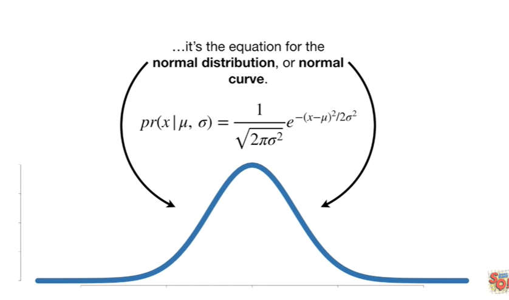

it\'s the equation for the normal distribution or normal curve.

It has two parameters :

the first parameter, the Greek character mu, determines the location of
the normal distribution's mean.

A smaller value for MU moves the mean of the distribution to the left

and a larger value for MU moves the mean of the distribution to the
right.

The second parameter, the Greek character Sigma, is the standard
deviation and determines the normal distributions width.

A larger value for Sigma makes the normal curve shorter and wider

and a smaller value for Sigma makes the normal curve taller and
narrower.

In this stat quest, we\'re going to use the likelihood of the normal
distribution

to find the optimal parameters from mu (the mean) and Sigma (the
standard deviation) given some data, x.

Let\'s start with the simplest data set of all a single measurement.

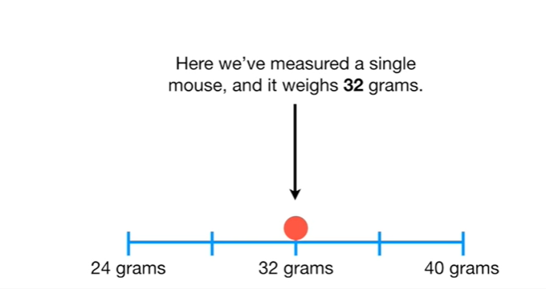

Here we\'ve measured a single Mouse and it weighs 32 grams.

Now, just to see what happens, we can overlay a normal distribution with
mu equals 28 and Sigma equals 2 onto the data.

To determine the likelihood of the data given this curve we can plug the
numbers into the likelihood function

and then plug the numbers into this equation

and here\'s the equation with mu equals 28 Sigma equals 2 and x equals
32 plugged in.

Now just do the math

plug and chug plug and chug

and the likelihood of the curve with mu equals 30 and Sigma equals 2
given the data, is 0.03.

Thus, the y-axis value here is 0.03.

Now we can shift the distribution a little bit to the right by setting
mu equals 30 and then calculate the likelihood.

Again, we just plug the numbers into the likelihood function

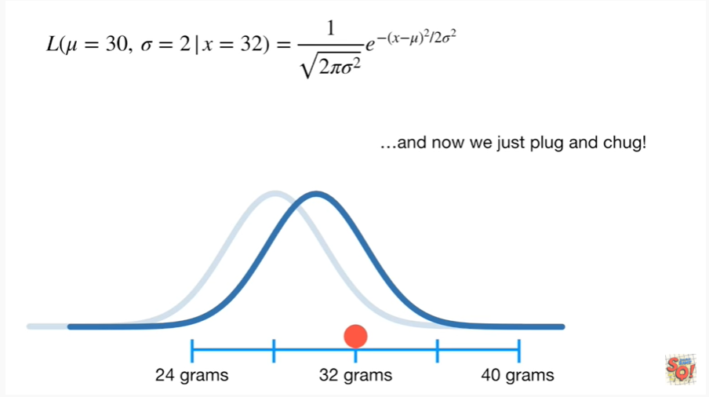

and now we just plug and chug !

and the likelihood of the new curve with mu equals 30, and Sigma equals
2, given the data, is 0.12.

Thus, the y-axis value here is 0.12.

If we decide to fix Sigma equals 2, so that it is a given, just like the
data

then we can plug in a whole bunch of values for mu and see which one
gives the maximum likelihood.

For example, if we start with the mean of the distribution over here on
the left at 20 grams

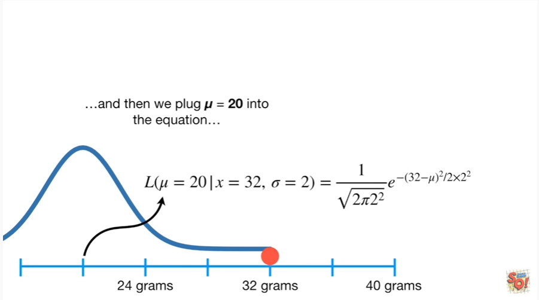

then we plug mu equals 20 into the equation

and we get a crazy small likelihood

and then we can plot the likelihood on a graph.

The y-axis is the likelihood value

and the x-axis is for the different values that we plug in for MU

each time we change mu, we calculate the likelihood and plot it.

We can identify the peak in the likelihood graph by determining where
the slope of the curve equals zero.

In this case, the slope equals zero when mu equals 32.

Now we can fix mu equals 32 and treat it like a given, just like the
data

and we can plug in different values for Sigma to find the one that gets
the maximum likelihood.

Note : you actually need more than one measurement to find the optimal
value for Sigma.

I\'ll leave the reason why as an exercise for the viewer !

That said if we had more data

then we could plot the likelihoods for different values of Sigma

and the maximum likelihood estimate for Sigma would be at the peak with
a slope of the curve equals zero.

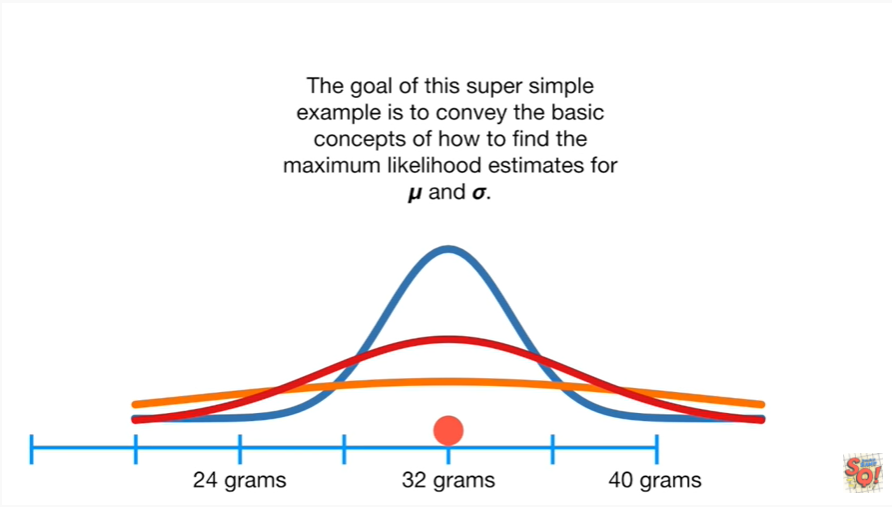

The goal of this super simple example is to convey the basic concepts of
how to find the maximum likelihood estimates for MU and Sigma.

To solve for the maximum likelihood estimate for MU, we treat Sigma like
it\'s a constant and then find where the slope of its likelihood
function is 0

and to solve for the maximum likelihood estimate for Sigma we treat me
like it\'s a constant and then find where the slope of its likelihood
function is 0.

The example with one measurement kept the math simple, but now I think
we\'re ready to dive in a little deeper

so let\'s use a two sample data set to calculate the likelihood of a
normal distribution.

Crazy times !

To keep track of things, let\'s call the mouse that weighs 32 grams X
sub 1.

and the mouse that weighs 34 grams X sub 2.

And again just to see what happens, let\'s overlay a normal distribution
with mu equals 28 and Sigma equals 2 onto the data.

We\'ve already seen how to calculate the likelihood for this curve given
X sub 1, the mouse that weighs 32 grams

and we can calculate the likelihood for the curve given X sub 2 by
plugging in 34 into this likelihood function

but what\'s the likelihood of this normal curve given both X sub 1 and X
sub 2 ?

In other words, what\'s this ?

Because these measurements are independent (ie weighing X sub 1 did not
have an effect on weighing X sub 2)

the likelihood of a normal distribution with mu equals 28 and Sigma
equals 2

given the data X sub 1 equals 32 and X sub 2 equals 34

is just the likelihood of the distribution given X sub 1

times

the likelihood of the distribution given X sub 2.

So we just plug in the numbers and do the math

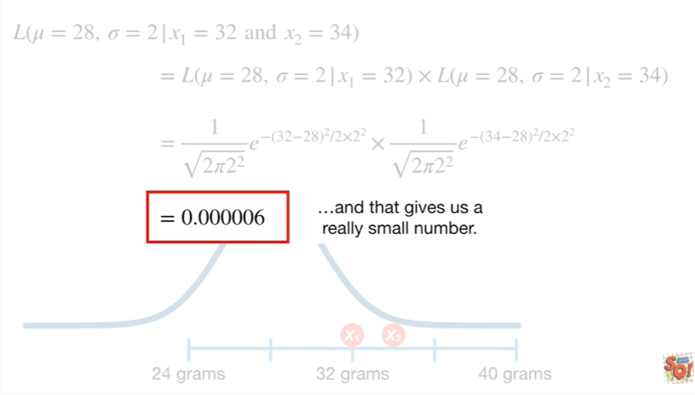

and that gives us a really small number.

If we had a third data point, then

we just add it to the given side of the overall likelihood

and add another individual likelihood term to our multiplication.

With n data points

we add all n data points to the given side of the overall likelihood
function

then multiplied together all in individual likelihood functions.

BAM !!!

Now that we know how to calculate the likelihood of a normal
distribution and when we have more than one measurement we just multiply
together the individual likelihoods let\'s solve for the maximum
likelihood estimates for MU and Sigma.

Brace yourself for a lot of math but don\'t freak out !

We\'ll go through it one step at a time.

Here\'s the likelihood function without any value specified for MU and
Sigma.

It equals the product of the likelihood functions for the N individual
measurements

and here\'s what the equation looks like.

What we need to do is take two different derivatives of this equation.

One derivative will be with respect to MU, when we treat Sigma like
it\'s a constant

and we can find the maximum likelihood estimate for MU by finding where
this derivative equals zero.

The other derivative will be with respect to Sigma, when we treat mu
like it\'s a constant

and we can find the maximum likelihood estimate for Sigma by finding
where this derivative equals zero.

But before we try to take any derivatives let\'s take the log of the
likelihood function.

We do this because it makes taking the derivative way, way easier

and the likelihood function and the log of the likelihood function both
peak at the same values for MU and Sigma.

I know it\'s hard to tell that the log likelihood function for Sigma
peeks, here but just take my word for it.

I double-checked !

Here\'s the log of the likelihood.

Now we\'re going to go step by step, through all of the transformations
that the log has on this function.

Just a heads up - the log is going to do a lot of transformations to
this function so hang in there !!!

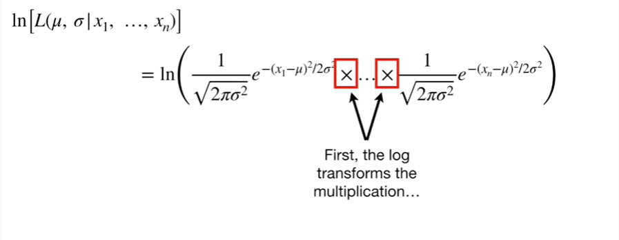

First, the log transforms the multiplication

into addition.

Now we log transform the individual likelihood function.

Let\'s focus on this one first.

Step 1 : move the log of the first likelihood function to the top
left-hand side of the screen for reference.

Step 2 : convert the multiplication

into addition.

Step 3 : convert 1 over the square root

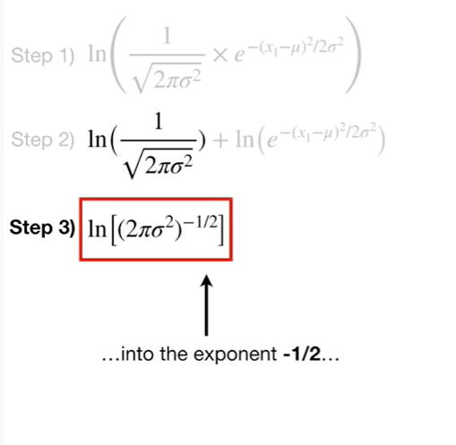

into the exponent negative 1/2

and convert the exponent

into multiplication.

Step 4 : convert the negative 1/2 exponent

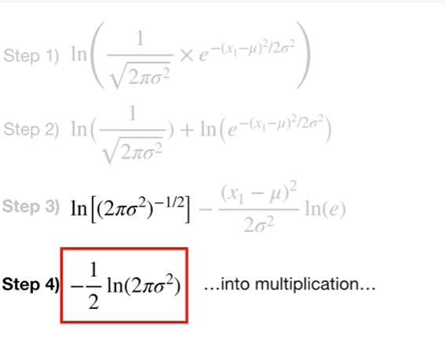

into multiplication

and the log of e equals 1

so we can remove it.

Step five : the log can convert the multiplication of two times pi times
Sigma squared

into addition of two times pi and Sigma squared

and there\'s nothing more to do to this term

so it doesn\'t change.

Step 6 : convert the exponent in the log of Sigma squared

into 2 times the log of Sigma.

Step 7 : lastly the 2/2 term cancels out.

BAM !!!

We started with this

and after the log transformation, ended up with this !!!

I know all of this log transformation stuff looks bonkers the first time
you see it.

Just remember it will make it easier to take the derivative !!!

So now we can go back to the original likelihood and turn this

into this.

And by following the same steps, we can transform the remaining parts of
the sum

into this.

Now let\'s simplify this equation.

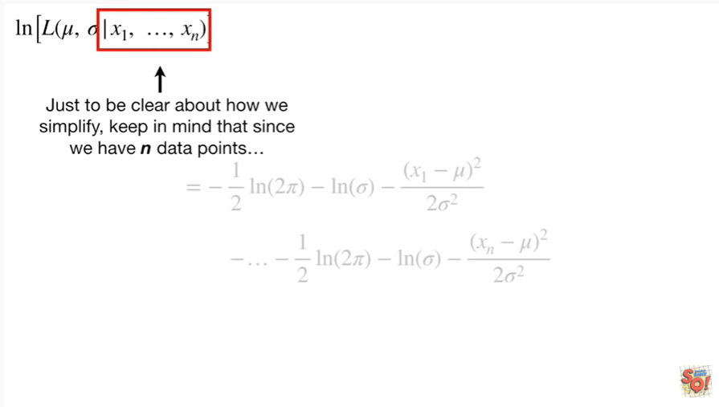

Just to be clear about how we simplify keep in mind that since we have n
data points

that means we have a term for the first data point X sub 1

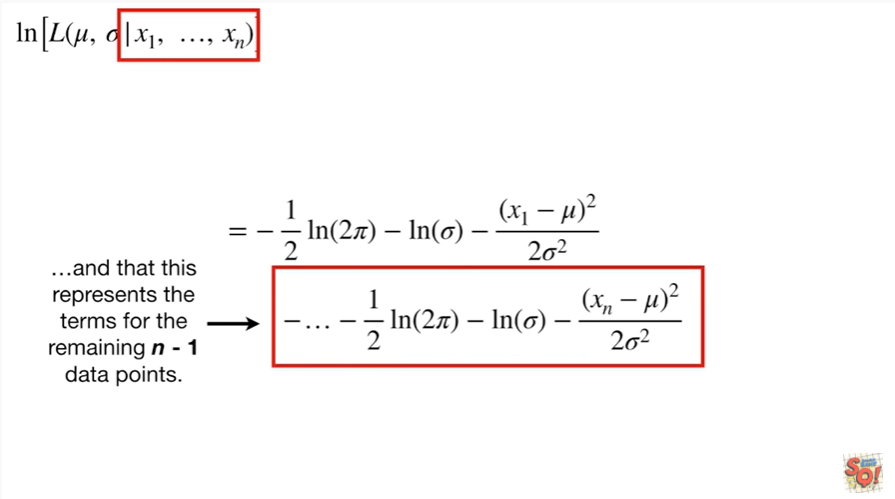

and that this represents the terms for the remaining n minus 1 data
points.

So we can combine this from the first term

with the remaining n minus 1 occurrences

1 plus n minus 1 equals n.

Then all n of the negative log of sigma\'s can be combined.

And the last parts of each term stay the same.

This is the log of the likelihood function after simplification, and it
is what we will take the derivative of.

So let\'s move it to the top for reference.

We\'ll start by taking the derivative with respect to MU.

This derivative is the slope function for the log of the likelihood
curve

and we\'ll use it to find the peak aka where the slope equals zero.

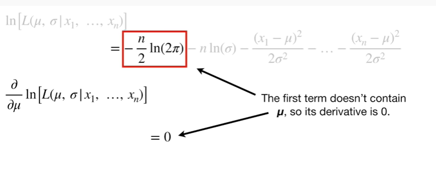

The first term doesn\'t contain mu so it\'s derivative is 0.

The second term doesn\'t contain mu either, so it\'s derivative is also
0.

The third term contains mu, so now we have to work.

Specifically, the numerator contains mu and we have to apply

the chain.

So we start with the outer derivative of negative 32 minus mu squared

and then we multiply that by the derivative of (32 minus mu)

and then we simplify.

Because the derivative is with respect to MU, Sigma is a constant and,
thus the denominator doesn\'t change

so we can combine the two pieces

an dthe twos cancel out

and that means the derivative of this

is this.

Likewise, we apply

the chain rule

to the remaining terms and get

these !

Bam !!!

Now we can simplify the equation.

These zeros go away

and we can pull the Sigma squared out

and add the numerators together

Tthen we can combine the measurements

And, lastly, we can combine the mus.

Thus, this is the derivative of the log likelihood function with respect
to mu.

Double bam !!!

Now let\'s take the derivative of the log likelihood function with
respect to Sigma.

This derivative is the slope function for the log of the likelihood
curve

and we\'ll use it to find the peak, which is hard to see in this graph !

So, from here on out, because they peak at the same spot, I\'ll show you
the likelihood functions instead of the log likelihood functions.

The first term doesn\'t contain Sigma so it\'s derivative is zero.

The derivative of the second term is just in over Sigma.

The derivative of this term isn\'t tricky, but it\'s easier to figure
out when we rewrite 1 over Sigma squared as Sigma to the negative 2.

Since we\'re taking the derivative with respect to Sigma, this part can
be treated like a big constant

and the derivative of this

is this.

The two negatives cancel out

and then the twos cancel out

and lastly we put Sigma back into the denominator by changing the sign
of the exponent.

So the derivative of this

is this !

So that\'s what we put into the equation.

Likewise, the derivatives of the remaining terms

simplify to these.

BAM !!!

This is the derivative of the log likelihood function with respect to
Sigma.

We can simplify the equation by omitting the zero

leaving the second term the same

and we can pull the Sigma cubed out

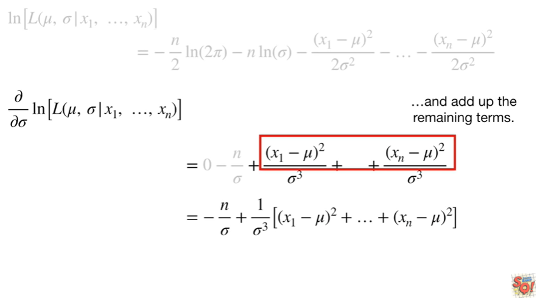

and add up the remaining terms.

Double bam !!!

At long last here are the two derivatives !!!

To find the maximum likelihood estimate for MU we need to solve for
where the derivative with respect to MU equals zero, because the slope
is zero at the peak of the curve.

Likewise, to find the maximum likelihood estimate for Sigma, we need to
solve for where the derivative with respect to Sigma equals zero because
the slope is zero at the peak of the curve.

We\'ll start by setting the derivative with respect to MU to 0

and solve for MU.

We start by multiplying both sides by Sigma squared that makes the Sigma
squared go away

then we add n times mu to both sides

divide both sides by N and solve.

Thus, the maximum likelihood estimate for MU is the mean of the
measurements.

So that is where the center of our normal curve will go.

Don\'t get too excited, we\'re not done yet !

Dang !!

Now we need to set the derivative with respect to Sigma to 0.

Now multiply both sides by Sigma

add n to both sides

multiply both sides by Sigma squared

divide both sides by n

and take the square root of both sides

and at long last we see that the maximum likelihood estimate for Sigma
is the standard deviation of the measurements.

Thus, we use the formula for the standard deviation to determine the
width of the normal curve that, given the data, has the maximum
likelihood.

In summary :

the mean of the data is the maximum likelihood estimate for where the
center of the normal distribution should go

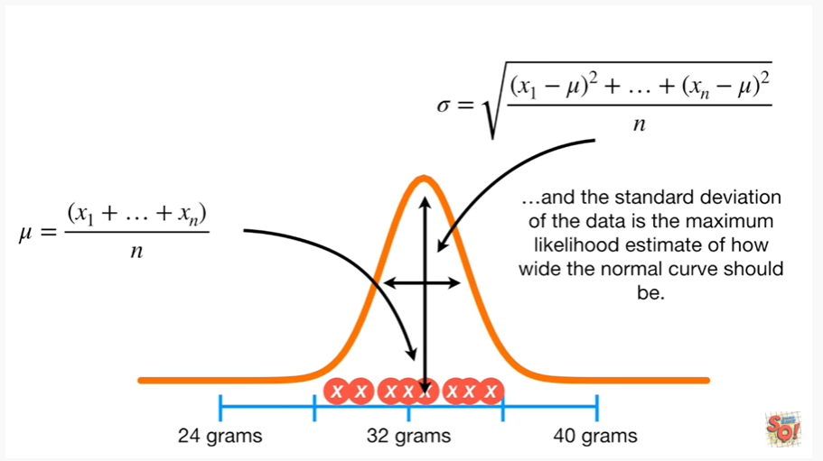

and the standard deviation of the data is the maximum likelihood
estimate of how wide the normal curve should be.

Note : these solutions may be obvious but now we have the math that
proves that our intuition is correct.

wait for it.

Triple bam !!!
