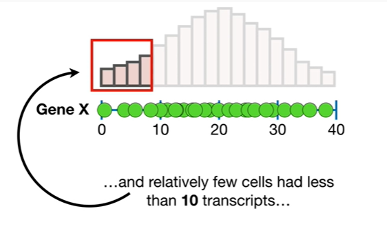
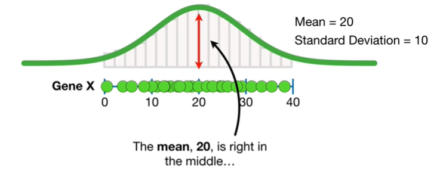
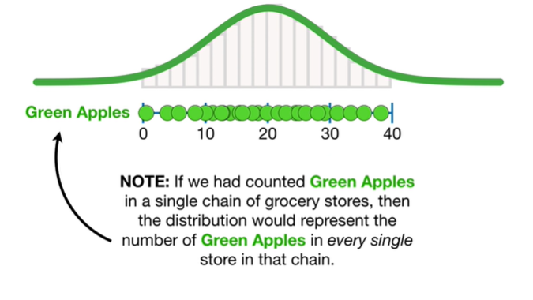
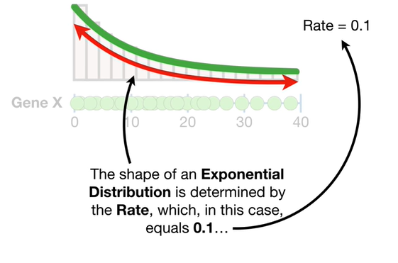
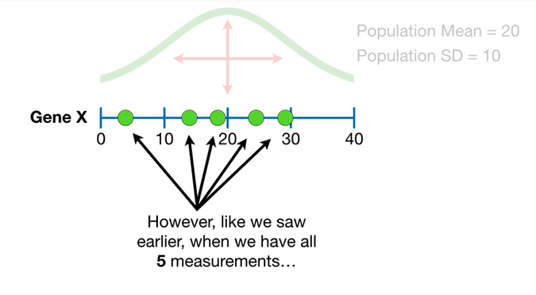

<https://www.youtube.com/watch?v=vikkiwjQqfU&list=PLblh5JKOoLUK0FLuzwntyYI10UQFUhsY9&index=4>

Today we\'re going to talk about some statistics fundamentals.

Specifically we\'re gonna talk about population parameters.

Note : this stat quest assumes you already know about histograms
statistical distributions and specifically the normal distribution if
not check out the quests.

The links are in the description below.

Now imagine we counted the number of mRNA transcripts from gene X in
five different liver cells.

Note if mRNA transcripts in liver cells doesn\'t mean anything to you
instead imagine we counted the number of green apples in five different
grocery stores

or you could imagine counting green t-shirts in five different clothing
stores

or imagine whatever you want to measure in five different units.

Since I work in a genetics lab, I\'ll stick with mRNA transcripts and
liver cells.

This green dot represents a liver cell that had three mRNA transcripts
for gene X

and this green dot represents a liver cell that had 13 mRNA transcripts

19 transcripts

24

and 29.

Now if we had a lot of time and money on our hands we could count the
number of mRNA transcripts for gene X in every single liver cell.

However for the sake of this example you\'ll just have to imagine 240
billion green dots on this line representing the 240 billion cells in a
human liver because I don\'t have time to draw them all.

Wah wah...

Now we can draw a histogram of the measurements.

The histogram tells us that most of the cells had between 20 and 30 mRNA
transcripts

and relatively few cells had less than 10 transcripts

and relatively few cells had more than 30 transcripts.

We can use the histogram to calculate probabilities and statistics.

For example if we wanted to know the probability of observing a liver
cell with 30 or more mRNA transcripts for gene X

then we would figure out how many liver cells had 30 or more mRNA
transcripts for gene X

and divided by the total number of liver cells.

In this case there are 38 billion cells with 30 or more transcripts

and we divide that by 240 billion.

Do the math and the probability of observing a cell with 30 or more
transcripts is 0.16.

BAM.

Note : this histogram made from mRNA counts in all 240 billion liver
cells corresponds to a normal distribution with mean equals 20 and
standard deviation equals 10.

The mean 20 is right in the middle

and the standard deviation 10 corresponds to how wide the curve is
around the mean.

In other words the standard deviation tells us how the data are spread
around the mean.

Just like with the histogram we can use the distribution to calculate
probabilities and statistics.

For example if we wanted to know the probability of observing a liver
cell with 30 or more mRNA transcripts for gene X

then we would calculate the area under the curve for all values equal to
or greater than 30

and divide by the total area under the curve in this case the area under
the curve greater than 30 equals 0.16

and the total area is 1 now we do the math

and that tells us that the probability of observing a cell with 30 or
more transcripts is 0.16.

Since we got the same value with the histogram it means the normal curve
is a good approximation of the real data .

BAM.

Note : if we had counted green apples in a single chain of grocery
stores then the distribution would represent the number of green apples
in every single store in that chain.

And that means we could use the distribution to calculate statistics
about apples in that grocery store chain.

BAM.

Oh no it\'s a terminology alert watch out.

Because this histogram represents every liver cell or all the grocery
stores in a specific chain a statistician would say that it represents a
population.

Thus the mean and standard deviation of the normal curve which
represents the population are called population parameters

and we call the mean the population mean

and we call the standard deviation the population standard deviation or
the population SD for short.

Note : if the histogram had looked like this

then we could fit an exponential distribution to the data.

The shape of an exponential distribution is determined by the rate which
in this case equals 0.1

and even though the exponential distribution looks different from the
normal distribution it would still represent the population of liver
cells

and that makes the rate the population rate

and we could use the exponential distribution to calculate probabilities
and statistics just like when we had a normal distribution.

Alternatively if the shape of the histogram had looked like this

then we would fit a gamma distribution to the data

and since the shape of the gamma distribution is determined by two
parameters shape and rate

then shape and rate or population parameters.

Note : the concepts that we discuss in the rest of the stack quest apply
to almost every statistical distribution however we\'ll just focus on
the normal distribution in these examples.

So returning to the original normal curve.

Since we rarely if ever have enough time and money to measure every
single thing in a population

we almost always estimate the population parameters using a relatively
small sample.

In this case we have measurements from only five of the 240 billion
cells

so we will use these five measurements to estimate the population
parameters.

The reason why we want to know the population parameters is to ensure
that the results drawn from our experiment are reproducible.

In other words if someone else measured gene X in five different liver
cells

then they would get five different measurements.

However the new measurements will come from the same population

and insights derived from the population like the probability of
observing more than 30 mRNA transcripts in a single cell will apply to
both experiments and future experiments.

So instead of just describing the five measurements that we made we want
to estimate the population parameters and use those as the basis for the
results.

Double bam.

Note : if you\'re coming from a machine-learning background it might be
helpful to think of these five measurements as the training data set

and the curve that represents the population is what we want to predict
with our machine learning method.

BAM.

Going back to our five measurements.

I can tell you that the estimated population mean is seventeen point six

and the estimated population standard deviation is ten point one.

Note : we\'ll talk about how to estimate the population mean and
standard deviation in a follow-up stat quest.

For now just know that it\'s not hard.

Now when we repeat the experiment the estimated population mean is
nineteen point two

and the estimated population standard deviation is twelve point seven.

Thus each time we do the experiment we get different estimates of the
population parameters

and both sets of estimates are different from the true population
values.

Now if you\'ve been paying attention what I just said should be a little

Disturbing.

Earlier we said the whole idea behind population parameters was to give
us reproducible results

so how does getting different estimates each time give us reproducible
results ?

To answer this question let\'s start by assuming we only have two
measurements.

When we just have these two measurements the estimated population mean
equals 11.

and the estimated population standard deviation equals eleven point
three.

Compared to the actual values the estimated mean 11 is way off from the
true population mean 20

and the estimated standard deviation eleven point three is a little
larger than the actual standard deviation 10

However if we had three measurements

then the estimated mean equals fifteen point three

which is closer to the true value than before

and the estimated standard deviation equals 11 which is slightly closer
to the true value than before.

However like we saw earlier when we have all five measurements

then the estimated mean equals seventeen point six

which is even closer to the true value

and the estimated standard deviation equals ten point one which is even
closer to the true value than before.

and if we had ten measurements then our estimates would be even better.

That means that the more data that we have the more confidence we can
have in the accuracy of the estimates.

One of the main goals and statistics is quantifying how much confidence
we can have in population estimates.

Specifically statisticians often calculate p-values and confidence
intervals to quantify the confidence in estimated parameters.

And like we just saw generally speaking the more data the more
confidence we have in the estimates.

Going back to the to replicate experiments.

Even though these experiments resulted in different estimates for the
population mean and standard deviation

we can use statistics to quantify our confidence in how different they
are.

In this case a p-value or alternatively a confidence interval would tell
us that while the estimates are different. they are not significantly
different.

And that means the results generated from the first experiment

should not be significantly different from the results generated from
the second experiment

and that means we should be able to replicate the results.

Triple bam.

In summary :

a population represents every single liver cell

or every grocery store in a chain of grocery stores

or whatever unit it is you are measuring something awesome.

And the parameters that determine how a distribution fits the population
data are called population parameters.

We rarely if ever have population data so we always estimate population
parameters.

Along with that we also calculate how much confidence we should have in
those estimates .

Generally speaking the more data we have the more confidence we have in
the estimates.

By estimating the population parameters and quantifying our confidence
in them we can generate results that are reproducible in future
experiments.

PS : if you\'d like to learn more about how we can quantify our
confidence in estimated population parameters check out the quest on
confidence intervals.

The link is in the description below.
