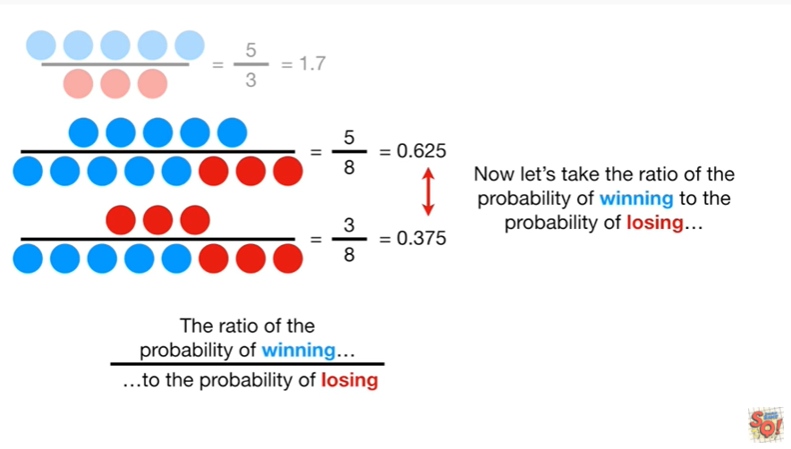
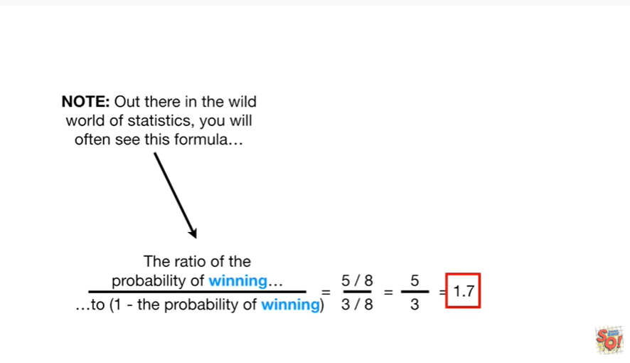
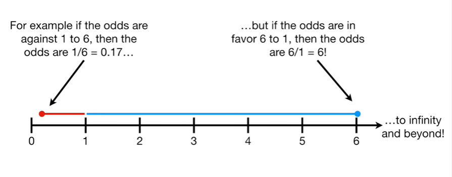
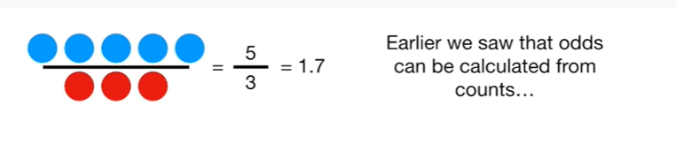
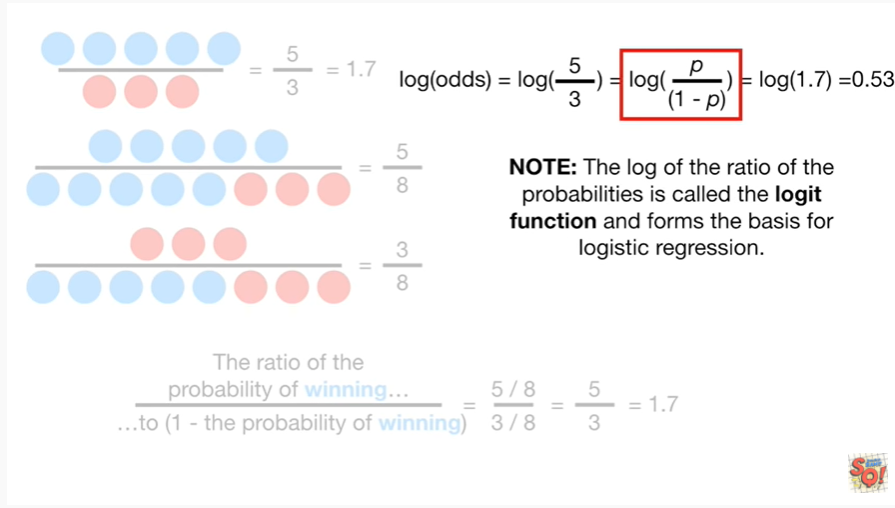
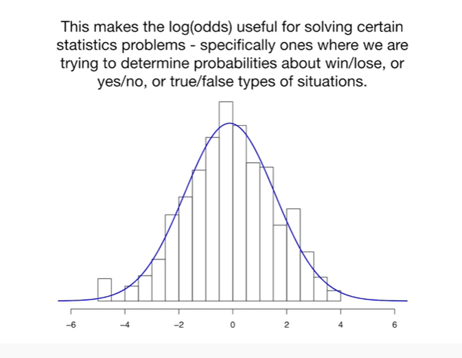

<https://www.youtube.com/watch?v=ARfXDSkQf1Y&list=PLblh5JKOoLUK0FLuzwntyYI10UQFUhsY9&index=41>

Today we\'re gonna be talking about odds and log odds and they\'re gonna
be clearly explained.

The odds are in favor that you\'re already familiar with odds.

For example, you might say that the odds in favor of my team winning the
game are 1 to 4.

Visually, we have 5 games total

1 of which my team will win

and 4 of which my team will lose.

So the odds are 1

to 4.

Alternatively, we can write this as a fraction.

Visually, we have one game my team wins

divided by the four games that my team loses.

if we do the math, we will see that the odds are 0.25 that my team will
win the game.

Here\'s another example : you might say that the odds in favor of my
team winning the game are five to three visually :

we have eight games total

five of which my team will win

and three of which my team will lose.

So the odds are five

to three.

Alternatively, we can write this as a fraction 5/3.

Visually, we have the five games my team wins

divided by the three games my team loses

if we do the math, we see that the odds are one point seven that my team
will win the game.

Note : odds are not probabilities.

The odds are the ratio of something happening (ie my team winning)

to something not happening (ie my team not winning).

Probability is the ratio of something happening (i.e. my team winning)

to everything that could happen (ie my team winning and losing).

In the previous example, the odds in favor of my team winning the game
are five to three

However, the probability of my team winning is the number of games they
win (five) divided by the total number of games they play (eight)

here\'s the math for the odds we have the ratio of 5 to 3 and for the
probability we have the ratio of 5 to 8.

Thus we see that the odds in favor of my team winning

are different from the probability of my team winning.

Now that we know that odds are different from probabilities, let\'s talk
about how odds can be calculated from probabilities.

In the last example we saw that the odds of winning are 1 point 7

and the probability of winning is 0.625.

We can also calculate the probability of losing

the probability of losing is 0.375.

Note : we could also calculate the probability of losing as :

1 minus the probability of winning

that equals 1 minus 5/8

and that gives us 8 divided by 8 minus 5/8

and ultimately we get 3/8.

This is equal to 0.375.

So, either, way we get the same probability.

Now let\'s take the ratio of the probability of winning to the
probability of losing.

Alternatively we can put (1 minus the probability of winning) into the
denominator

either way, we get the same ratio : 5/8 divided by 3/8.

The eights cancel out since they scale the numerator and the denominator
by the exact same amount.

Thus, the ratio of the probability ends up being the same thing as the
ratio of the raw counts

and so either way, we get the same odds 1.7

I mentioned this because about 50% of the time you see odds calculated
from counts

and the other 50% of the time you will see odds calculated from
probabilities either way you get the same results.

Note : out there in the wild world of statistics, you will often see
this formula

simplified to this

where P is the probability of winning.

BAM !!!

Now that we know what the odds are let\'s talk about the log of the
odds.

Let\'s go back to the original example.

In this example we calculated the odds of winning as one to four or
0.25.

If my team was worse, the odds of winning could be one to eight, or
0.125

and if my team was terrible, the odds of winning could be one to sixteen
or 0.063

and, lastly, if my team was the worst, the odds of winning could be one
to 32 or 0.031.

We can see that the worse my team is, the odds of winning get closer and
closer to zero.

In other words, if the odds are against my team winning, then they will
be between zero and one.

Now, if my team was good, then the odds might be four to three, or one
point three, in favor of my team winning

and if my team was better, the odds might be eight to three, or two
point seven, in favor of winning

and if my team was really good, the odds might be thirty two to three,
or ten point seven, in favor of winning.

We can see that the better my team is, the odds of winning started one
and just go up and up.

In other words, if the odds are for my team winning, then they will be
between 1 and infinity !

Another way to look at this is with a number line.

The odds of my team losing go from zero to one

and the odds of my team winning go from one to infinity (and beyond !).

The asymmetry makes it difficult to compare the odds for or against my
team winning.

For example if the odds are against one to six, then the odds are 1/6
which equals zero point 1 7

but if the odds are in favor 6 to 1 then the odds are 6 divided by 1
which equals 6 !

The magnitude of these odds looks way smaller

than these odds !

Taking the log() of the odds solves this problem by making everything
symmetrical.

For example if the odds are against one to six, then the log of the odds
or the log of one divided by six which equals the log of 0.1 seven which
equals negative one point seven nine.

And if the odds are in favor six to one then the log of the odds are the
log of 6 divided by 1 which equals the log of 6 which equals one point
seven nine.

Using the log function, the distance from the origin (or zero) is the
same for one to six or six to one odds.

Double bam !!!

Okay, now that we know the main idea about the log of the odds, let\'s
get into some details.

Earlier we saw that odds can be calculated from counts

and we saw that the same odds could be calculated from probabilities

and that means we can calculate the log of the odds with counts or
probabilities either way we\'ll get the same value.

Note : the log of the ratio of the probabilities is called the logit
function and it forms the basis for logistic regression.

I mention it because if you do logistic regression, you\'ll see it a
whole lot.

It\'s no big deal !

Ok, I get it.

Odds are just the ratio of something happening to something not
happening

and the log of the odds is just the ... duh ... log of the odds.

What\'s the big deal ?

To show you what the big deal is all about, if I pick pairs of random
numbers that add up to 100 (for example) and use them to calculate the
log of the odds and draw a histogram

the histogram is in the shape of a normal distribution !

This makes the log of the odds useful for solving certain statistics
problems specifically ones where we are trying to determine
probabilities about win or lose or yes or no or true or false type
situations.

Triple bam !!!

In summary, the odds are just

the ratio of something happening (i.e. my team winning)

to something not happening (ie my team not winning).

And the log of the odds is just the log of the odds.

It\'s no big deal !

The log of the odds makes things symmetrical, easier to interpret and
easier for fancy statistics.

One last thing before we go.

Even though the odds is a ratio

it\'s different from an odds ratio !!!

But don\'t panic !!!

We\'ll talk about the odds ratio in the next stat quest.
