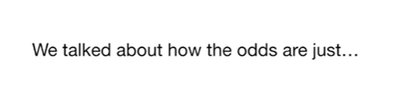
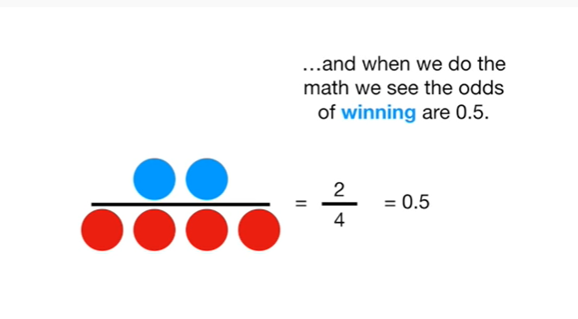
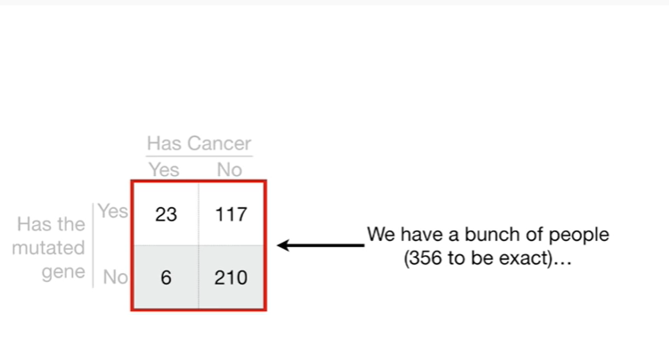
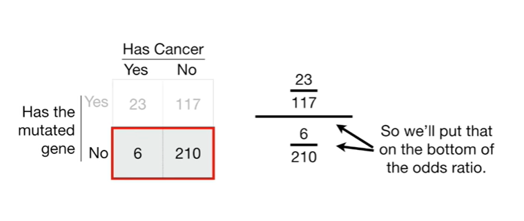
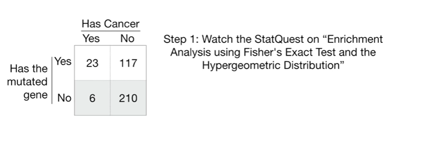
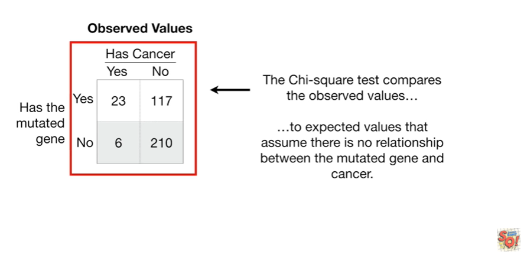
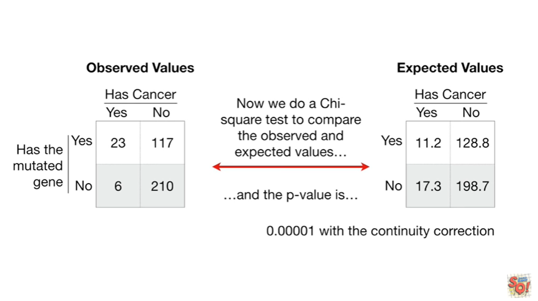
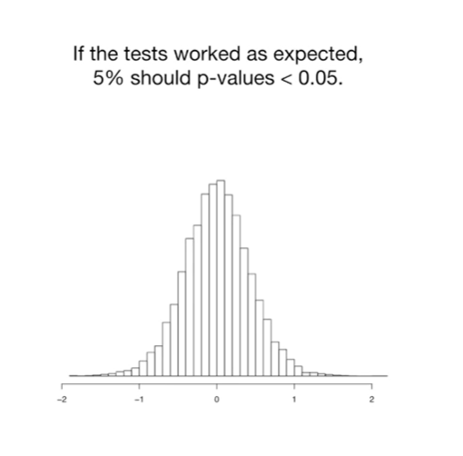
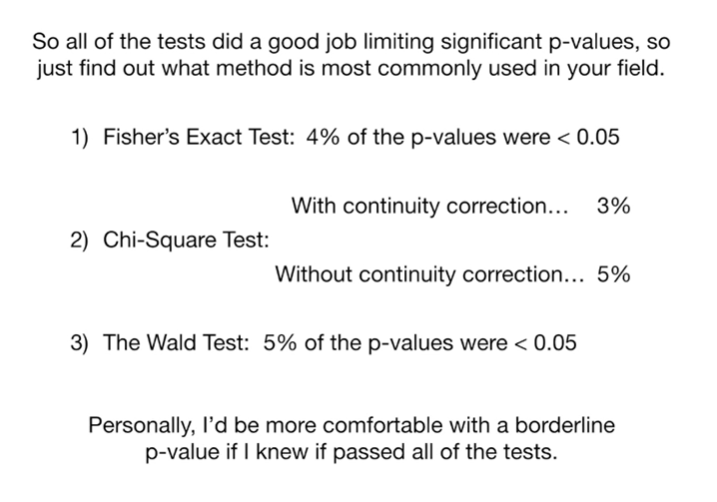

<https://www.youtube.com/watch?v=8nm0G-1uJzA&list=PLblh5JKOoLUK0FLuzwntyYI10UQFUhsY9&index=42>

Today we\'re going to talk about odds ratios and log odds ratios and
they\'re gonna be clearly explained.

The stack quest on odds and the log of the odds ended in a cliff
hanger !!!

We talked about how the odds are just

the ratio of something happening (ie my team winning)

to something not happening (ie my team not winning).

We Illustrated this with circles

blue circles represented my team winning.

Red circles represented my team losing.

And the odds of my team winning were just the blue circles over the red
circles.

Alternatively, we could just use numbers to represent the odds

and when we do the math we see the odds of winning are 0.5.

The cliff-hanger came when I said that even though the odds our ratio,
it\'s not what people mean when they say odds ratio !!!

So let\'s clear this up once and for all.

When people say odds ratio, they are talking about a ratio of odds.

So we\'ve got a ratio of these odds

to these odds.

Doing the math gives us 2 divided by 4 over 3 divided by 1

and that gives us zero point 1 7.

Just like when we calculate the odds of something, if the denominator is
larger than the numerator, the odds ratio will go from 0 to 1

and if the numerator is larger than the denominator, then the odds ratio
will go from 1 to infinity (and beyond)

And, just like the odds, taking the log of the odds ratio makes things
nice and symmetrical.

For example if the odds ratio is two divided by four over three divided
by one, then the log of the odds ratio equals negative one point seven
nine

and if the odds ratio is the opposite it\'s three to one over two to
four, then the log of the odds ratio is the positive version it equals
one point seven nine.

Great !

Now that we\'ve got that cleared up what can we do with odds ratios ?

Here\'s an example of the odds ratio in action !

We\'ve got a bunch of people (356 to be exact)

29 of these people have cancer

and 327 do not.

We also know that 140 of these people have the mutated gene

I\'m just going to let you imagine which gene I\'m talking about here

and 216 people do not have the mutated gene.

We can use an odds ratio to determine if there\'s a relationship between
the mutated gene and cancer.

If someone has the mutated gene, or the odds higher that they will get
cancer ?

Given that a person has the mutated gene the odds that they have cancer
are 23 to 117.

So we\'ll put that on top of the odds ratio.

And given that a person does not have the mutated gene the odds that
they have cancer are 6 to 210.

So we\'ll put that on the bottom of the odds ratio.

Here\'s our odds ratio.

We do the math

and the odds ratio tells us that the odds are six point eight eight
times greater that someone with the mutated gene will also have cancer

and the log of the odds ratio is 1.93.

Small bam !

What does all this mean ?

The odds ratio and the log of the odds ratio are like r-squared : they
indicate a relationship between two things (in this case, a relationship
between the mutated gene and cancer)

and just like r-squared the values correspond to effect size

larger values mean the mutated gene is a good predictor of cancer
smaller values mean that the mutated gene is not a good predictor of
cancer.

BAM !!!

However, just like r-squared, we need to know if this relationship is
statistically significant.

So let\'s do it !

There are three ways to determine if an odds ratio or log of an odds
ratio is statistically significant.

1\. Fisher\'s exact test

2\. a chi-square test

and 3. the Wald test.

One super annoying thing is that there is no general consensus on which
method is best and people often mix and match.

Some people we use Fisher\'s exact test

or the chi-square test to calculate a p-value

and use the Wald test to calculate a confidence interval

and some people are happy to let Wall do all the work calculate the
p-value and the confidence interval.

the last method ensures that the p-value and confidence interval will
always be consistent, but check and see what other folks do in your
field to find out what is most acceptable.

So let\'s start with Fisher\'s exact test.

Step 1 : watch the stat quest on enrichment analysis using Fisher\'s
exact test and the hyper geometric distribution ? BAM !!!

Now think of the people as a bag of tasty M&Ms.

People with cancer are represented by 23 plus 6 equals 29 red M&Ms.

People without cancer are represented by 117 plus 210 equals 320 7 blue
M&Ms.

Now, just like in that stat quest, we work out the p-value for grabbing
a handful of 23 red M&Ms and 117 blue M&Ms

and just like in that stat quest we use a computer and it says the
p-value equals zero point zero zero zero zero one.

Another small BAM !

Now let\'s talk about how to calculate the p-value using a chi-square
test.

The chi-square test compares the observed values

to expected values that assume there is no relationship between the
mutated gene and cancer.

To do this, we calculate the probability of having cancer as the total
number of people with cancer.

That\'s 29

divided by the total number of people that\'s 356.

So the probability of having cancer is 0.08.

So if the gene is not associated with the 23 plus 117 equals 140 people
with the mutated gene, then

the probability of having cancer

times the number of people with the mutated gene

equals 11 point 2.

Thus, the expected number of people with the mutated gene and cancer is
11 point 2.

and the remaining 128.8 people with the mutated gene are expected not to
have cancer.

Likewise, if the gene is not associated with the six plus 200 ten equals
216 people without the mutated gene, then

the probability of having cancer

times the number of people without the mutated gene

equals seventeen point three.

Thus, the expected number of people with cancer that do not have the
mutated gene is seventeen point three

and the remaining 198.7 people with the mutated gene are expected not to
have cancer.

Now we do a chi-square test to compare the observed and expected values

and the p-value is

zero point zero zero zero zero one with the continuity correction

and zero point zero zero zero zero zero four without the continuity
correction.

If you\'re not familiar with the chi-square test, don\'t panic.

We\'ll do a stat quest on it.

One last small BAM !

Lastly, let\'s talk about the Wald test.

This test is commonly used to determine the significance of odds ratios
in logistic regression and to calculate confidence intervals.

The wald test takes advantage of the fact that the log of the odds
ratios just like the log of the odds, are normally distributed.

This is a histogram of 10,000 randomly generated log of the odds ratios
that tells us what to expect if there is no relationship between the
mutated gene and cancer.

Psst : if you want to draw this histogram at home ...

Randomly pick a total number of people between 300 and 400.

We do this to simulate the fact that if we repeated this experiment, we
might not get the exact same sample size each time.

Then for each sample select a random number between 0 and 1

if the number was less than 0.08 (the proportion of people with cancer),
then the sample has cancer.

Then pick another random number between zero and one

if the number was less than 0.3 nine the proportion of people with the
mutated gene then it has the mutated gene.

This gives you a matrix of random values that did not depend on a
relationship between the mutated gene and cancer.

Lastly, calculate the log of the odds ratio.

Do this 10,000 times.

And draw a histogram.

A normal curve fits pretty well !!!

Notice that the histogram and curve are centered on zero.

When there is no difference in the odds the log of the odds ratio equals
zero.

The standard deviation of the 10,000 log of the odds ratios is zero
point four three.

However, it is more common to estimate the standard deviation from the
observed values

you do this by taking the square root of the sum of one over each of the
observed values.

If we do the math we get 0.47. the two different standard deviations
that we calculated are very similar.

All that the wold test does is look to see how many standard deviations
the observed log of the odds ratio is from zero

and since the Wold test typically uses the estimated standard deviation

we\'ll replace the histogram with a normal curve centered on 0 that has
a standard deviation of 0.47.

The log of the odds ratio is the same one that we already calculated.

Here\'s where the log of the odds ratio goes on the curve.

To find out how many standard deviations the log of the odds ratio is
away from 0 we simply divide by the standard deviation.

Thus we divide 1.93

by 0.47.

And that gives us 4 point 1 1 so our log of the odds ratio is 4 point 1
1 standard deviations away from the mean of the distribution.

A general rule of thumb with normal distributions is that anything
further than two standard deviations from the mean will have a p-value
less than 0.05 so we know our log of the odds ratio is statistically
significant.

However, to get a precise two-sided p-value, we can add up the areas
under the curve for points greater than one point nine three

and four points less than negative one point nine three.

However, this is traditionally done using a standard normal curve ie a
normal curve with mean equals zero and standard deviation equal to one.

And that means adding up the areas under the curve for points that are
greater than four point 1 1 and for points that are less than negative 4
point 1 1 where for point 1 1 is the number of standard deviations that
the log of the odds ratio is away from the mean.

Ultimately ; the p-value that the mutated gene does not have a
relationship with cancer is 0.00005.

Double bam !!!

Before we go, here are some final thoughts about the three different
statistical tests we can use with the log of the odds ratio.

When I generated the 10,000 random log of the odds ratios I performed
all three tests on them.

If the tests worked as expected 5 percent should have p-values less than
0.5.

Here\'s what I got :

1\. For Fisher\'s exact test : four percent of the p-values were less
than 0.05.

2\. For the chi-square test : with the continuity correction three
percent of the p-values were less than 0.05

without the continuity correction five percent of the p-values were less
than 0.05.

3\. For the Wold test 5% of the p-values were less than 0.05.

So all of the tests did a good job limiting significant p-values so just
find out what method is most commonly used in your field.

Personally, I\'d be more comfortable with a borderline p-value if I knew
it passed all of the tests.

In summary :

An odds ratio is just a ratio of odds

and a log of the odds ratio is just (wait for it)

the log of an odds ratio !

The odds ratio and the log of the odds ratio tells us if there is a
strong or weak relationship between two things, like whether or not
having a mutated gene increases the odds of having cancer

And, depending on the field you work in, people use Fisher\'s exact
test, chi squared or the wold test to determine p-values for the
significance of that relationship.
