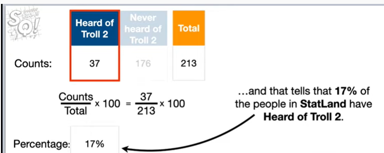
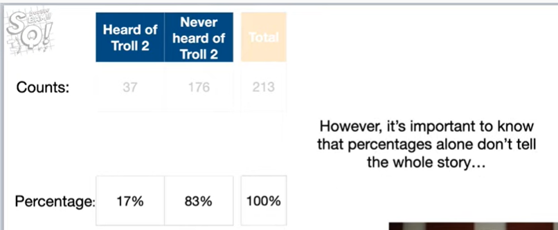

<https://www.youtube.com/watch?v=fU2PuYKsr6M&list=PLblh5JKOoLUK0FLuzwntyYI10UQFUhsY9&index=43>

Welcome to stat quest thank you for joining me.

I see in the chat we\'ve got all kinds of people from all over in place
we\'ve got Egypt.

I just saw Egypt go by, we\'ve got lots of people from India, we got
Poland, Colombia, Brazil, Uruguay, anyways...

Lots of excitement a lot of stuff going on I\'m just gonna go ahead and
get started because I\'m super excited about today.

So BAM !!!

Alright today we\'re gonna talk about probability and expected values
and I\'m gonna take off my guitar.

So there BAM !!

We\'re gonna start crazy basic but just hang in there.

I know this probability, this intro probability stuff is gonna be, so
simple, that is you might get a little bored but whatever we\'re gonna
plow through that stuff found and then we\'re gonna dive in.

Whoo !!!

I just lost power so I don\'t know how long I\'m gonna last a
transformer just exploded somewhere down the street.

So, so we\'ll see what happens, if I just drop out.

I will try to do this again tomorrow, but for now we\'ll just keep
plowing about through anyways we\'re gonna start off with simple
probability stuff.

And but by the end you\'re gonna understand the concept of an expected
value, and how to calculate one.

Okay, just so you know, probability and expected values are two of the
fundamental building blocks for statistics.

So if you ever try to like figure out why something works, the way it
works like, why do we divide the variance by n minus 1.

Instead of in Y is n minus 1 make it unbiased, if you want to understand
what kind of Y of Statistics you\'re gonna run into expected values.

All the time it\'s sort of like the Gig way to understanding all the all
the kind of like mucky things that lurk underneath everything that we do
in statistics.

Okay !!

So, with that said, let\'s take a trip to the magical place called stat
land !!!

And if I had chimes, I\'d have chimes going okay.

So !

Once we get to stat land, this guy, he\'s gonna be our friend, our
friend in state land, he says

Hey, I bet the next person we meet has heard of the movie troll 2.

And we say.

Are you kidding me ?

Troll 2 is one of the worst movies ever made.

Why would anyone know about it ?

By the way, I\'m talking about the 1990 movie troll 2, that if you look
at it, on Rotten Tomatoes.

Tomatoes it is routinely rated as the worst movie.

Ever made so why would anyone know about that movie, anyways our friend
says, I bet you \$1 that the next person we meet has heard of the movie
troll 2.

So we think to ourselves

We go, huh, thinking, thinking, thinking .

Good thing we have just asked everyone in stat land if they\'ve heard of
the movie troll 2, and here\'s the data.

BAM !!!

There are two types of people in stat land.

People that have heard of the 1990 terrible movie troll 2

and people who have never heard of troll 2.

There isn\'t anyone who sort of heard of troll 2 or sort of hasn\'t
heard of troll 2.

They\'re either in one group or the other.

Each person is either heard of troll 2 or they have never heard of troll
2, they may not remember that, they\'ve heard of troll 2 but they\'ve
heard of it.

Ok !!!

So 37 people in stat land have heard of troll 2.

and the remaining 176 people in stat land never heard of Troll 2.

And that means there are 213 people living in stat land.

So statLand is not a huge place !

And looking at the raw numbers is useful because they tell us one stat
land is pretty small

and that whatever analysis we do only applies to a handful of people.

So it\'s always important to kind of know what what size population
we\'re talking about.

And by looking at the numbers we can get a general sense of the trends.

And in this case, we see that most of the people in stat land have never
heard of troll 2.

But, at a glance, it\'s not super obvious how the number of people who
have never heard of troll 2 relates to the total population of stat
land.

However, we can make this relationship super obvious by calculating
percentages.

So let\'s calculate the percentage of people in stat land that have and
haven\'t heard of troll 2.

Actually I\'ve been I\'ve been nosed ichinose oh I\'ve got something
well I was gonna say I\'ve got something to show you but let\'s let\'s
keep going I\'ll show it to you at the very end okay

So the percentage of people that have heard of troll 2 is the counts
37th of 37 people have heard of troll 2 divided by the total which is
213 people.

So there\'s 213 people that live in stat land and then we multiply that
fraction by 100, all you guys know this, everybody knows how to
calculate percentages and if you don\'t wow you just learned.

So no big deal !

Either way okay.

and that tells us that 17 percent of the people and stat land have heard
of troll 2.

Likewise, the percentage of people in stat land who have never heard of
troll 2 is the counts 176

divided by the total 213 multiplied by 100

and that gives us 83 percent.

So we see that 83% of the people and stat land have never heard of troll
2.

Okay.

Lastly, we can plug in the total counts 213 into the equation

it\'s just the counts and the total.

And that tells us that 100% of the people have either heard of troll 2
or never heard of troll 2.

Alternatively, we can just add up the percentage of people that have
heard of troll 2 (17 percent) to the percentage of people who have not
heard of troll 2 that\'s 83 percent

and that should give us a hundred percent of the people in stat line.

Because we said people in the set land are - there\'s just two types
you\'ve either heard of troll 2 or you haven\'t heard of troll 2
there\'s no other category so that accounts for 100 percent of the
population okay.

Percentages give us a good sense of how each sub population in stat lamb
and by sub population I mean people that have heard of troll 2 or not,
relates to the whole.

However, it\'s important to note that percentages alone don\'t tell the
whole story

and that we also need to know the total number of people to know if we
were talking about a large population or a small one.

So it\'s nice to know sort of the population size or the number of
people were talking about okay.

Now, if we wanted to know the probability that a randomly selected
person in stat land has heard of troll 2

We simply divide the counts 37 by the total to 13 and that gives us zero
point one seven.

Now I told you this is going to be basic.

So if you\'re fading out, don\'t worry stick with us, it\'s gonna get
kind of cool pretty soon.

Okay

0.17.

What does that mean ?

That means that the probability that someone in stat land has heard of
troll 2 is zero point one seven, which is pretty low, which means,
we\'re unlikely to just run into someone randomly.

And they\'re gonna say, hey, I\'ve heard of troll 2, the probability
that a randomly selected person that land has not heard of troll 2 is
0.83.

Which is pretty high and that means and that means that there\'s a good
chance, if we just randomly bump into someone.

That they\'re gonna say no, I\'ve never heard of that movie, I don\'t
care about that movie.

So, so, that\'s that\'s a pretty pretty probable outcome.

Okay.

Lastly, the probability that randomly select a person instantly and that
is either heard of troll 2 or not heard of troll 2 is one.

So they\'re kind of guaranteed to be in one of those two categories.

Now remember that bet our friend wanted to make our friend said.

I bet you \$1 that the next person we meet has heard of the movie troll
2.

And because we want to know the probability that we will win the bet
we\'re gonna focus on probability.

So let\'s move the probabilities to the top, so we can focus on them.

Okay.

Now, if the next person we meet has heard of troll 2, then we will lose
the bet and that means we will lose \$1.

So let\'s put negative 1.

Here to represent the outcome of losing \$1.

If we meet someone who has heard of troll 2, in contrast if the next
person has not heard of troll 2 then we will win the bet.

Hooray !!

And that means we will win \$1.

So let\'s put a 1.

Here to represent the outcome of winning \$1, if the next person we meet
has not heard of troll 2.

So now we see that the probability we will lose \$1 is 0.17 and the
probability that we will win \$1 is 0.83.

In other words the probability we will win \$1 is much higher than the
probability that we will lose one dollar.

So this looks like a pretty good bet for us to make.

Oh I just said that so it seems like it would be a good idea to accept
this bet.

However, even though there\'s a high probability that we will win the
bet.

There\'s still a low probability that we will lose the bet and no one
likes to lose money especially me.

I\'m I\'m not a betting person so I\'m gonna be honest, this example is
completely abstract.

Betting is one of those things that some people do for fun, but it
stresses me out, so I tend not to bet.

So we say can we make this bet a hundred times or is this just a
one-time offer and there I\'ll be honest the reason why I\'m saying this
is if we just make the bet once you know we could win or lose.

We either win a dollar or we lose a dollar but if we make this bet a
bunch of times.

Maybe on average we\'ll come up you know ahead no matter what make you
know, there\'s always a small chance, we could lose our honored bets.

In a row but that\'s a very small chance and so I\'d like to know is
like what\'s our chance of sort of like what are we gonna do on average
over a hundred bets and our friend says we can make this bet 100 times.

So this is great.

So what we\'re gonna do is we\'re gonna we\'re gonna make this bet a
hundred times we\'re going to ask a hundred people.

Okay !!

And so if we make this bet a hundred times, we will win some and we will
lose some but we can use this table to figure out how much we will win
and lose.

And that\'ll give us a sense of like what will happen in the long term
how safe is this bet.

Okay, if we make the bet a hundred times we can approximate how many
times we will lose by multiplying the probability we will lose 0.17 by
100 and if we do the math we get seventeen.

So that means we expect to lose seventeen times out of 100 bets.

However, just for now humor me and let\'s not do the math and just know
that this this represents the approximate number of times we will lose
the bet.

Since each time we lose the bet, we lose one dollar, we can estimate how
much money we will lose by multiplying the X the number of times we
expect to lose by negative one.

So this whole term represents how much money we expect to lose in 100
bets and if we did the math we\'d see that we expect to lose about 17
dollars.

Wha-wha.

Now since we can make the bet 100 times, we can approximate how many
times we will win by multiplying the probability we will win zero point
eight three by 100.

Again, if we did the math we\'d see that we expect to win eighty three
times but we\'re not doing the math quite yet since each time we win the
bet we win \$1 we can estimate how much money we will win by multiplying
the number of times we expect to win by one.

So this whole term represents how much money we expect to win in 100
beds and if we did the math we\'d see that we expect to win eighty three
dollars if we wanted to find out the total of how much we could expect
to win or lose. We can add these two terms together and now when we do
all of the math we see that we expect to win approximately 66 dollars
after 100 bets.

However, we can also calculate the average amount of money we win per
bet by dividing everything by the number of bets 100 doing the math
gives us 66 divided by 100 which is 0.66.

So on average we expect to win 66 cents every time we bet note even
though I win or lose \$1 each time I bet so I don\'t win or lose 66
cents even though I\'m betting \$1 and I\'m either winning or losing
that dollar on average I expect to win 60 cents each time because
sometimes I\'m gonna lose and sometimes I\'m gonna win and so on once
you a verge on the wins we get 66 cents each time in statistics lingo 66
cents is the expected value for the bet.

Using statistics notation we would write e of the bat or the expected
value of the bet equals zero point six six so that\'s how you notate
that and if we wanted to make it look even more cryptic we would write e
of X or the expected value of x equals zero point six six where in this
case X represents the bet whether or not someone has heard of troll 2
and I\'m using this sort of fancy cryptic terminology because that\'s
what you\'re gonna see if you pull up the Wikipedia article on any
distribution they\'re gonna say who the expected value they\'re gonna
say e of x equals something and I just want you to know that e of X is
really just an average it\'s a type of average and we\'re gonna go
through a bunch of examples I\'m going to see that kind of different
ways to do it okay so we\'re gonna put a of X or the expected value of x
over here and we\'re going to talk about why we left this math so messy
because you remember we could have done the math halfway through but I
said let\'s just not do it quite yet and we\'re gonna we left it messy
and now we\'re gonna talk about why we did that okay since I\'m
multiplying each probability by the number of bats and I\'m dividing by
the number of bats 100 all of the values that represent the number of
bets cancel out and we are left with the probability that someone in
stat land has heard of troll 2 times the outcome negative 1 plus the
probability that someone has not heard of troll 2 times the outcome 1
and when we do the math we get the same thing we got before 0.66 because
those hundreds just cancel out so of course we\'re gonna get the same
result note because all of the terms for the number of bets cancelled
out the expected value simply represents the average of what we would
expect if we made this bet a bunch of times now if we made that bet once
we will either win \$1 or we will lose \$1 we won\'t win or lose 66
cents but if we make it a bunch of times and we just average out the
wins and the losses we\'re gonna get 66 cents every time we do it so
that\'s what this expected value represents note in fancy math notation
this expected value is this sum so it\'s the sum of each outcome X and
we\'ll talk about what X means in a little bit times the probability of
observing each outcome X okay so for the first term heard of troll 2 the
outcome is negative 1 so x equals negative 1 so that\'s that\'s what
we\'re observing is that we\'ve lost some money and the probability of
observing the outcome of negative on at the other deserving the loss of
money is zero point 1 7 so we multiply those two values together then we
add that term to the term for not heard of troll 2 and in this case the
outcome is 1 so x equals 1 and the probability of observing the outcome
of 1 is zero point 8 3 so we see the probability that x equals 1 is zero
point 8 3 okay so now we\'ve seen how the fancy math definition of
expected value works so if you if you if you\'re out there in the wild I
usually don\'t like doing these fancy terminology things but this is one
of those things but I will I\'m gonna be honest with you expected value
for a long time when someone said hey we\'re just gonna do the expected
value I kind of get chills down my spine and I go oh no that\'s not good
and then they would show me this equation I go what does that equation
mean I don\'t know and that would have that would intimidate me so what
I\'m doing is I\'m putting them on the screen to try to like demystify
so we\'re gonna plug in things for X and we\'re going to plug in stuff
for that probability a bunch of times so hopefully by the end of this
tech quest you\'re gonna be real comfortable with this formula you\'ll
be like I get it it\'s just a way of calculating an average okay BAM
okay now imagine our friends saying because it is rare for someone in
stat land who have heard of troll 2 I will pay you ten dollars if the
next person we meet has heard of the movie troll 2 but if they have not
you pay me \$1 okay so this is a slightly different bet if they\'ve
heard of troll 2 we get a lot we get a bigger payout but it\'s also rare
to find people that have heard of troll 2 so there\'s a higher
likelihood we\'re gonna have to pay our friend okay so we will win money
will we win money or lose money if we can make this bet a bunch of time
so what\'s gonna happen on average say like we could make this bet a
hundred times or a thousand times overall are we gonna win money are we
gonna lose money so we\'re gonna calculate the expected value to find
out okay this outcome this is the outcome for when someone has heard of
troll 2 so that\'s 10 and the outcome for when someone has not heard of
troll 2 holy smokes someone just did a crazy super chat Andre care avail
yo holy smokes that\'s like the superest superjet I\'ve seen in a long
time dang ok sorry about that shoutout but I just had to do it totally
caught me I see a lot of chat going on in the background and people are
using the the triple triple BAM and the special emojis but I had to had
to shout that out ok oh where were we and the outcome for when someone
has not heard of troll 2 was negative 1 okay when these are the outcomes
the expected value is and we\'re using that fancy notation the sum of
each outcome that\'s x times The Associated probability so the
probability that we observe that outcome we\'ll start by plugging in
numbers for heard of troll 2 the outcome is 10 and the probability of
observing that outcome is 0 point 1 7 now we add the term for never
heard of troll 2 the outcome is negative 1 and the probability of
observing that outcome is zero point 8 3 so that\'s how we plug the
numbers into that fancy equation now we just do the math and the
expected value is zero point eight seven and that means we expect to
make on average eighty seven cents every time we make this bet double
BAM okay I\'ve got two more examples I know we\'ve been going pretty
long I\'ve got two more examples using a six-sided die this first
example is kind of a standard example so if you go to the Wikipedia
article on expected values you\'re gonna see this example but now that
you\'ve got a better feel for expected values you\'re gonna see that
example I get it I know how that works okay so the probability so we\'re
imagine we\'re rolling this die and the probability of landing on any
specific side like having five like we have over here in the in the
image of the die is 1/6 now if we want to find the expected value or the
average value of rolling the die a bunch of times then we need just need
to plug in values into the formula for the expected values and I think I
skipped a slide or it got deleted somehow but you see that we get out
the outcomes are just the the number that length comes up on top of the
die so if we roll one the outcome is 1 if we roll a 6 the outcome is 6
so those are the outcomes and we\'re gonna plug the probabilities and
the outcomes into this formula for the expected value so for lands on
one the outcome is 1 and the probability of observing a one is 1/6 and
that gives us 1 times 1/6 for lands on to the outcome is 2 and the
probability of observing a 2 is 1/6 and that gives us 2 times 1/6 so we
add that term to our sum and four lands on three we get three times one
time 1/6 we add that term to the sum and four lands on four we get four
times 1/6 and four lands on five we get five times 1/6 and four lands on
six we get six times 1/6 now we just do the math and the expected value
for rolling a six-sided die is three point five note there is no side on
the die for 3.5 so we will never roll 3.5 exactly but if we take the
average of what we get after a bunch of rolls then we expect that
average value to be close to 3.5 damn okay one last example and then
we\'re gonna be all done okay here\'s the new bet this is what our
friend says he says I will pay you \$100 if you roll a six otherwise you
pay me ten dollars this bet means the outcome for rolling a six is 100
because he will pay us \$100 and the outcome for rolling anything else
is negative 10 so if we roll a 1 we owe this guy our friend nay we owe
him 10 dollars so that\'s the those are our outcomes now what\'s the
expected value all we have to do to find the expected value is plug the
outcomes and probabilities of observing the outcomes into the formula so
boo boo boo boo boo boo now we just do the math and the expected value
for this bet is eight point three in other words if we can bet a bunch
of times and not just once if we can bet a bunch of times we will win on
average eight dollars and thirty cents each time and that means our
friend is the worst gambler ever triple bam um so that is hold on I
think that\'s our last slide we\'re I try to keep these things to about
30 minutes and we\'re at 30 minutes however I just want to do a little
shout out to smeared you mayn\'t it she just became a member and that\'s
awesome that\'s super helpful for me and keeping stat quest alive
memberships are doing pretty well we\'re almost up to 200 the channel
members which is really exciting and remember channel members are a way
to support me making stack quest videos full-time as a job and the more
time I can dedicate to that the more the more time the more videos and
more live streams and more stuff you get and I\'ve got some exciting
stuff to talk about the last time we talked about how I was working on
these Jupiter notebooks for how to do machine learning in Python I\'ve
got a bunch of those made and here\'s the deal what I\'m gonna do is
I\'m gonna start doing umm because everyone\'s doing zoom these days
I\'m gonna start doing zoom classes we\'re gonna do a zoom class where I
take you through this Python notebook oh this Jupiter notebook and
we\'re gonna go through how to use XG boost from start to finish we\'re
gonna get some data we\'re gonna clean that data up we\'re gonna deal
with missing values we\'re gonna make sure that the data is formatted
correctly each type is correct we\'re gonna do all that then we\'re
gonna do XG boost we\'re gonna optimize the hyper parameters hyper
parameters is just a fun fancy fancy way for things that you just have
to tweak by hand but we\'re gonna call him hyper printer parameters
because that makes him sound cool rather than things you tweak by hand
and we\'re gonna tune those and then we\'re gonna have a finished model
and I\'m we\'re gonna start doing those so that\'s something very
exciting to look forward to I\'m also working on the study guides PDF
study guides and those are gonna be downloadable so lots of exciting
things that are going on right now and so I\'m excited about stat quest
I want to thank all of you guys for tuned in unfortunately I rambled on
for way too long today so I\'m unable to take questions live but I rest
assured I I will save the live stream and I will go through it and I
will look at your questions and I\'ll read through everything and some
may end up as a queue for a future stat quest a future live stream or
whatever I think we\'re gonna stick with this probability for a little
while I want to do look I\'ll be honest when I started this out my goal
was to do conditional probability and and sort of joint distributions
and marginal distributions and kind of talk about these sort of like
weird kind of fundamental concepts that have a lot of scary terms
associated with them but a really basic and and once we do that we can
start heading into bayesian territory then we\'ll start understanding
Bayesian so if that was the goal but when I was just I was just kind of
going and all the sudden I was like wham expected values are here let\'s
talk about them because expected values are a big deal and I\'ve been
meaning to to cover them because I\'ve got a I\'ve got a stat quest on
extraña to explain why the variance equation the way it is why do we
divide when we want an unbiased estimate of the variance why do we
divide by n minus 1 instead of n where n is the number of observations
and it all has to do with expected values and so this is a stepping
stone towards answering that question so anyways thank you very much
I\'m really happy you guys are here it means a ton to me and I\'m
looking forward to the next stat quest it\'s gonna be the first Monday
in May and I think we\'re just gonna do them all at noon it\'s a good
time for me and I hope it\'s a good time for you I know it\'s not a good
time for everybody but these are recorded and so if it\'s not a good
time for you you can always watch it later alright until next time quest
on
