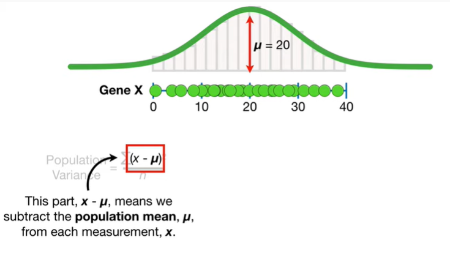
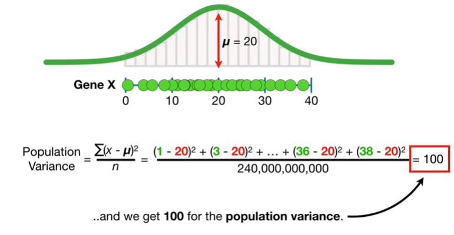
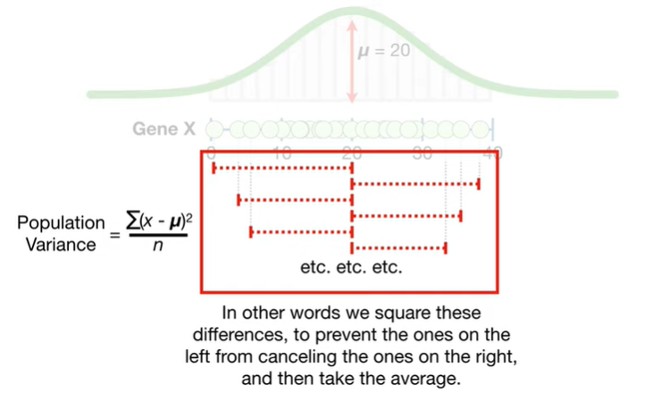
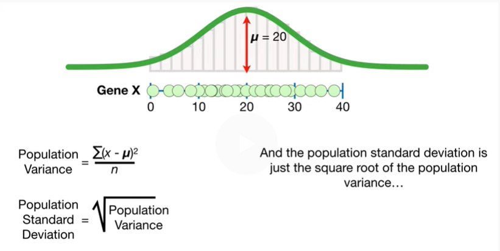
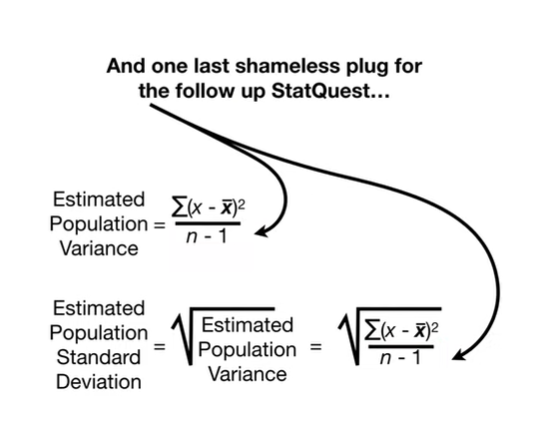

<https://www.youtube.com/watch?v=SzZ6GpcfoQY&list=PLblh5JKOoLUK0FLuzwntyYI10UQFUhsY9&index=5>

Today we\'re gonna continue our series on statistics fundamentals.

This time we\'re gonna talk about estimating the mean variance and
standard deviation.

Note : this stat quest assumes you already know about histograms
statistical distributions and specifically the normal distribution.

If not check out the quests.

The links are in the description below.

Also this stat quest assumes you already understand why we want to
estimate population parameters.

If not check out the quest.

In the stat quest on population parameters we counted the number of mRNA
transcripts from gene X in five different liver cells.

Alternatively if mRNA transcripts and liver cells didn\'t mean anything
to you we counted the number of green apples in five different grocery
stores

or green t-shirts and five different clothing stores

or whatever you want to measure in five different units.

This green dot represented a liver cell that had three mRNA transcripts
for gene X

and this green dot represented a liver cell that had 13 mRNA transcripts
19 24

and 29.

Now if we had a lot of time and money on our hands we could count the
number of mRNA transcripts for gene X in all 240 billion liver cells.

Now we can draw a histogram of the measurements.

If we wanted to fit a normal curve to this histogram like this then we
need to calculate the population mean in the population variance or
population standard deviation.

Calculating the population mean is easy we take the average of all 240
billion measurements

BP booty P due to baby boo doo bee doo doo boo boo

and we get 20 for the population mean

and we Center the normal curve on the population mean.

Note : because we calculated the mean with all 240 billion measurements
in the population this is not an estimate of the population mean

it is the population mean.

However since we rarely if ever have enough time and money to measure
every single thing in a population

we almost always estimate the population mean using a relatively small
sample.

In this example we have the measurements from only five of the 240
billion cells.

Estimating the population mean is super easy we just calculate the
average of the measurements we collected doodoo booty boot boot boot
boot

and in this case the estimated population mean is seventeen point six.

Oh no it\'s the dreaded terminology alert.

Statisticians often use the symbol x-bar to refer to the estimated mean
which is also called the sample mean

and they use the Greek symbol mu to refer to the population mean.

The estimated mean x-bar is different from the population mean mu but
with more and more data x-bar should get closer and closer.

Going back to the full set of population data

we will now determine how wide to make the curve by calculating not
estimating the variance and standard deviation.

In other words we want to calculate how the data are spread around the
population mean.

This is the formula we use to calculate not estimate the population
variance.

Note : I\'m making a big deal about calculating versus estimating
variance because it makes a big difference that we\'ll talk about later.

This part X minus mu means we subtract the population mean mu from each
measurement X.

Boo-boo-boo-boo-boo.

The square tells us to square each term

and the greek character Sigma tells us to add up all the terms.

Lastly we want the average of the squared differences so we divide by
the number of measurements n which in this case is 240 billion.

Thus we\'re just calculating the average of the squared differences
between the data and the population mean.

Note : squaring each term ensures that each difference is positive.

Otherwise the measurements on the left side of the mean would give
negative differences

which would cancel out the positive differences from the measurements on
the right side of the mean.

Note : if you are wondering why we don\'t take the absolute value of
each term great we\'ll talk about that in the follow-up video that dives
deep into these details.

Anyway and now we just do the math

and we get 100 for the population variance.

BAM.

Okay we calculated the population variance and we\'re all proud of
ourselves however there is one thing that is annoying about it.

Because each term is squared

the units for the result 100 are mRNA transcripts squared.

Note : if the data have been the number of apples and grocery stores
then the variance would be 100 apples squared.

Either way we can\'t plot the variance on the graph since the units on
the x axis are not squared.

To solve this problem we can take the square root of everything

and that gives us the population standard deviation

so the population standard deviation is the square root of 100 the
population variance which is 10 and we can plot that on the graph.

This shows the main 20 plus and minus the standard deviation 10 mRNA
transcripts.

Note : before we move on I want to emphasize the point that we almost
never have the population data so we almost never calculate the
population mean and population variance in standard deviation.

Instead we estimate the population variance and population standard
deviation from the relatively small number of measurements that we have.

Remember the population variance and standard deviation determines how
much the curve spreads out

and that means the estimated variance and the estimated standard
deviation should reflect how the data are spread around the population
mean.

However when we do an experiment we don\'t see the curve or the
population mean we only see the data

so we have to use the estimated mean x-bar instead.

This is the formula we use to estimate the population variance.

Because we almost always work with a relatively small sample and not the
entire population this is the formula we will use most of the time.

The differences between this formula and the one for the calculated
population variance are subtle but important.

First since we don\'t know the population mean mu we use the sample mean
x-bar.

Second we are dividing by n minus 1 instead of n

dividing by n minus one compensates for the fact that we are calculating
the differences from the sample mean instead of the population mean

otherwise we would consistently underestimate the variance around the
population mean.

This is because the differences between the data and the sample mean

tend to be smaller than the differences between the data and the
population mean.

Thus the differences around the population mean or result in a larger
average

and the larger average is what we are trying to estimate.

Note : if you\'re like me and want to know more details about why we
need to compensate for calculating differences from the sample mean
check out the follow-up stat quest.

The link is in the description below.

Now let\'s do the math !

Just like before we calculate the differences between the mean and the
data

doopa doopa doopa doopa

then we square each term

then we add up each term

but now we divide by n minus 1

and the estimated population variance is 101.8.

Now we just take the square root of the estimated variance to get the
estimated standard deviation

and we get 10.1

and we can draw the mean plus and minus the standard deviation on the
graph.

Double BAM !!!

The estimated population parameters correspond to this purple curve with
mean equals seventeen point six and standard deviation equals ten point
one

which isn\'t too far off from the true distribution with mean equals 20
and standard deviation equals 10.

With more data the estimated parameters would be more accurate and we
would have more confidence in them.

However with just five measurements we still did pretty well and that
saved us a ton of time and money.

Hooray.

In summary :

if we have all of the data from a population we can calculate the
population mean

the population mean equals the sum of the measurements divided by the
number of measurements and that equals the average measurement mu.

When we don\'t have the population data we can estimate the population
mean with the same formula.

The estimated population mean equals the sum of the measurements divided
by the number of measurements which equals the average measurement
x-bar.

When we have the population data we can calculate the population
variance and standard deviation.

The population variance is the average of the squared differences
between the data and the population mean mu.

In other words we square these differences to prevent the ones on the
left from canceling the ones on the right and then take the average.

And the population standard deviation is just the square root of the
population variance

and since the standard deviation is in the original units that we
measured we can draw it on the graph.

However we almost never have the population data so chances are you
should not use these formulas.

Instead, we almost always estimate the variance and standard deviation.

When we estimate the population variance we divide by n minus one to
compensate for measuring distances from the sample mean.

Instead of the population mean and the estimated standard deviation is
just the square root of the estimated population variance.

And since the standard deviation is in the same units that we measured
the data we can draw it on the graph.

And one last shameless plug for the follow up stat quest if you want to
know

why dividing by n underestimates the variance check out the quest.

The link is in the description.

In this stat quest I made a big deal about how we rarely have the
population data and we almost always estimate the population parameters.

One reason I did this was because while many software packages estimate
the variance and standard deviation by default Microsoft Excel does not.

Instead it gives two choices one function VAR p calculates the
population variance the other VAR s estimates it.

Since we almost always have a relatively small sample rather than the
population data we should almost always use VAR.s.
