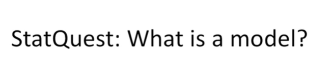
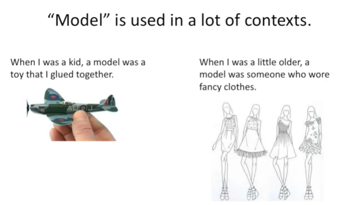
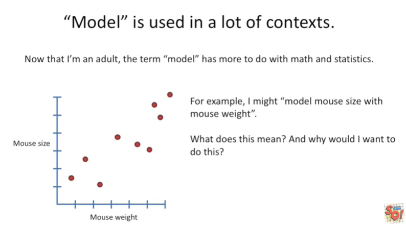
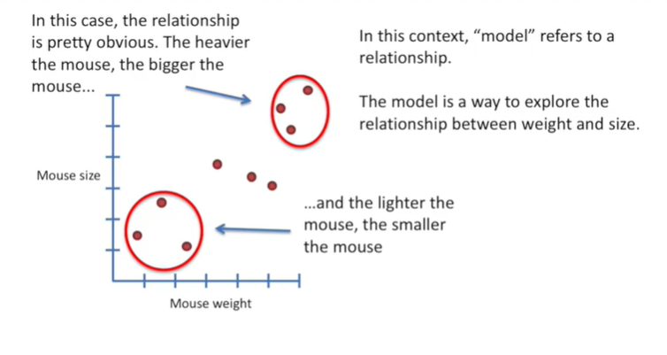
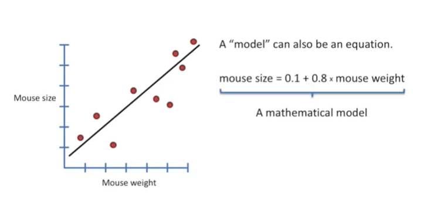
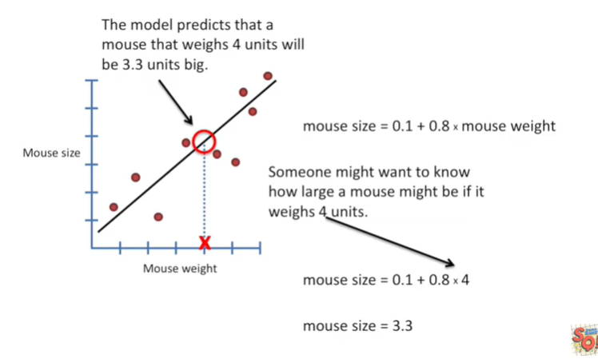
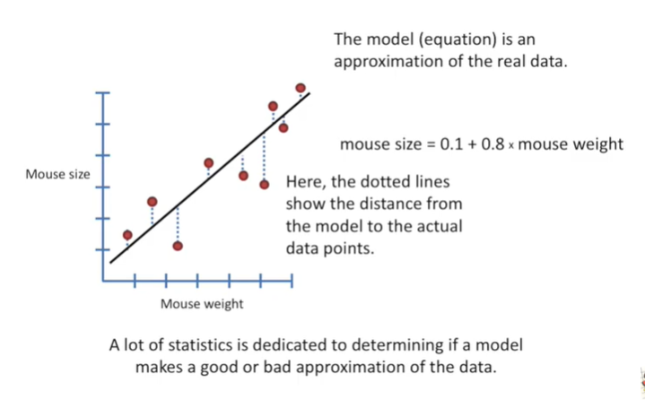
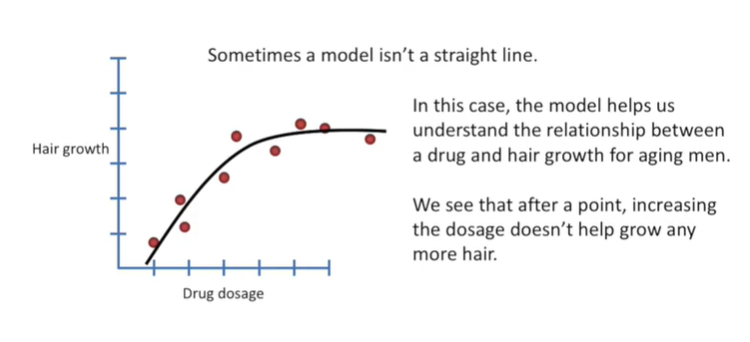
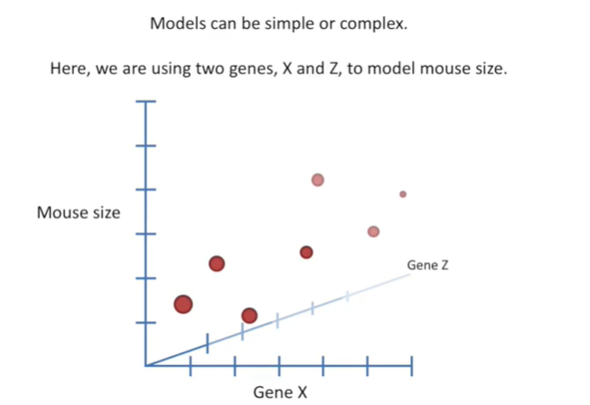
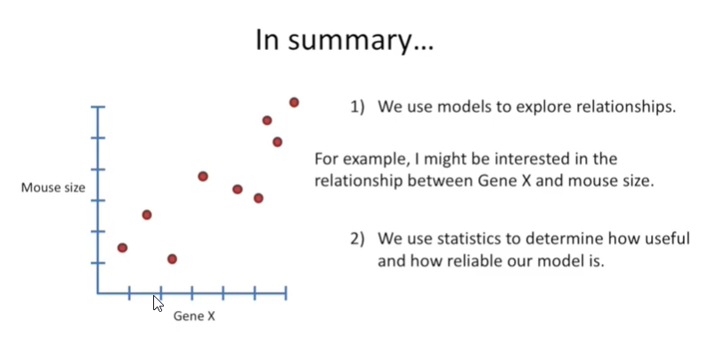

<https://www.youtube.com/watch?v=yQhTtdq_y9M&list=PLblh5JKOoLUK0FLuzwntyYI10UQFUhsY9&index=6>

Today we\'re going to be talking about what is a model ?

The word model is used in a lot of contexts.

When I was a kid a model was a toy that I glued together.

When I was a little older a model with someone who wore fancy clothes.

Now that I\'m an adult the term model has more to do with math and
statistics.

For example I might model mouth size with Mouse weight.

What does this mean and why would I want to do this ?

In this context model refers to a relationship.

The model is a way to explore the relationship between weight and size.

In this case the relationship is pretty obvious.

The heavier the mouse, the bigger the mouse...

...and the lighter the mouse, the smaller the mouse.

A model can also be an equation.

Here we have the equation for the line that we have fit to the data.

The equation is a mathematical model.

The model or equation can tell us about mice we haven\'t measured yet.

Someone might want to know how large a mouse might be if it weighs 4
units.

So we plug that value into our equation and we get Mouse size equals
3.3.

The model predicts that a mouse that weighs 4 units will be 3.3 units
big.

The model or equation is an approximation of the real data.

Here the dotted lines show the distance from the model to the actual
data points.

A lot of Statistics is dedicated to determining if a MA makes a good or
bad approximation of the data.

Right now I\'m working on a bunch of new stat quests to cover these
subjects specifically this includes linear regression, general linear
models, t-tests, ANOVA\'s and F tests and all kinds of really exciting
things that I can\'t wait to cover sometimes.

A model isn\'t a straight line.

In this case the model helps us understand the relationship between a
drug and hair growth for aging men.

We see that after a point increasing the dosage doesn\'t help grow any
more hair.

Models can be simple or complex.

Here we are using two genes x and z to model mouth size.

In summary :

1.  we use models to explore relationships. For example I might be
    interested in the relationship between gene X and a mouth size.

2.  We then use statistics to determine how useful and how reliable our
    model is.
