<https://www.youtube.com/watch?v=XLCWeSVzHUU&list=PLblh5JKOoLUK0FLuzwntyYI10UQFUhsY9&index=7>

Today we\'re going to be talking about sampling a distribution or
getting samples from a distribution.

This is something that we do all the time and stack quest.

So I wanted to make a video that we could reference rather than covering
the same material over and over and over again.

So let\'s get down to it.

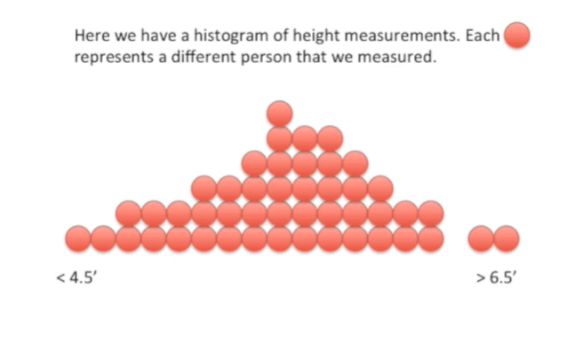

Here we have a histogram of height measurements.

Each red dot represents a different person that we measured.

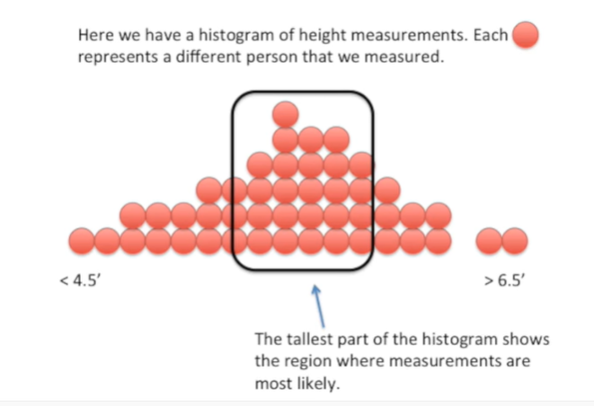

The tallest part of the histogram shows the region where measurements
are most likely.

In this case most of the people we measured were between 5 foot 7 inches
and 6 feet tall.

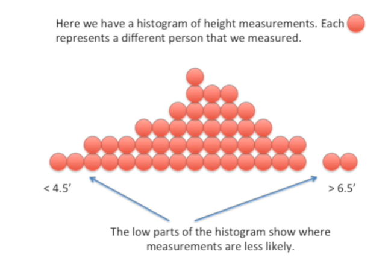

The low parts of the histogram show where measurements are less likely.

In this case we didn\'t measure many people that were shorter than four
and a half feet were taller than six-and-a-half feet.

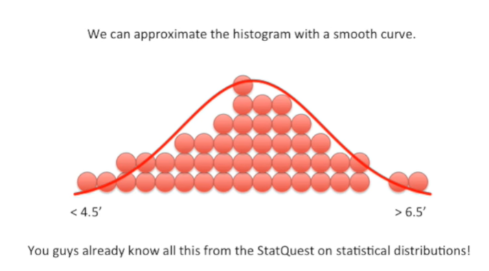

We can approximate the histogram with a smooth curve.

You guys already know all this from the stat quest on statistical
distributions !

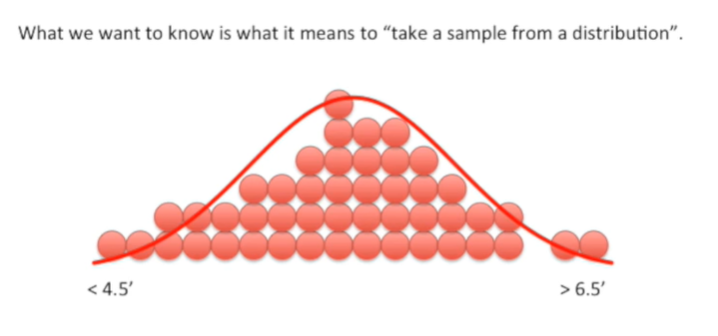

What we want to know today is what it means to take a sample from a
distribution.

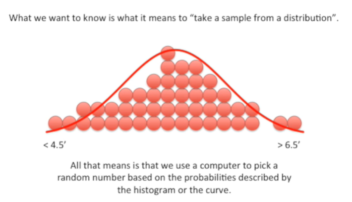

All that means is that we use a computer to pick a random number based
on the probabilities described by the histogram or the curve.

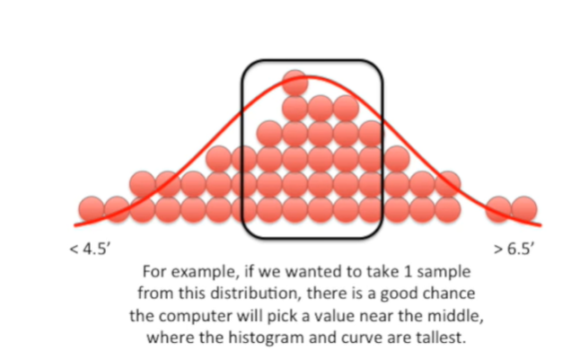

For example if we wanted to take one sample from this distribution
there\'s a good chance the computer will pick a value near the middle
where the histogram and curve are tallest.

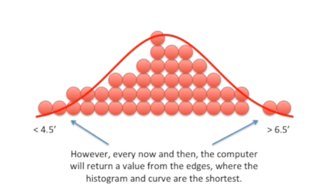

However every now and then the computer will return a value from the
edges where the histogram and curve are the shortest.

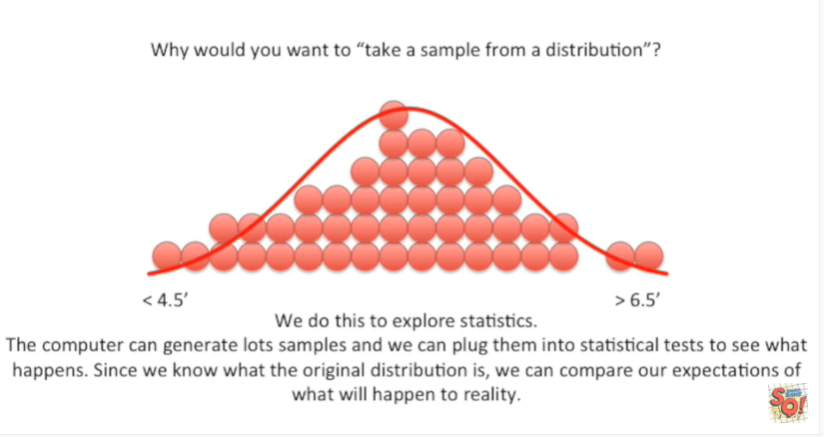

Why would you want to take a sample from a distribution ?

We do this to explore statistics.

The computer can generate lots of samples and we can plug them into
statistical tests to see what happens.

Since we know what the original distribution is we can compare our
expectations of what will happen to reality.

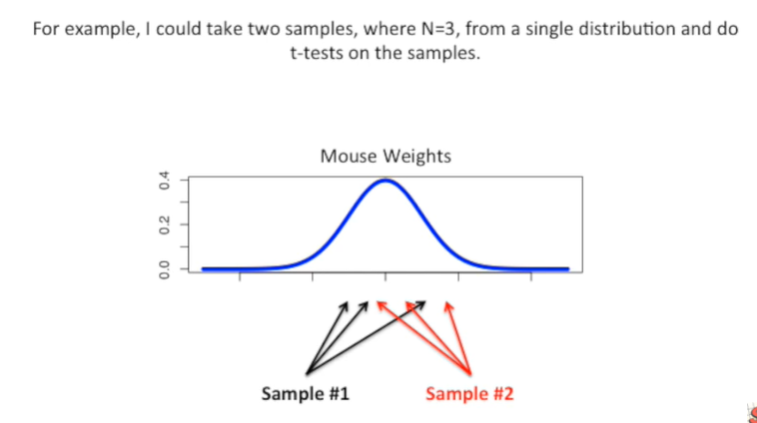

For example I could take two samples where N equals three from a single
distribution and do T tests on the samples.

In this case N equals the number of measurements we take within each
sample.

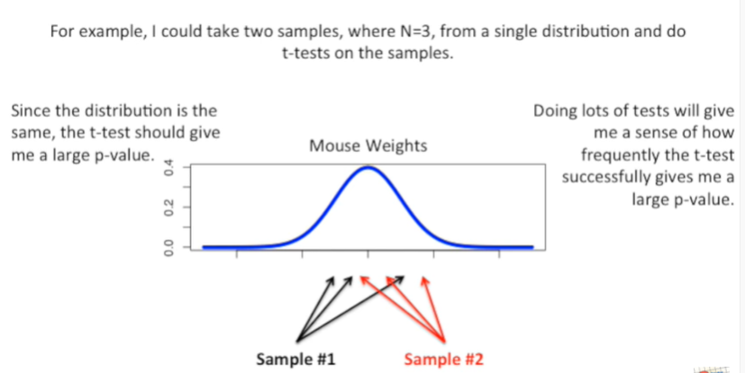

Since the distribution is the same the t-test should give me a large
p-value.

Doing lots of tests will give me a sense of how frequently the T test
successfully gives me a large p-value.

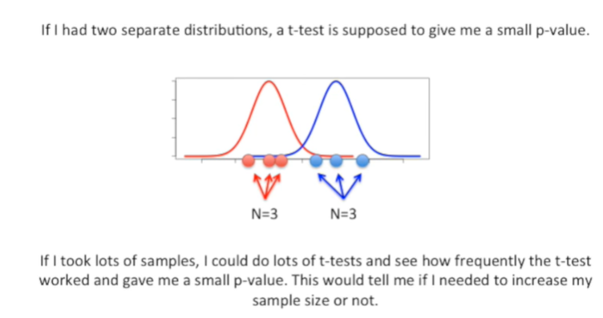

If I had two separate distributions a t-test is supposed to give me a
small p-value.

If I took lots of samples I could do lots of T tests and see how
frequently the t-test worked and gave me a small p-value.

This would tell me if I needed to increase my sample size or not.

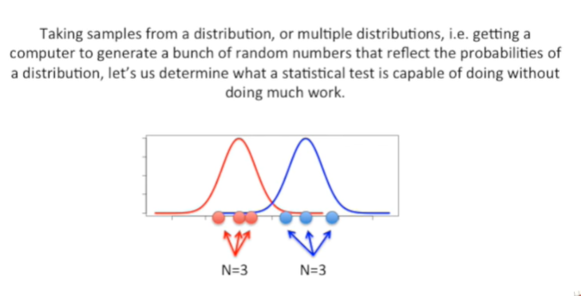

Taking samples from a distribution or multiple distributions ie getting
a computer to generate a bunch of random numbers that reflect the
probabilities of a distribution lets us determine what a statistical
test is capable of doing without doing much real work.
