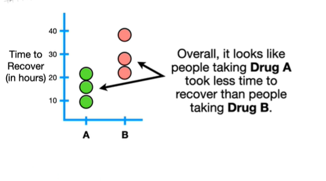
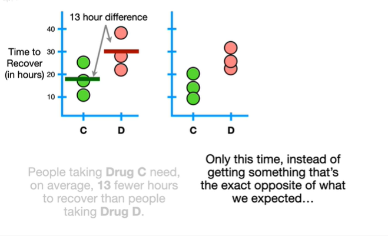
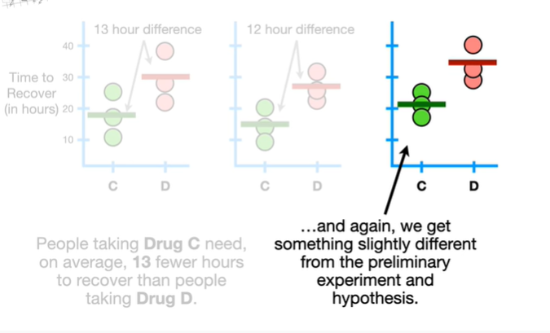
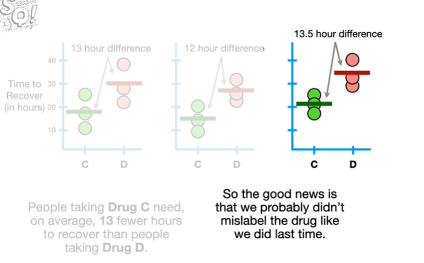
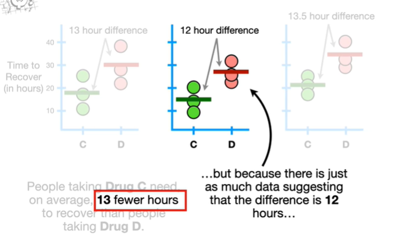
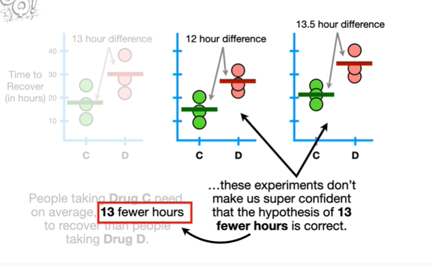
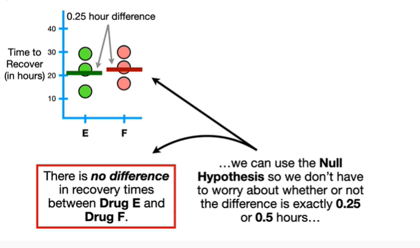

<https://www.youtube.com/watch?v=0oc49DyA3hU&list=PLblh5JKOoLUK0FLuzwntyYI10UQFUhsY9&index=8>

Today we\'re gonna talk about hypothesis testing and the null
hypothesis.

I\'m not going to name names but imagine there was a virus

and we had two drugs we could use to treat it.

So we give drug a to three people

and measure how long it takes each person to recover from the virus.

The first thing we notice is that not everyone recovered in the exact
same amount of time.

Person number one recovered the fastest

and person number two recovered the slowest.

It\'s possible that person number one eats healthy food and exercises
and already has a strong immune system and that helped them recover
quickly.

And maybe person number two doesn\'t get as much exercise.

Or maybe person number two has a stressful job or lives where there is a
lot of air pollution.

The point is is that even though all three people had the same virus and
took the same drug (drug A)

they did not all recover in the exact same amount of time and that might
be due to a lot of random things like exercise or job stress that we
cannot control.

Now let\'s give drug b to three different people that have the virus

and measure how long it takes them to recover.

Again we see that even though three people had the same virus and took
the same drug (drug B)

they did not all recover in the exact same amount of time.

And this is probably due to random stuff that we can\'t control like how
much exercise each person gets or how much candy they eat.

Overall it looks like people taking drug a took less time to recover
than people taking drug B.

And when we calculate the mean or average value for drug A

and the mean value for drug B

we see that on average there is a 15-hour difference between drug A and
drug B.

So after seeing this preliminary data it might seem reasonable to form
the following hypothesis

people taking drug a need on average 15 fewer hours to recover than
people taking drug B.

And now that we have this hypothesis we can test it

by repeating the experiment.

Now when we calculate the means we see that on average people taking
drug A need 35 more hours than people taking drug B.

Compared to our preliminary data this result is very unexpected !!!

In fact it is the opposite of the original hypothesis.

But it is also possible that all three people that took drug a in the
second experiment have super stressful jobs and unhealthy lifestyles

and maybe that\'s why it took them so long to recover.

And maybe everyone taking drug B was well rested and super healthy to
begin with

and maybe that\'s why they recovered so quickly.

But it is also possible that we mislabeled drug a and drug B and did the
wrong experiment.

So we repeat the experiment

and again the results are totally backwards from the preliminary
experiment

and totally backwards from the hypothesis that we made.

So again just to make sure we didn\'t miss label things we redo the
experiment

and again these results are the opposite of the original hypothesis.

So we just keep repeating the experiment each time double-checking every
little detail and every time we do the experiment we get the opposite
result of the original hypothesis.

So after doing all of these repeated experiments where we double-checked
every little step

we can confidently reject this hypothesis that we came up with after
doing the preliminary experiment.

BAM !!!

Now let\'s imagine we had two more drugs C and D.

And just like before we gave drug C to three people

and measured how long it took each person to recover from the virus.

Then we gave drug D to three different people

and measured how long it took them to recover from the virus.

And based on this data we can create a hypothesis about drug C and drug
D.

People taking drugs C need on average 13 fewer hours to recover than
people taking drug D.

Now just like before we decide to test this hypothesis by repeating the
experiment.

Only this time instead of getting something that\'s the exact opposite
of what we expected

we get something that is only slightly different.

In this case the difference is in the same direction but it is only 12
hours.

Then we repeat the experiment again

and again, we get something slightly different from the preliminary
experiment and hypothesis.

The difference is in the same direction but this time it is 13.5 hours.

So the good news is that we probably didn\'t mislabel the drug like we
did last time.

And the differences between the three experiments might be due to random
things we can not control

like maybe these people exercised a lot and had relatively healthy diets

compared to these people who took longer to recover.

But regardless the hypothesis says that people taking drug C needed 13
fewer hours to recover

but when we repeated the experiment

the first replicate said the difference between averages was 12

which is different from the hypothesis

and the second replicate said the difference was 13.5

which is also different from the hypothesis.

And let\'s be honest the only reason the hypothesis says 13 fewer hours
is because that was the result from the first experiment.

However we could have just as easily put 12 fewer hours in the
hypothesis because that\'s what we got the second time

or we could have put 13.5 fewer hours in the hypothesis because that\'s
what we got the third time.

So if we just pick one experiment like the first one

and use that to define the hypothesis

then we have two experiments that are not different enough to give us
confidence to reject the hypothesis

but because there is just as much data suggesting that the difference is
12 hours

and there is just as much data suggesting that the difference is 13.5
hours

these experiments don\'t make a super confident that the hypothesis of
13 fewer hours is correct.

Again maybe drug a reduces recovery by 13 fewer hours

but maybe it reduces recovery by 12 hours

or 13.5.

Because the results from the repeated experiments are not different
enough to cause us to reject the hypothesis

and because they don\'t convince us that the hypothesis is correct
either

the best we can do is fail to reject the hypothesis.

Small BAM.

To summarize what we\'ve covered so far

we can create a hypothesis

and if data gives us strong evidence that the hypothesis is wrong

then we can reject the hypothesis.

But when we have data that is similar to the hypothesis but not exactly
the same

then the best we can do is fail to reject the hypothesis

because it\'s unclear if the hypothesis should be based on this result

or this other slightly different result

or this result

or any other possible outcome.

Double bam !!!

Now let\'s take a closer look at the hypothesis itself.

You may remember that the only reason the hypothesis is 13 fewer hours
is that it was the first result.

But we could have just as easily gotten a 12 hour difference

or a 13.5 hour difference and ended up with a different hypothesis.

And if 12 and 13.5 are reasonable hypotheses then so is 12.25 or 13.1.

In other words there are a lot of reasonable hypotheses.

How do we know which one to test ?

Since the goal is to see if drug C is different from drug D

we simply test to see if there is no difference between the drugs.

Oh no it\'s the dreaded terminology alert.

The hypothesis that there is no difference between things is called the
null hypothesis.

So let\'s take a look at two examples of the null hypothesis in
action !!!!

Now imagine we are testing two new drugs E and F

and this time we only get a 0.5 hour difference.

This person recovered the fastest

but it is easy to imagine that if they had exercised a little less or
had a slightly worse diet

then they might have taken a little longer to recover.

Likewise if this person was just a little healthier to begin with

then they might have recovered a little more quickly.

These small random differences give us a slightly different result.

Now instead of drug f being slightly better by 0.5 hours drug ii is
slightly better by 0.25 hours.

Because these small random differences give us slightly different
results

we can use the null hypothesis so we don\'t have to worry about whether
or not the difference is exactly 0.25 or 0.5 hours

instead we simply see if the data convinces us to reject the hypothesis
that there is no difference between drug E and drug F.

In this case the original result was zero point five hours in favor of
drug F

but small random things could have easily changed the result to be a
0.25 hour difference in favor of drug E

and thus the data does not overwhelmingly convince us to reject the null
hypothesis.

So we fail to reject the null hypothesis that there is no difference
between the drugs.

In contrast if we tested the drugs on a lot of people

and little random things would not change the results very much

then we could confidently reject the null hypothesis that there is no
difference between drug E and drug F.

BAM !!!

Note : without the null hypothesis we need preliminary data in order to
make a statement that we can test and follow-up experiments.

This is because we don\'t know if we should test if the difference is 13
hours or 13,000 hours until we get some data.

In contrast the null hypothesis does not require preliminary data
because the only value that represents no difference is zero.

Triple bam !!!

In summary :

Rather than get stressed out over a large number of possible hypotheses
that we could test to see if drug C is different from drug D

we use the null hypothesis to determine if there is a difference.

If we do an experiment with a bunch of people

and a lot more people taking drug C had shorter recovery times than
people taking drug D

so many that it would be hard to imagine that the results were due to
random things like everyone taking drug C had better diets or got more
exercise than the people taking drug D

then we could reject the null hypothesis.

And then we know that there is a difference between drug C and drug D.

Alternatively if little random things could easily shift the result from
one drug to the other and then back again

then we would fail to reject the null hypothesis.

BAM !!!

But wait what about the alternative hypothesis.

Because the alternative hypothesis is super important it has its own
quest so check it out.

And if you don\'t already know about p-values they would make a
wonderful follow-up.

Lastly if you want to review statistics and machine learning offline
check out the stat quest study guides at statquest.org.

There\'s something for everyone.
