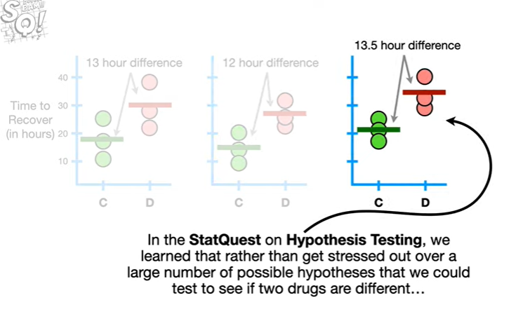
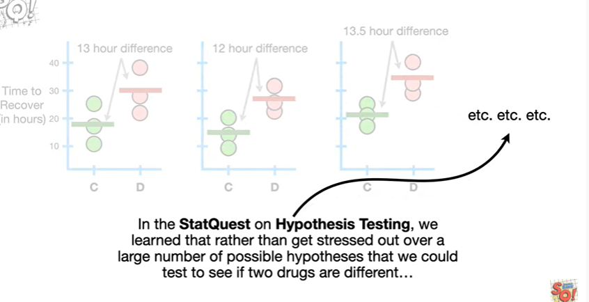
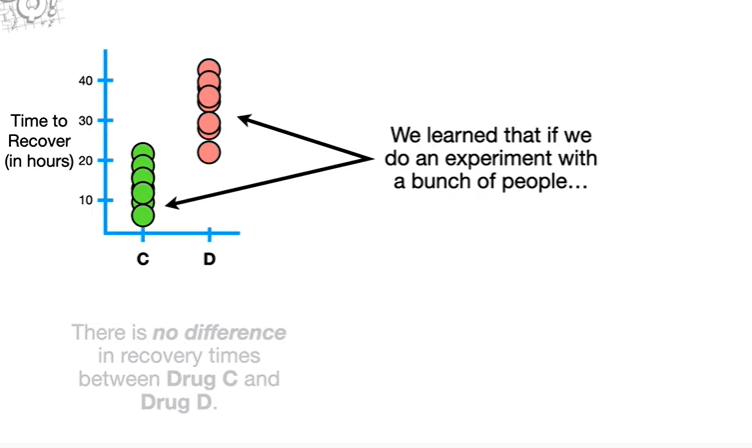
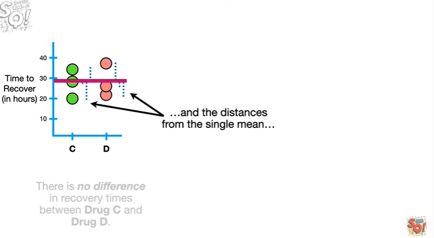
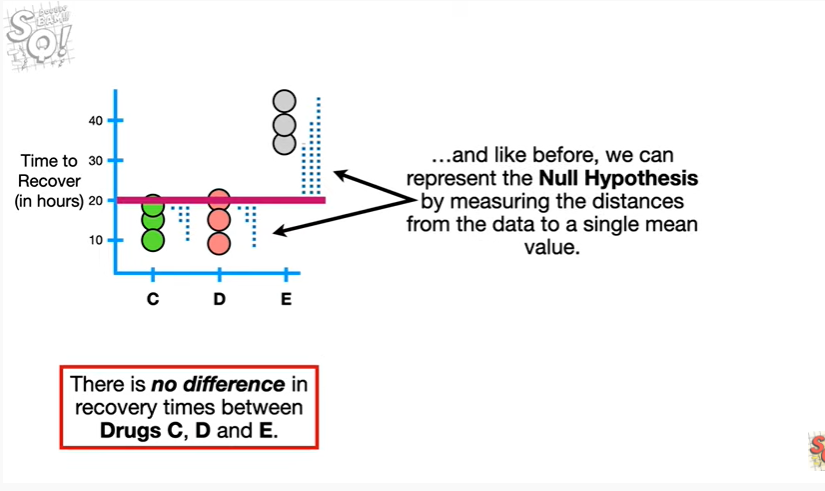
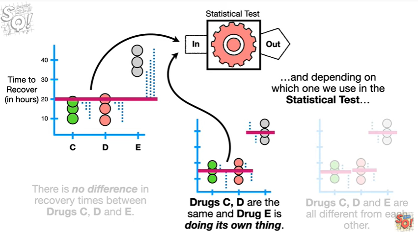

<https://www.youtube.com/watch?v=5koKb5B_YWo&list=PLblh5JKOoLUK0FLuzwntyYI10UQFUhsY9&index=9>

Today we\'re going to talk about alternative hypotheses.

So that you understand the main ideas.

Note : this stat quest follows up on the stat quest on hypothesis
testing and the null hypothesis if you haven\'t already seen that one
check out the quest the link is in the description below.

Either way let\'s do a super quick review.

In the stat quest on hypothesis testing, we learn that rather than get
stressed out over a large number of possible hypotheses that we could
test to see if two drugs are different

we simply use the null hypothesis to determine if there is a difference.

We learn that if we do an experiment with a bunch of people

and a lot more people taking drugs see had shorter recovery times than
people taking drug D

so many that it would be hard to imagine that the results were due to
random things like everyone taking drug C had better diets or got more
exercise than the people taking drug D

then we can reject the null hypothesis.

And then we would know that there is a difference between drug C and
drug D.

Alternatively we learn that of little random things could easily shift
the result from being in favor of one drug to another

then we would fail to reject the null hypothesis.

And then we said triple BAM !

Now that we\'re done with our review let\'s talk about the alternative
hypothesis.

First here\'s some data that shows how quickly people taking drugs C and
D recovered from a virus.

The goal of collecting all of this data is to determine if we should
reject or fail to reject the null hypothesis.

In order to decide if we should reject or fail to reject the null
hypothesis we run the data through something called a statistical test

and the output of the statistical test is a decision to reject or fail
to reject the null hypothesis.

A statistical test needs three things.

1\. it needs data

2\. it needs a null, or primary hypothesis ie it needs something to
reject or fail to reject

and 3. it needs an alternative hypothesis.

In this case the alternative hypothesis is simply the opposite of the
null hypothesis.

Warning things are about to get a little hand wavey the idea is to give
you a general sense of why the alternative hypothesis is important and
is used in statistical tests not to give you all the details of how
those tests work.

That said if you want the details there\'s a stat quest playlist that
goes through examples step by step the link is in the description below.

Now one way to test the null hypothesis that there is no difference
between drug C and D

is to calculate a mean value for all the data from both drugs

and calculate the distances between each observation and the mean

and compare those two distances calculated from individual means for
drug C and drug D.

The distances around the single mean represent the null hypothesis that
there is no difference

and the distances around the two separate means represent the
alternative hypothesis.

If the distances around two means are much shorter

than the distances around the single mean

then that suggests that using two means to summarize the data makes more
sense than using one.

So we reject the null hypothesis.

Alternatively if the data looked like this

and the distances from the single mean

were not dramatically different from the distances around the separate
means

then that would suggest that the difference between two means only
reflects little random things that we can\'t account for.

For example it could be that the subtle difference in the means is due
to this one guy getting less exercise than everyone else.

If he had exercised just a little bit more he might have recovered from
the illness a little faster

and then we would no longer see a difference between the two means.

So in this case we would fail to reject the null hypothesis.

Psst !! If you\'re familiar with machine learning lingo failing to
reject the null hypothesis

it\'s the same thing as realizing that using two averages means that you
have overfit the data.

If you\'re not familiar with machine learning lingo ignore what I just
said or better yet check out the machine learning stack Quests !!!

Note : when we only have two groups of data the alternative hypothesis
is pretty obvious because it is simply the opposite of the null
hypothesis.

However when we have three or more groups the alternative hypothesis
becomes more interesting.

In this case the null hypothesis is that there is no difference between
drug C D and E

and like before we can represent the null hypothesis by measuring the
distances from the data to a single mean value.

However now we have choices for the alternative hypothesis.

One alternative hypothesis could be that all three drugs are different

and in this case we would measure the distances from a separate mean for
each drug.

Or the alternative hypothesis could be that there is no difference
between drug C and D but drug E is doing its own thing.

In this case we would calculate the distances from a single mean value
for drug C and D and a separate mean for drug E.

So far we have two different alternative hypotheses

and depending on which one we use in the statistical test

we can end up making a different decision about the null hypothesis.

And that is why it is important to clearly state which alternative
hypothesis we want to use.

However regardless of the alternative hypothesis we used in the test we
only reject or fail to reject the primary or null hypothesis.

If we tested the null hypothesis

using this alternative hypothesis

and we rejected the null hypothesis

we might say that we rejected it in favor of this alternative
hypothesis.

However we would still not say we accept the alternative hypothesis
because just like we saw in the stat quest on hypothesis testing other
alternatives might be better.

In other words there are too many possibilities to test to know if we
have accepted the correct one.

And this is why we only reject or fail to reject the null or primary
hypothesis.

BAM !!!

In summary :

a statistical test needs three things

1\. it needs data

2\. it needs a null or primary hypothesis

and 3. it needs an alternative hypothesis.

When we only have two groups of data the alternative hypothesis is super
obvious because it is just the opposite of the null hypothesis.

But when we have three or more groups

we have options for the alternative hypothesis

and depending on which one we use in the statistical test

we can end up making a different decision about the null.

Double bam !!!

Note : if you\'re not already familiar with p-values these stat quests
would be an awesome follow-up to this one !!!

And if you want to learn more about statistical testing check out the
playlist on linear models it sounds fancy but if you\'ve made it this
far it will be a snap !
